# **Multi-factor Authentication**

Before we delve into the actual application of MFA, let’s first understand the key concepts surrounding it.

## MFA Concept: A safe with two locks.
Imagine a safe that requires two keys to open. One key is something that you have, but you also need the second key to unlock the safe. Just as a safe with two locks requires two keys to be opened, MFA requires two different factors to access your account. Even if someone has the first key (personal password), they cannot open the safe without the second key (MFA code).

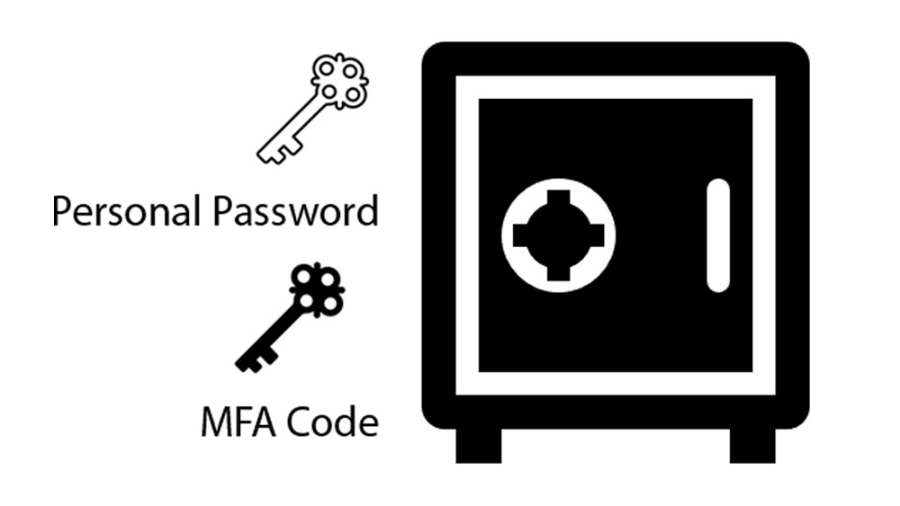

## Authenticator Concept: The Gatekeeper
Authenticator is like a gatekeeper who verifies your identity before granting you access to a secure area. It is the giver of the second key (MFA code). A gatekeeper checks credentials to ensure only authorized individuals can enter, an authenticator generates and verifies codes to confirm that the person trying to access the account is genuinely who they claim to be.

## **Enabling MFA for Root User [DEMO]**
Now that you understand some of the basic concepts, let's delve into the actual implementation of MFA in a user account.

Upon creation of your root user account, you will see in the IAM Dashboard the security recommendations. It is saying that it is better for you to add MFA for root user.

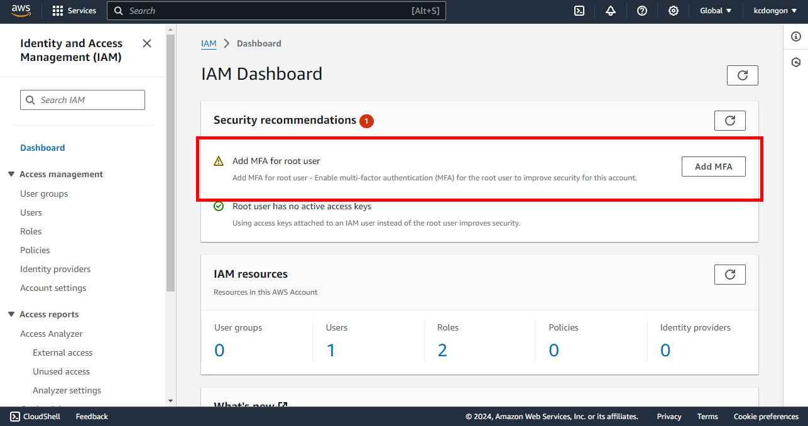

With these foundational concepts in mind, we can now proceed to implement multifactor authentication (MFA) on your account. This step will enhance your security by adding an additional layer of protection, ensuring that your sensitive information remains safe from unauthorized access. Let’s walk through the process of setting up MFA and explore how it can help safeguard your account against potential threats. Now, click “Add MFA”.

### **Step 1: Select MFA Device**
It should take you to this section wherein you can set up your MFA.

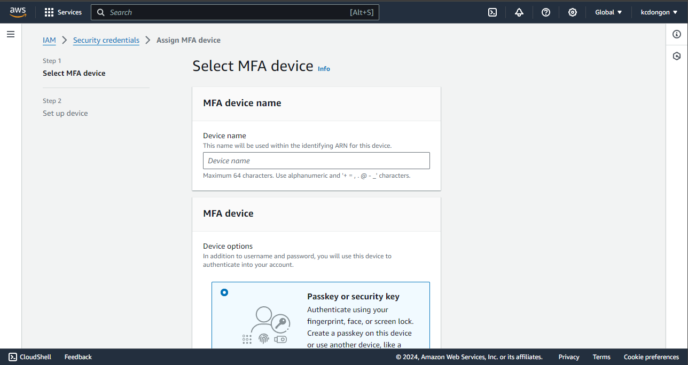

As you can see, there are only 2 steps to doing this. You can give a certain device name of your choice.

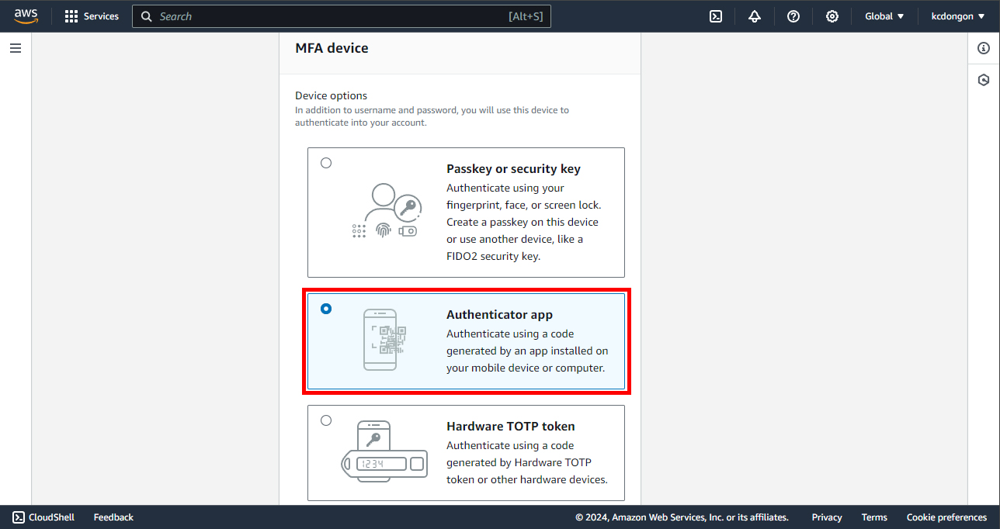

You have 3 options to choose from. Nowadays, the authenticator app is used more frequently since it is fast and portable. You can download Google Authenticator, Duo Mobile, or Authy app on your mobile device or computer.

### **Step 2: Set up Device**
Once you are done downloading your authenticator app, you can now proceed to this section.

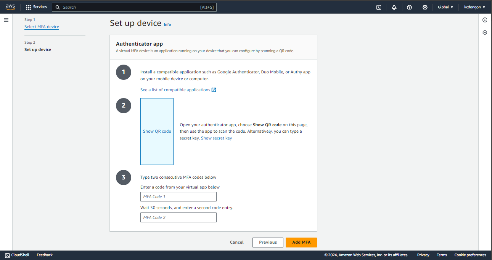
The instructions here are self-explanatory. You can now show the QR Code. For google authenticator, press the “+” symbol and the scan QR code will show, or you can use a secret key.

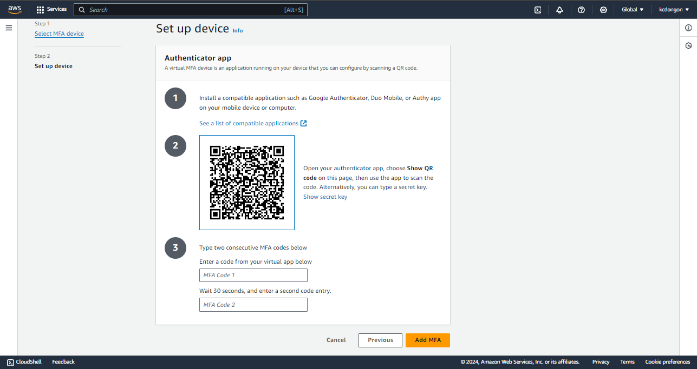

The moment you scan the QR code, the authenticator will give you codes. Type the first code in the “MFA Code 1 box” and the second code in the “MFA Code 2 box”. After that, press “Add MFA”.

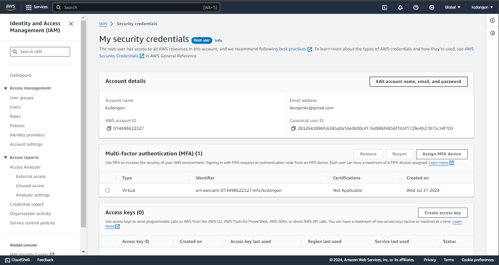

With that, your MFA implementation is done. Now, it is time to test it.

### **Step 3: Testing the MFA**
Prepare your authenticator app first. Once you are done preparing it, let us now test if the authenticator gives the second password to us.

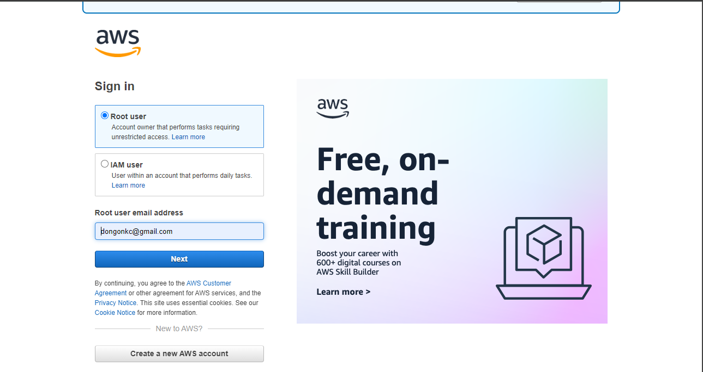

Here, you can enter your root user email address. After that, press “Next”.

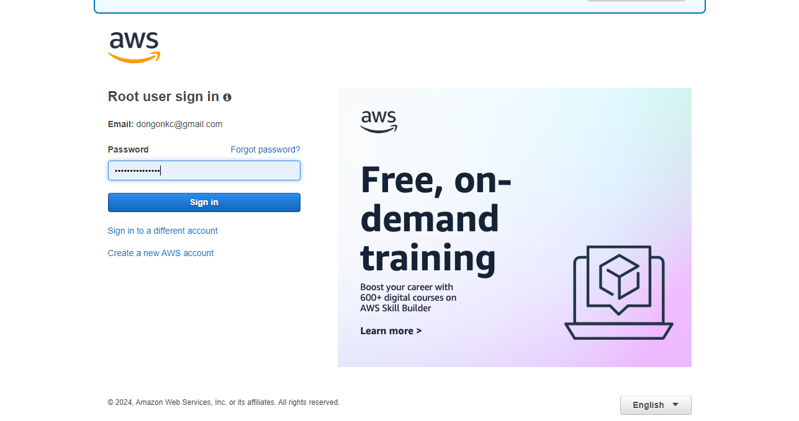

Now, enter your password. This is the first key to your safe.

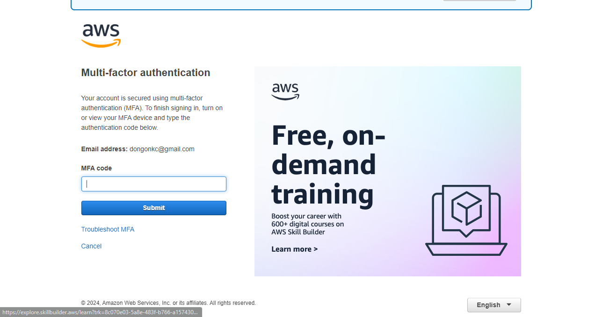

Now, it requires you to give the second password. Look at your authenticator and type the current code.

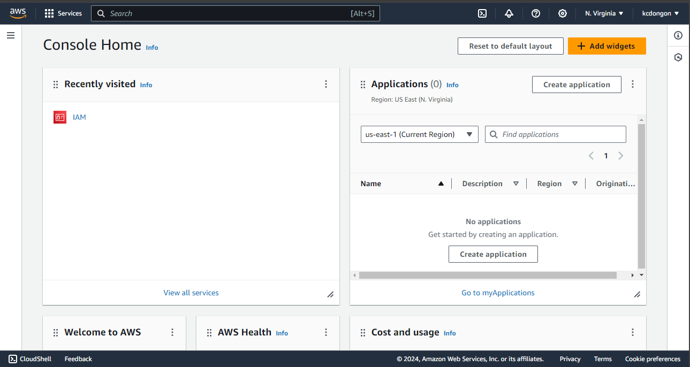

Congratulations! You can access your account now.

In conclusion, multi factor authentication (MFA) is a vital security tool that significantly enhances the protection of your online accounts by requiring multiple forms of verification. By implementing MFA, you add an extra layer of defense against unauthorized access, making it much more difficult for malicious actors to compromise your sensitive information. In today’s digital world, where cyber threats are constantly evolving, MFA is an essential component of any robust security strategy.

[Next >> AWS Identity and Access Management (IAM)](05%20-%20AWS%20Identity%20and%20Access%20Management.md)