# IAM Roles Demonstration

## **Introduction**
IAM Roles are a powerful feature in AWS that allows you to grant temporary access to your AWS resources without needing to share long-term credentials. In this demonstration, we will walk through the process of creating an IAM role, configuring the AWS CLI to use that role, and performing actions using the role's permissions.

## **STEP 1: Create an IAM Role**

1. **Navigate to IAM Dashboard:**
   - Log in to the AWS Management Console.
   - Go to the IAM service.

   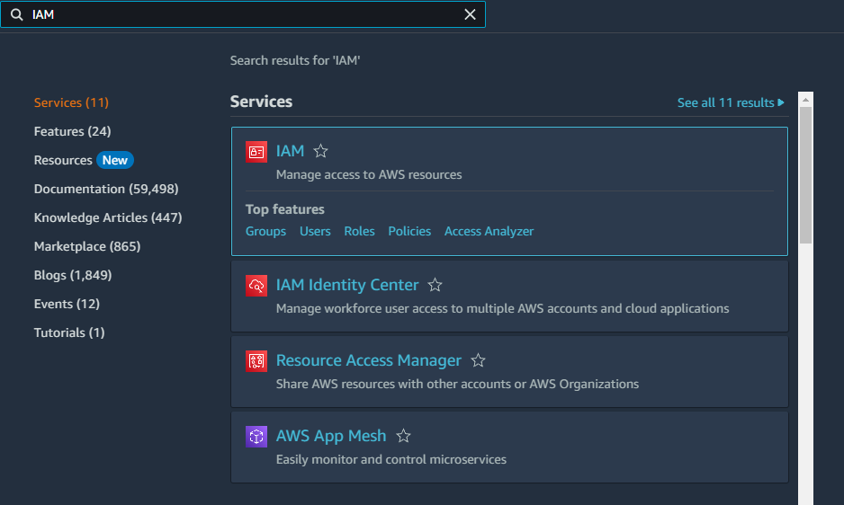

2. **Create a New Role:**
   - In the IAM Dashboard, click on **Roles** in the left-hand menu.

   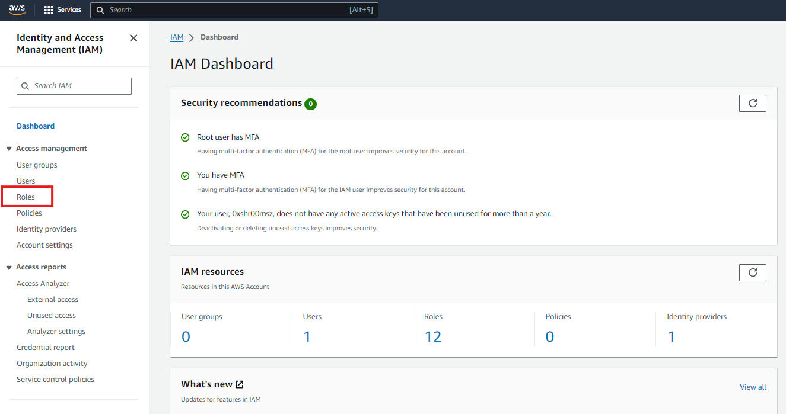
   - Click **Create role**.

   

3. **Select Trusted Entity:**
   - Choose **AWS service** as the trusted entity.

   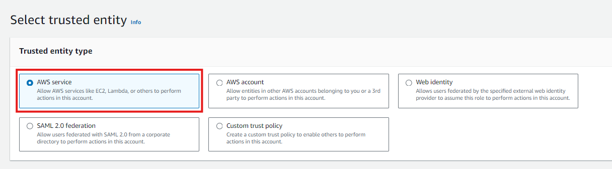
   - Select the service that will use the role, such as EC2.

   

4. **Attach Permissions:**
   - Attach the `AmazonS3ReadOnlyAccess` policy to the role to grant read-only access to **S3**.

   

5. **Name and Create the Role:**
   - Give the role a descriptive name, such as `EC2_S3ReadOnlyAccess`.

   
   - Review the settings and click **Create role**.


## **STEP 2: Create an EC2 Instance**

### Navigate to EC2
1. In the AWS Management Console, **search for "EC2"** in the search bar at the top.
2. Click on **“EC2”** from the search results to open the EC2 Dashboard.

   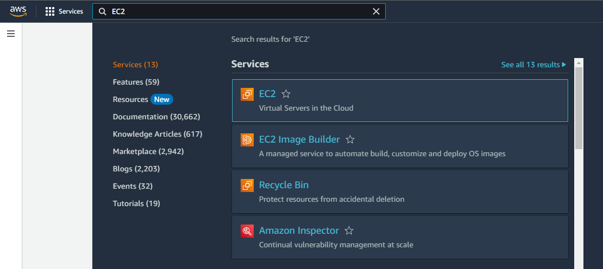
### Launch Instance
1. In the EC2 Dashboard, click on the **“Launch Instance”** button to start the instance creation process.

   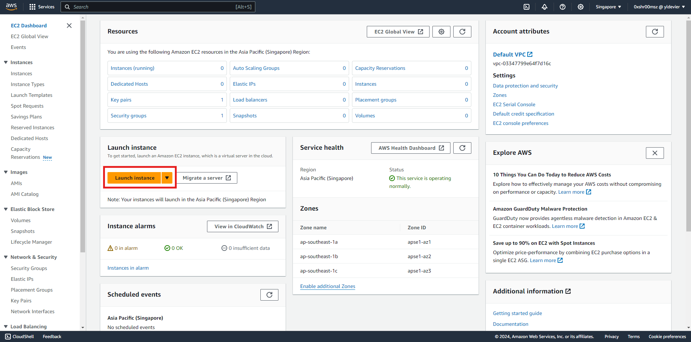

### Choose an Amazon Machine Image (AMI)
1. Provide a name for your EC2 Instance
2. You’ll be presented with a list of AMIs. **Select an AMI** that suits your needs. For this workshop, you can choose an Amazon Linux AMI.

   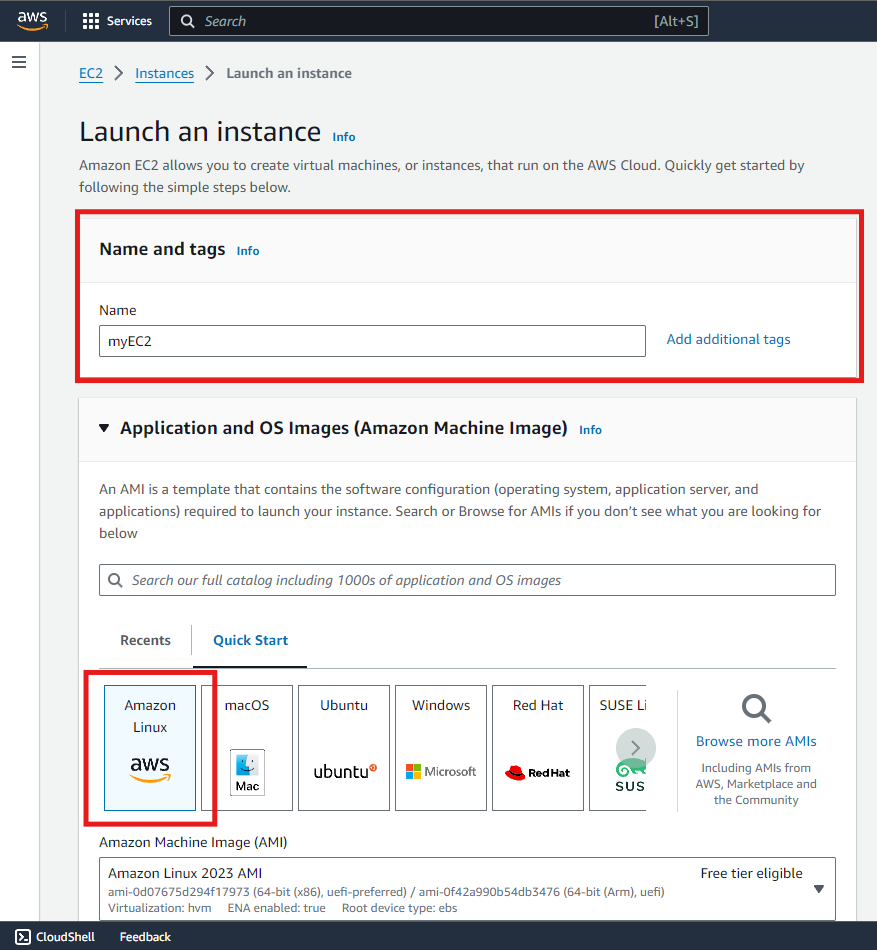

### Create a Key Pair
1. When prompted, create a new one. This key pair will be used to securely connect to your instance.

   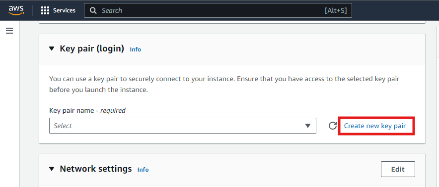
2. Provide a key pair name, select RSA Key Pair Type and click Create Key Pair.

   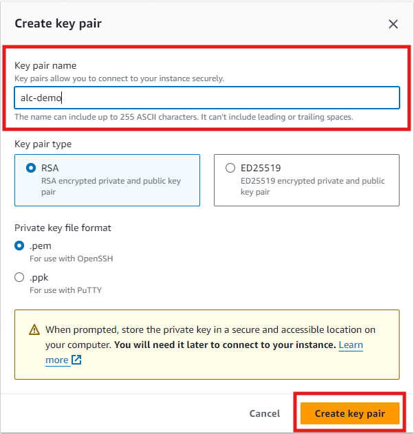
2. **Download the key pair** file if you create a new one and store it in a safe location.

### Launch Instance
Leave everthing else as it is and click the Launch Instance.

   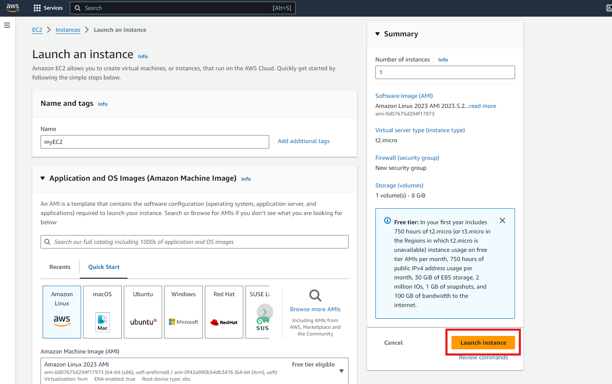

### Attach the role to your EC2 Instance
1. Go back to the EC2 Dashboard.
2. In the left sidebar, click on “Instances”.

   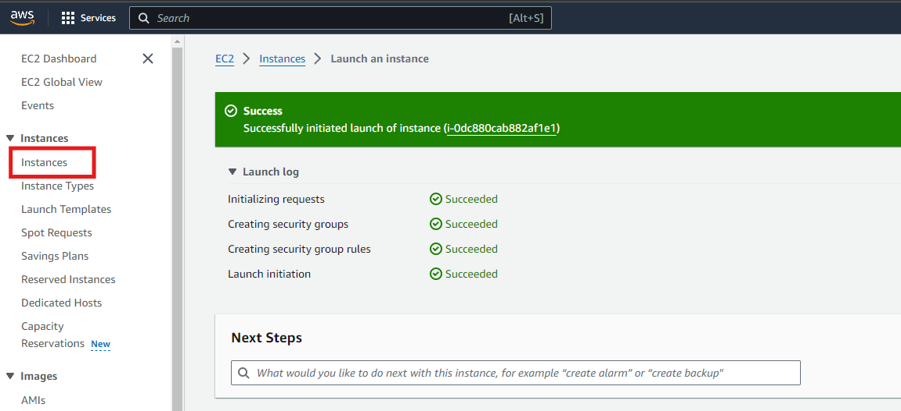
3. Select the instance to which you want to attach the role.
   
   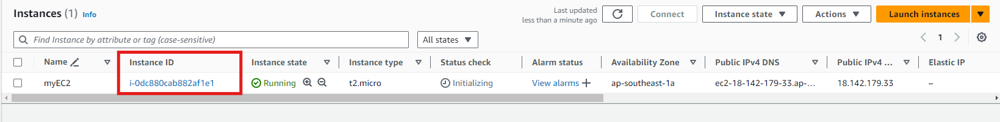

4. In default, our newly created EC2 Instance has no IAM Role yet.

   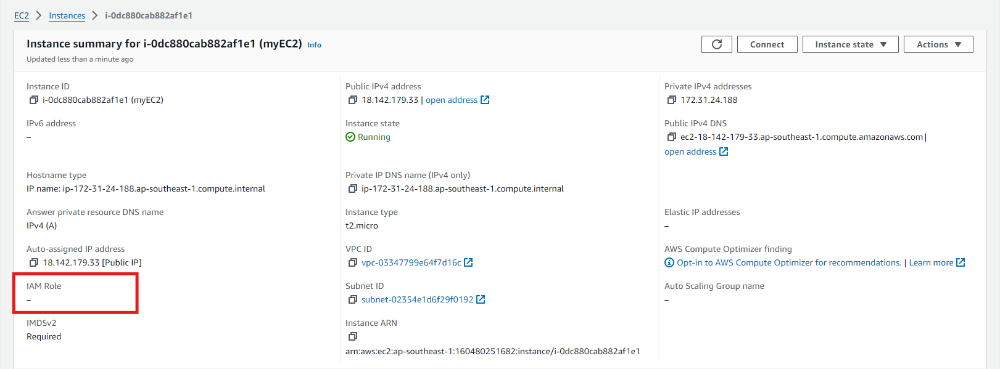
5. Click on the “Actions” dropdown menu, then select “Security” > “Modify IAM Role”.

   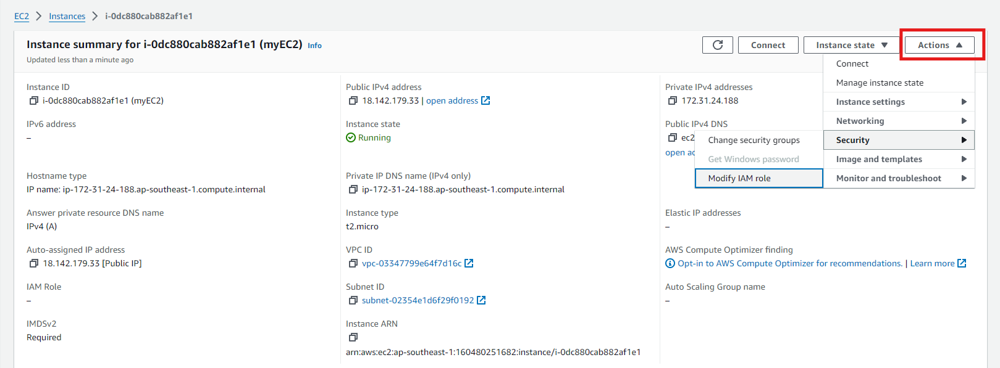

6. In the “Modify IAM Role” dialog:
- Select the IAM role you want to attach from the dropdown list. In this case, select the IAM role we created earlier and click `Update IAM Role`

   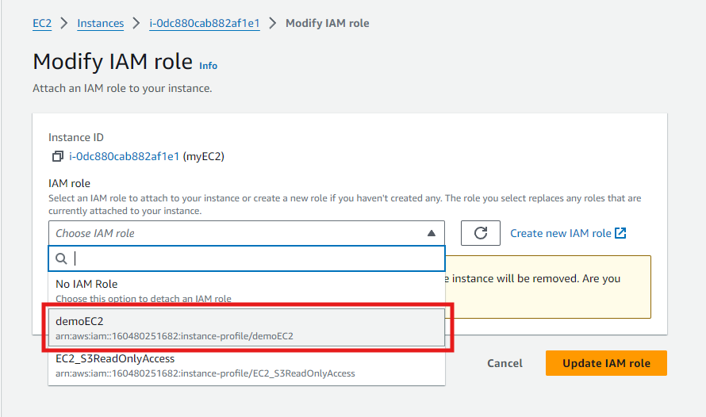

### Connecting to EC2 Instance
1. With your instance selected, click on the `Connect` button at the top of the page.

   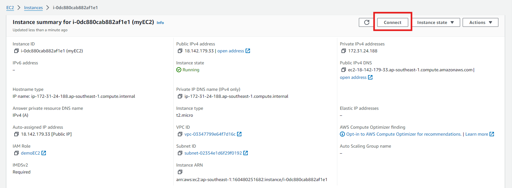

2. In the "Connect to Instance" Dialog, select the “EC2 Instance Connect” tab.
3. Ensure the Connection Type selected is the "Connect using EC2 Instance Connect".
4. Click the "Connect" button.

   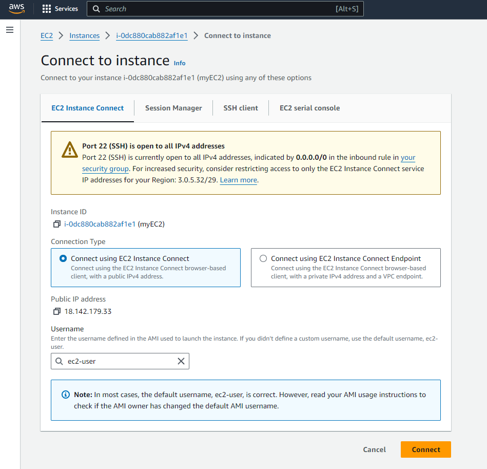

### Access Your Instance
1. A new terminal window will open with an SSH session to your instance.
2. You are now connected to your instance and can start working on it.

   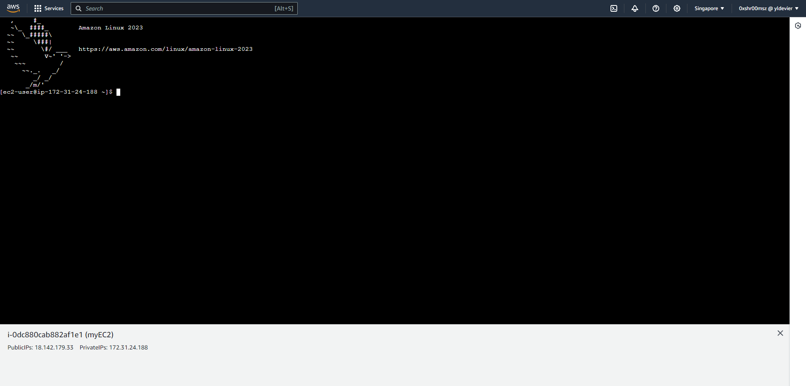

## **STEP 3: Demonstrate Role Usage**

### List S3 Buckets:
- Use the command below to list all S3 buckets accessible with the role:

     ```bash
     aws s3 ls
     ```

   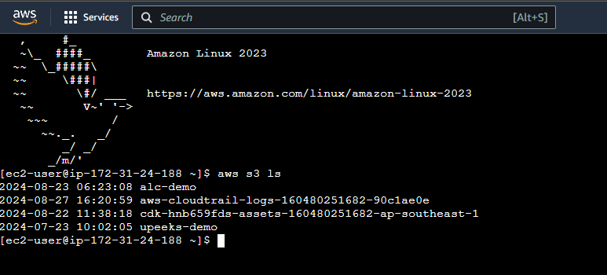
   
### Accessing S3 with the Role:  
- Go to S3 Dashboard and click the bucket we created to view the files. Let's try to download `alcnumber1.txt` or depends on the filename you uploaded.

   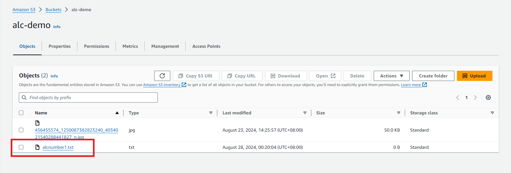

### Upload Files to the S3 Bucket
- Lets create a file first
   ```bash
   touch test.txt
   ```
- In the EC2 instance, let's try to upload a file to the S3 Bucket we created earlier.
   ```bash
   aws s3 cp test.txt s3://alc-demo/
   ```
   

   The permissions of the role we created is `ReadOnly`. ReadOnly permissions are designed to restrict actions to viewing and reading data only, which is why uploading files is not allowed under this permission set. 

### Download Files from S3 Bucket
- Let's download the file `alcnumber1.txt`
   ```bash
   aws s3 cp s3://alc-demo/alcnumber1.txt ./
   ```
   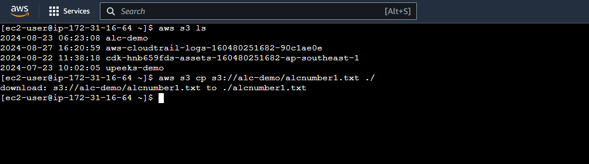

- We now have the `alcnumber1.txt` file inside our EC2 Instance.

   

## **STEP 4: Terminating EC2 Instance**
1. Select the EC2 instance

   

2. Click on the Instance State dropdown button at the top of the page.
3. Select "Terminate Instance" from the dropdown menu.

   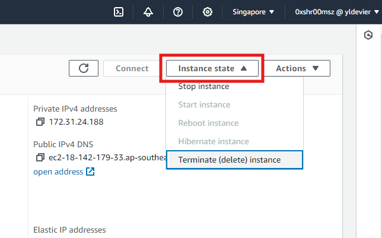


[Next >> IAM Policies](12%20-%20Simple%20Identity%20Policies%20in%20AWS.md)