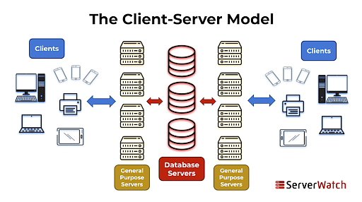
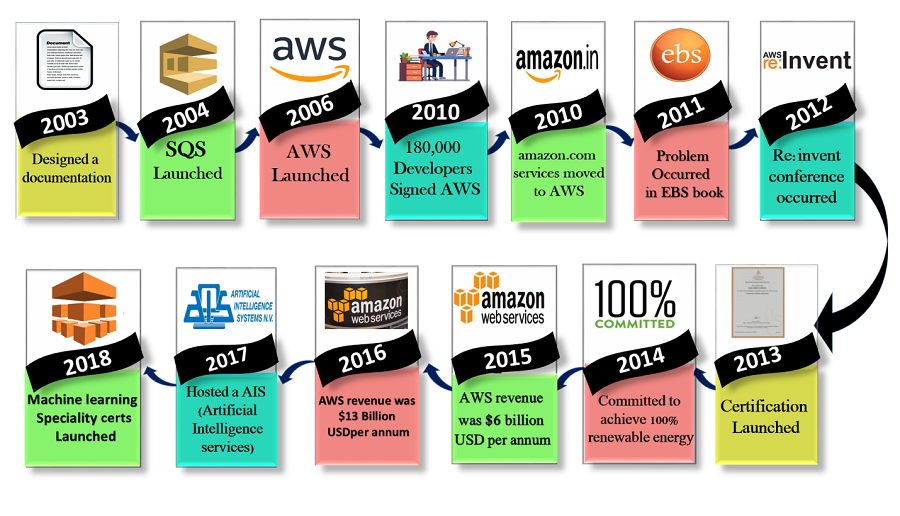

# Why AWS?: History of AWS's Emergence

## History: The Beginning of AWS
AWS emerged in the early 2000s from Amazon’s internal need to optimize and **scale its infrastructure**. At the time, Amazon realized that its e-commerce business required a significant amount of computing power, but these resources were often underutilized during non-peak periods. This led Amazon to explore ways to **capitalize on excess computing capacity**. The realization of their internal challenges and inefficiencies—managing infrastructure that could scale up for peak seasons and then remain idle during downtime—prompted the company to think of a broader solution. By the mid-2000s, the company recognized a gap in the market where other organizations were facing similar issues, and AWS was born to help businesses avoid the capital expense and complexity of managing their own IT infrastructure.  

## The Emergence of Cloud-Based Services
AWS represents a paradigm shift in how companies manage IT services. Rather than investing in physical servers or data centers, **businesses could now rent computing resources on demand**. AWS introduced this idea of a cloud-based service model that allowed companies to quickly scale up or down based on demand. This flexibility dramatically lowered the costs associated with IT infrastructure while allowing businesses to focus more on innovation rather than maintenance. The initial offerings, such as Simple Storage Service (S3) and Elastic Compute Cloud (EC2), gave businesses scalable storage and computing power with the added benefits of reliability, speed, and security.

## From Renting Servers to Offering a Comprehensive Ecosystem
AWS started primarily as a service to rent out excess server capacity through EC2. However, this was **only the beginning of a more extensive ecosystem**. Over time, AWS expanded from basic server renting to offering a wide array of services, including managed databases, machine learning, content delivery, networking, security, and developer tools. These services are now used by businesses globally to handle everything from basic web hosting to complex data analytics and artificial intelligence applications. AWS's success lies in its ability to offer more than 200 fully-featured services that cater to industries such as healthcare, finance, manufacturing, and entertainment.

---

### Key Milestones in AWS History

**2000-2003: The Idea**  
  In the early 2000s, Amazon faced internal challenges managing their own infrastructure. This led to the concept of offering excess computing capacity to other companies.

**2002: Early Web Services**  
  Amazon launched its first web services, such as the Amazon e-commerce service, but the full cloud concept wasn’t implemented yet.

**2004: AWS Development**  
  A small team led by Andy Jassy began working on the foundations of AWS. They aimed to create a platform that could help developers build applications more efficiently.

**2006: Official Launch of AWS**  
  AWS officially launched in 2006 with its first services, Simple Storage Service (S3) and Elastic Compute Cloud (EC2). These services allowed businesses to rent storage and computing power on demand.

**2007-2011: Growth and New Services**  
  AWS rapidly grew and expanded its services, including the introduction of Relational Database Service (RDS) in 2009, CloudFront for content delivery in 2008, and Elastic Block Store (EBS) in 2008.

**2012-2015: Global Expansion**  
  AWS expanded its global infrastructure with new data centers worldwide, establishing a robust presence in regions like Europe, Asia, and South America. During this period, it launched over 100 new services, including DynamoDB (2012) and Redshift (2013).

**2016: $10 Billion Milestone**   
  AWS hit $10 billion in annual revenue in 2016. This highlights its dominance in the cloud industry. New services like Lambda (serverless computing) also emerged during this time.

**2020-Present: Continuing Innovation**  
  AWS continues to dominate the cloud industry with innovations in AI, machine learning, and edge computing. It now offers more than 200 services across various sectors.
