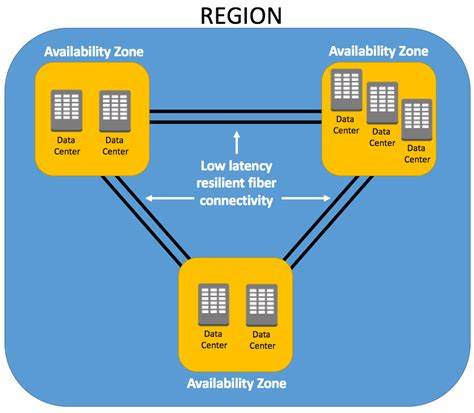

# Understanding AWS’s Architecture

Amazon Web Services (AWS) provides a vast and scalable cloud platform that enables companies to deliver services globally. To ensure high availability, fault tolerance, and low-latency access, AWS has built a robust global infrastructure. Below is the breakdown of its architecture.

## Regions

A **Region** is a geographically distinct area where AWS operates data centers. AWS offers multiple Regions around the world, and each Region is isolated from others to ensure data sovereignty and compliance. For example, AWS has Regions in North America, Europe, Asia-Pacific, and other continents.

### Purpose
Regions provide proximity to customers, help with legal and compliance requirements (such as GDPR in the EU), and offer disaster recovery by distributing resources across geographic locations.

### Common Regions
- US East (N. Virginia)
- Asia Pacific (Singapore)
- Europe (Frankfurt)

When deploying services on AWS, users choose which Region to deploy their resources in based on factors like latency, cost, and compliance.

## Availability Zones (AZs)

Each Region consists of multiple **Availability Zones (AZs)**. An Availability Zone is essentially a cluster of one or more data centers equipped with independent power, cooling, and networking.

### Purpose
Availability Zones are designed to be physically separated from each other to ensure fault tolerance. If one AZ experiences an outage, others in the same Region can take over, ensuring minimal disruption to services. For instance, deploying a web application across three AZs in the same Region allows it to remain operational even if one AZ fails.

### Usage
When building highly available applications, it's recommended to distribute workloads across multiple AZs to avoid a single point of failure.

### Examples
- **ap-southeast-1b (Singapore)**: This is one of the AZs within the AWS Region ap-southeast-1 (Asia Pacific, Singapore). The "b" indicates it is one of multiple zones within this region.
- **us-east-1a (Northern Virginia)**: us-east-1 is the AWS Region for Northern Virginia, a major hub for AWS services.
- **eu-west-1c (Ireland)**: The AWS Region eu-west-1 is based in Ireland, and eu-west-1c is one of its Availability Zones.

## Core AWS Services

### Compute
Compute services provide the backbone for processing power on AWS. These services allow you to run applications, perform calculations, and host servers in a scalable environment.

#### Importance to AWS Architecture
Compute services are essential for handling the dynamic workloads of modern applications.

#### Services
- **Amazon EC2 (Elastic Compute Cloud)**: Provides resizable virtual machines (instances) for running applications.
- **AWS Lambda**: A serverless compute service that runs code in response to events.
- **Amazon ECS (Elastic Container Service)**: A highly scalable container management service that supports Docker containers.

### Storage
AWS offers several storage solutions to securely store and manage data, from object storage to block storage and archival solutions.

#### Importance to AWS Architecture
Reliable and scalable storage is key for data persistence, disaster recovery, and regulatory compliance.

#### Services
- **Amazon S3 (Simple Storage Service)**: Object storage service for storing large amounts of unstructured data.
- **Amazon EBS (Elastic Block Store)**: Block storage for use with Amazon EC2 instances.
- **Amazon Glacier**: Low-cost archival storage for infrequently accessed data.

### Networking
AWS networking services provide the infrastructure to manage connectivity between AWS resources, the internet, and private on-premises environments.

#### Importance to AWS Architecture
Networking services are critical for creating highly available, secure, and fast network architectures.

#### Services
- **Amazon VPC (Virtual Private Cloud)**: Allows you to define a logically isolated section of the AWS Cloud to run AWS resources.
- **AWS Direct Connect**: Provides a dedicated network connection from your premises to AWS.
- **Elastic Load Balancing (ELB)**: Automatically distributes incoming traffic across multiple EC2 instances.

### Databases
AWS offers various types of databases, from relational to NoSQL, that are fully managed to simplify deployment and scaling.

#### Importance to AWS Architecture
Databases are foundational for handling transactional data, big data analytics, and operational workloads.

#### Services
- **Amazon RDS (Relational Database Service)**: Managed relational database service for databases like MySQL, PostgreSQL, and Oracle.
- **Amazon DynamoDB**: A NoSQL database for applications needing low-latency performance at scale.
- **Amazon Redshift**: Data warehousing service designed for fast, scalable analytics on structured data.

### Content Delivery
AWS provides services to deliver content efficiently and securely to users around the world.

#### Importance to AWS Architecture
Content delivery ensures fast and secure delivery of data, applications, and videos to a global audience with low latency.

#### Services
- **Amazon CloudFront**: Content delivery network (CDN) service that speeds up the distribution of static and dynamic web content.
- **AWS Global Accelerator**: Improves the availability and performance of your global applications by routing traffic to the best-performing AWS regions.

### Security

AWS provides security services that help protect data, applications, and the infrastructure.

#### Importance to AWS Architecture
Security is crucial for protecting sensitive data, ensuring compliance, and mitigating cyberattacks.

#### Services
- **AWS IAM (Identity and Access Management)**: Manages user access and permissions securely.
- **AWS Shield**: A managed Distributed Denial of Service (DDoS) protection service.
- **AWS Key Management Service (KMS)**: Helps manage the encryption keys used to encrypt data.

### Monitoring and Management
AWS offers tools to monitor and manage your resources, applications, and infrastructure.

#### Importance to AWS Architecture
Monitoring and management services help ensure the health and performance of your applications, reduce downtime, and troubleshoot issues in real-time.

#### Services
- **Amazon CloudWatch**: Monitors AWS resources and applications in real-time.
- **AWS CloudTrail**: Provides a history of AWS API calls for governance, compliance, and debugging.
- **AWS Config**: Tracks changes to AWS resources to ensure they comply with organizational policies.

### Elasticity and Scaling
AWS services offer the ability to automatically scale resources based on demand.

#### Importance to AWS Architecture
Elasticity ensures that applications can automatically adjust to fluctuating demands, reducing cost and ensuring efficient use of resources.

#### Services
- **Auto Scaling**: Automatically adjusts the number of EC2 instances based on traffic and load.
- **Amazon RDS Read Replicas**: Automatically scale out read-heavy workloads.
- **AWS Elastic Beanstalk**: Automatically scales your web application based on traffic demands.

### Serverless Architecture

Serverless architecture allows developers to build and run applications without managing the underlying infrastructure.

#### Importance to AWS Architecture
Serverless services remove the need for server management, enabling rapid application development and scaling, as well as cost-efficiency.

#### Services
- **AWS Lambda**: Executes code in response to triggers without provisioning or managing servers.
- **Amazon API Gateway**: Fully managed service for creating, publishing, and maintaining APIs.
- **AWS Step Functions**: Coordinates the components of distributed applications using workflows.

## Key Benefits of AWS Global Architecture

1. **Scalability**: Easily scale resources up or down in any Region or AZ.
2. **Low Latency**: Thanks to the global distribution of Edge Locations, AWS services can be accessed with low latency from almost anywhere.
3. **High Availability**: The use of multiple AZs and Regions ensures that AWS services remain available even in the case of localized outages.
4. **Compliance and Governance**: With Regions worldwide, AWS helps companies meet data residency and compliance regulations.
5. **Disaster Recovery**: AWS supports robust disaster recovery plans using cross-Region replication and backup services.

AWS’s global infrastructure is built for flexibility, scalability, and reliability, making it one of the most sophisticated cloud platforms available today. This structure allows businesses to deploy resilient, globally distributed applications while minimizing latency and ensuring compliance with local regulations.
