# Guide to Launching Your First EC2 Instance

In the AWS Management Console, type `EC2` in the search bar or locate it under the **Services** menu. Click on **EC2** to open the EC2 Dashboard.

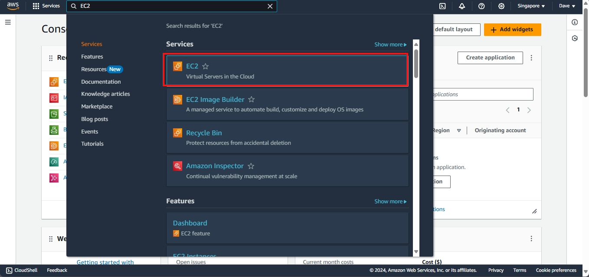

#### 1. Launching the Instance

On the EC2 Dashboard, click the **Launch Instance** button to start the instance creation process.

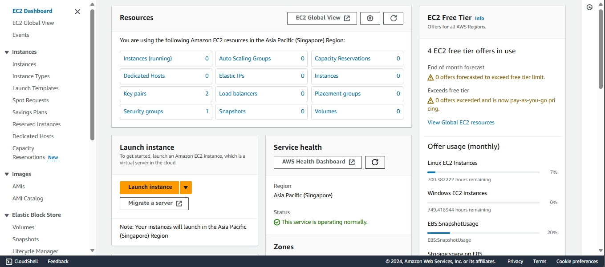

#### 2. Naming and Tagging Your Instance  
Create a name for your instance. If you want to add a tag, click on **Add additional tags**.

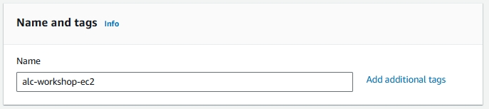

**Tags** help in identifying, organizing, and managing your instances, especially when dealing with multiple resources.  
*Example:*

- **Key:** Backup
- **Value:** ServerBackup
- **Resource Type:** EBS Volume

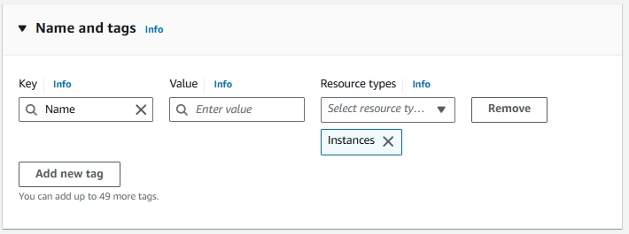

#### 3. Selecting an AMI (Amazon Machine Image)

AMIs are preconfigured templates for your instances, containing the operating system and software you want. Choose ‘Amazon Linux’ for this workshop.

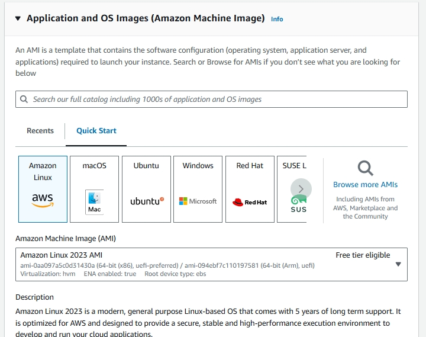

##### 3.1. Choose ‘64-bit (x86)’ for the computer architecture.

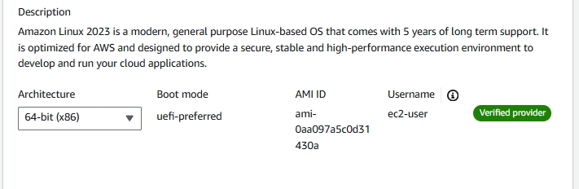

#### 4. Choosing an Instance Type
    
An instance type in Amazon EC2 defines the virtual hardware for your server, such as CPU, memory, storage, and network capacity. Different types are suited for different workloads. 

- **Choose t2.micro** for this one as it's affordable, Free Tier eligible, and offers on-demand usage where you only pay for what resources you use.

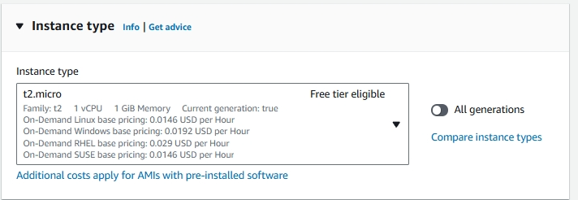

#### 5. Configuring a Key Pair

A key pair in Amazon EC2 consists of a public and private key used for securely connecting to your instance. AWS provides the public key for the server, while you download the private key as a `.pem` file.  
Let's create a new key pair.

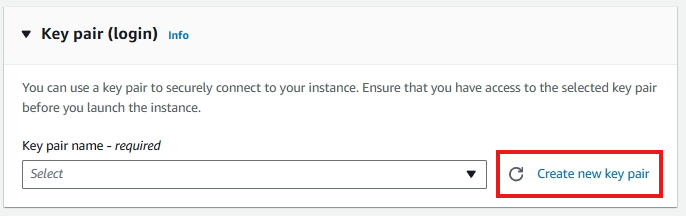

Let's name it `keypair` and click **Create Key Pair**. It will automatically download. Move it in a folder where you can easily access it, as you will need it to connect to your instance later.

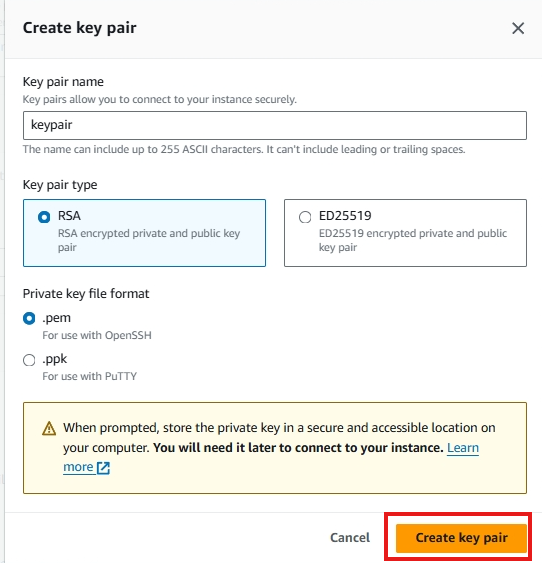

#### 6. Configuring Networking

These are some minute networking details for your instance.

- **Network:** The network defines the Virtual Private Cloud (VPC) where your instance will reside, isolating your server and enabling you to control it.
- **Subnet:** A subnet is a segment of a VPC's IP address range, allowing you to group resources logically by having an efficient network structure.
- **Auto-assign Public IP:** This setting automatically assigns a public IP address to your instance, enabling direct internet access.
  
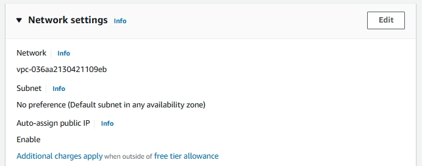

#### 7. Configuring Security Groups

Security groups act as virtual firewalls for your Amazon EC2 instances. They control inbound and outbound traffic based on defined rules. Choose **create security group** and check **allow SSH traffic**. This allows us to connect to our instance later.

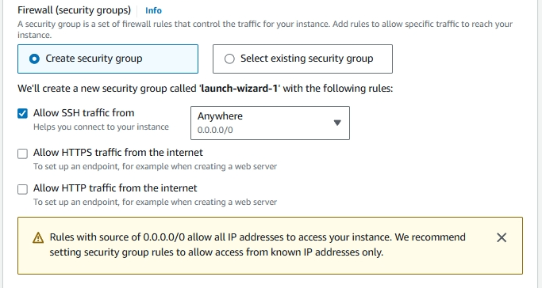

#### 8. Configuring Storage

This will specify the storage options of your instance. Leave the option as it is. Here are the details you need to know:

- **1x:** This indicates that there is one volume attached as the root volume to the EC2 instance.
- **8 GiB:** This specifies the size of the root volume, which is 8 GiB (Gibibytes). This is the amount of storage allocated for the instance's operating system and any applications installed on it.
- **gp3:** This indicates the type of storage volume. gp3 is a type of General Purpose SSD (Solid State Drive) that offers a balance of price and performance. It provides faster and more consistent performance compared to standard magnetic disks.
  
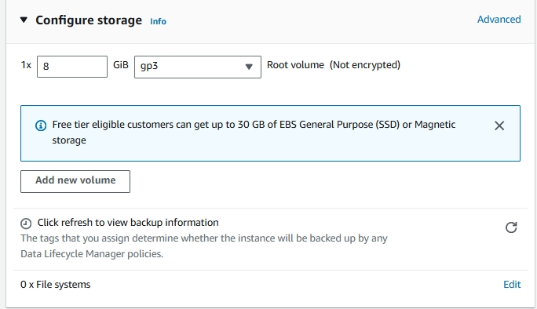

#### 9. Reviewing and Launching

Review your configured instance. If everything looks correct, click **launch instance**.

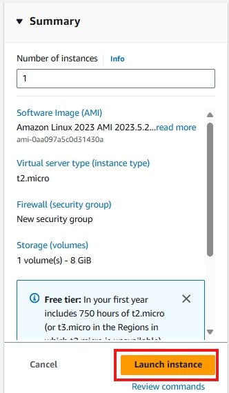

#### 10. Accessing the Instance

You will proceed to this page, just click the instance ID.  
An **Instance ID** is a unique identifier assigned to each instance upon launch. This ID is used to track, manage, and connect to specific instances. Think of it like a unique ID number for each person. Each EC2 instance has its own **Instance ID** for identification.

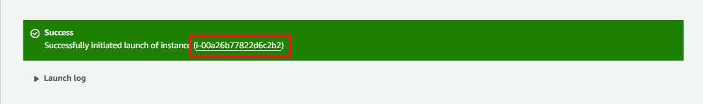

The instance will take time to initialize. It will usually take 2-3 minutes. 

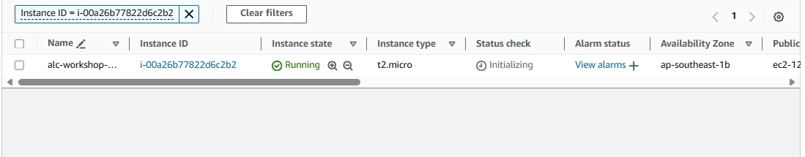

You can see the instance is ready if the status is on 2/2 checks passed.
To know what this mean we need to know these concepts. Click on status and alarms.
- **System reachability check**: Verifies the underlying AWS infrastructure is healthy.
- **Instance reachability check**: Ensures the specific EC2 instance is operational and reachable.
  
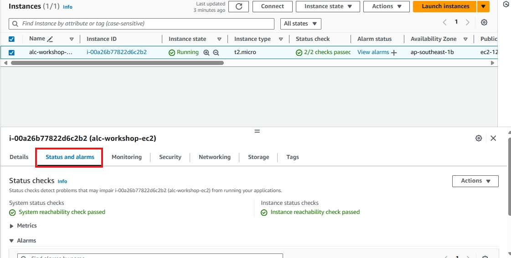

Click on the instance ID to view the details. 

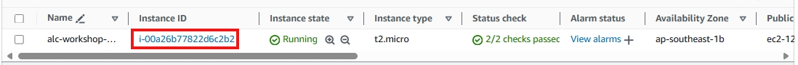

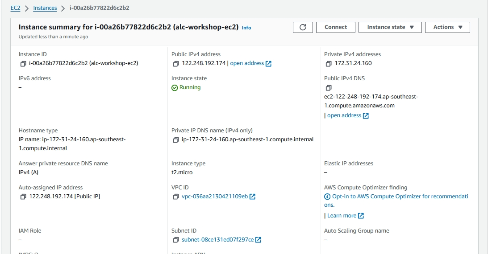

#### Congratulations!

You have successfully launched your first instance. Welcome to the world of cloud computing and painful billings!

#### Cleaning Up:
- **Terminating the instance:** To avoid unnecessary charges, remember to terminate the instance when you're done using it. You can do this by selecting the instance and clicking **Actions** > **Instance State** > **Terminate**.

#### Optional: Setting up RDP AMI Instance

- **RDP:** Remote Desktop Protocol - This will provide us a graphical interface that lets you interact with the remote desktop, just like you would on your local machine. This will be useful if you want to use Windows-based server. Lets test this later.

Choose **Microsoft Windows Server** as the AMI base.  

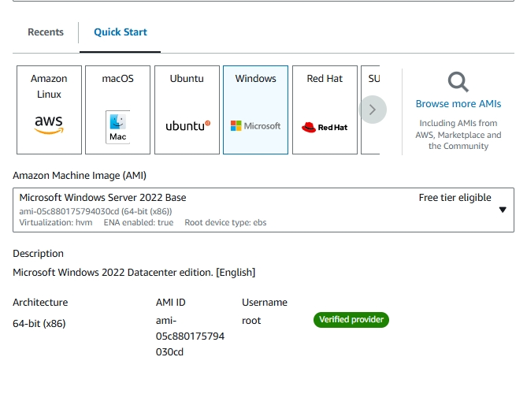

Check the instance summary, then you're done!  

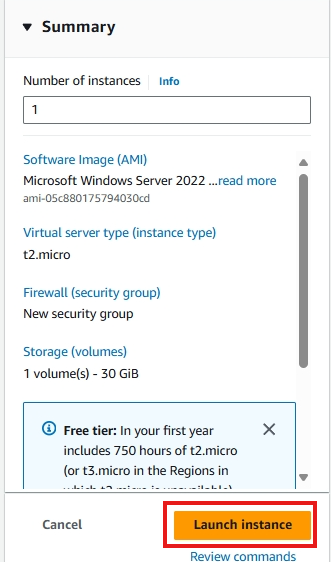

