# Making an EC2 Instance using AWS CLI
AWS Command Line Interface (CLI) allows you to interact with AWS services programmatically.

## **What are IAM Access Keys?**

IAM Access Keys consist of two components: an _**Access Key ID**_ and a _**Secret Access Key**_. These keys are analogous to a username and password and are used to sign programmatic requests to AWS services.

The **Access Key ID** is a unique identifier, while the Secret Access Key is a secret that should only be known by the user who owns the key.

IAM Access Keys are required when you interact with AWS services via the AWS CLI, SDKs, or APIs. They are essential for tasks like launching EC2 instances programmatically.

## **Why do we need Access Keys?**

### 1. Security and Access Control  
   - **Non-Root Access:** It's a best practice to avoid using root account credentials. Instead, you can create IAM users with Access Keys and specific roles/permissions to reduce risk.
   - **Granular Permissions:** You can assign precise permissions to IAM users, following the principle of least privilege, and ensure the Access Keys only allow specific actions or access to certain AWS resources.  

### 2. Programmatic Access  
   - **APIs and SDKs:** AWS SDKs and APIs rely on Access Keys for programmatic access to AWS services.  
   - **Command Line Interface (CLI):** The AWS CLI uses these keys for authentication when managing AWS resources from the command line.

### 3. Automating  
   - **CI/CD Pipelines:** Automation tools like Jenkins or GitLab use Access Keys to authenticate and automate tasks in your AWS account, including launching EC2 instances.

## How to Create Access Keys in the Management Console
### 1. Navigate to the IAM Service
In the AWS Management Console, search for "IAM" and click on the IAM service.

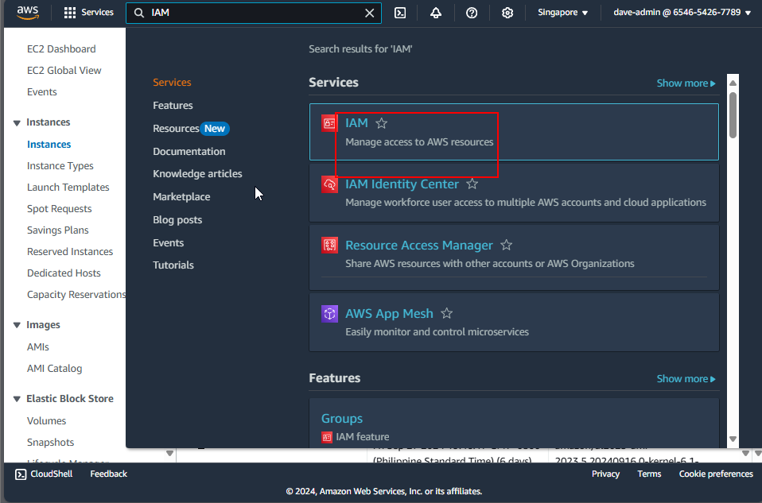

### 2. Select a User
In the "Users" section, click on the username you created.

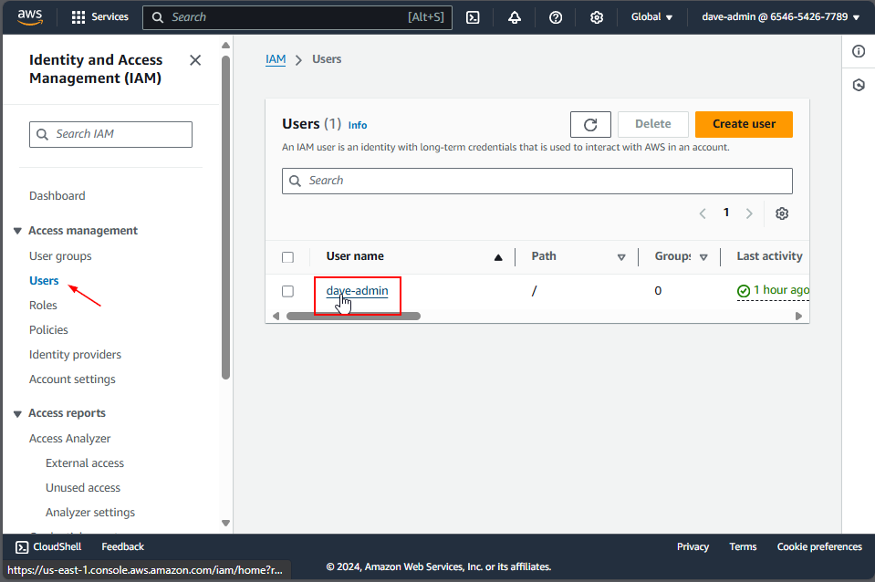

if you don't have one, refer to this guide
https://awsccupmindanao.github.io/knowledge_base/Workshops/Security/First%20Line%20of%20Defense/06%20-%20IAM%20Users%20and%20ARNs/#step-1-go-to-your-aws-console-and-open-iam-dashboardconsole

#### 2.1 Create Access Keys Using the Root Account (Optional)
If you do not have an IAM user, you can use your root account to create access keys. However, it’s important to note that using root account credentials is not a best practice due to security risks. If you choose to proceed, follow these steps:

1. Log in to the AWS Management Console using your root account credentials.
   
2. Click on your account name in the top right corner and select My Security Credentials.
   
3. In the Access Keys section, you can create access keys for the root account by clicking on Create New Access Key.

### 3. Create Access Keys
Once a user is selected, create an access key by clicking the **Create Access Key** button.

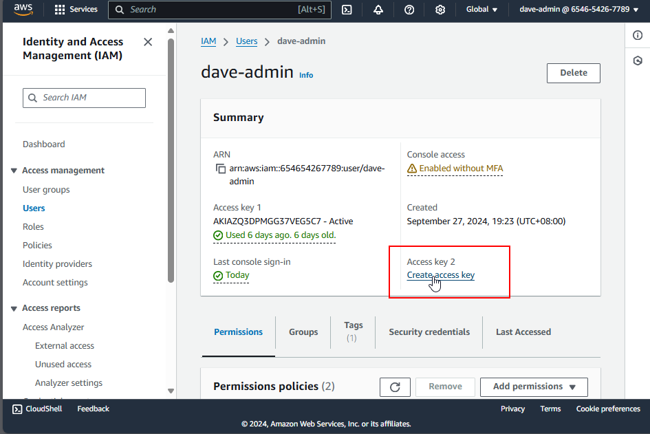

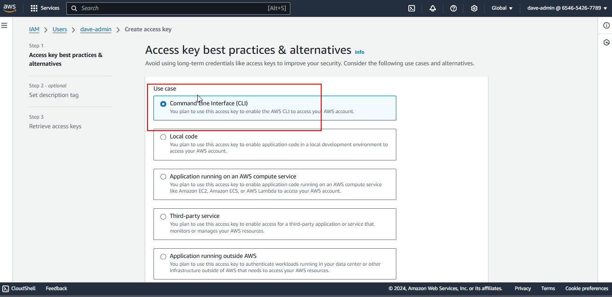

### 4. Download the Access Key
- Download the `.csv` file or copy the **Access Key ID** and **Secret Access Key** immediately.
- Remember: AWS does not store the Secret Access Key, so if you lose it, you will need to create a new one.

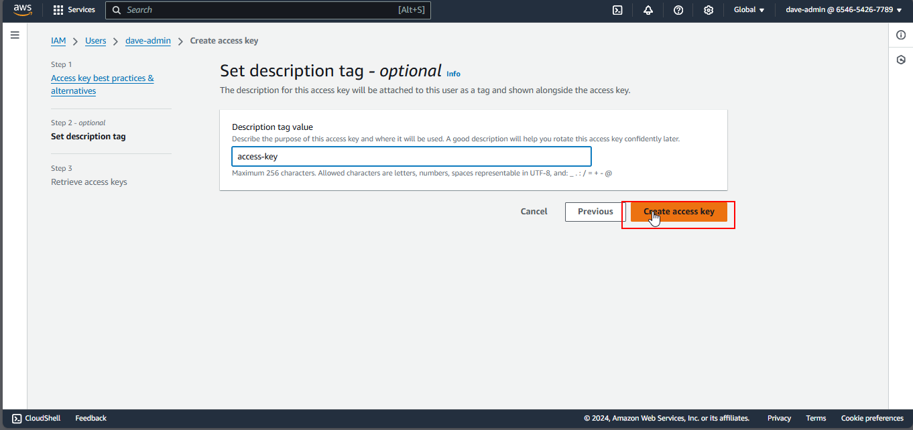

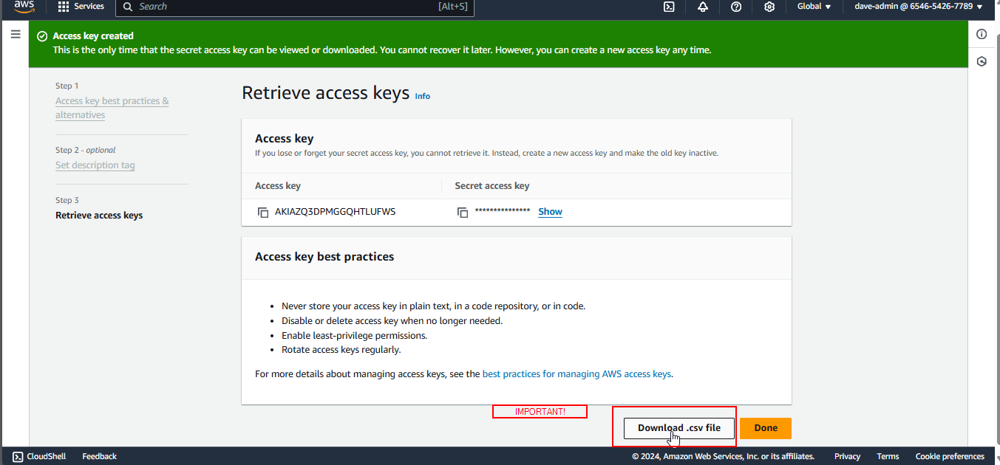

## **How to Install and Configure AWS CLI**

To interact with AWS services programmatically, you’ll need to install the **AWS CLI** and configure it with your IAM Access Keys.

### **Step 1: Install unzip (Linux or WSL)**

```
sudo apt install unzip 
```

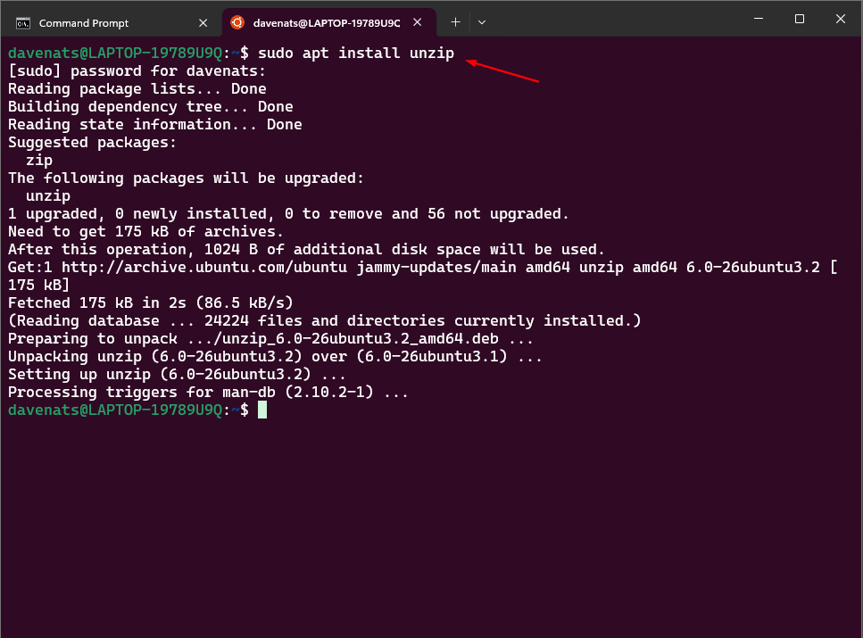  

This command installs the unzip utility, which is required to extract the AWS CLI installation files.

### Step 2: Download and Install AWS CLI

```
curl "https://awscli.amazonaws.com/awscli-exe-linux-x86_64.zip" -o "awscliv2.zip"

unzip awscliv2.zip

sudo ./aws/install
```

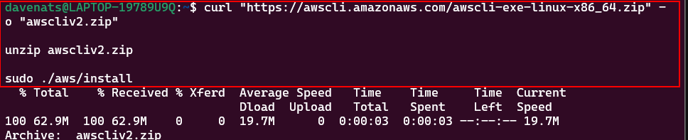

### Step 3: Verify AWS CLI Installation

```
aws --version
```


## Step 4: Configure AWS CLI with IAM Access Keys

```
aws configure
```

Upon running the command, you'll be prompted to enter your credentials:  

```
AWS Access Key ID [None]: YOUR_ACCESS_KEY_ID

AWS Secret Access Key [None]: YOUR_SECRET_ACCESS_KEY

Default region name [None]: [click enter]

Default output format [None]: [click enter]
```

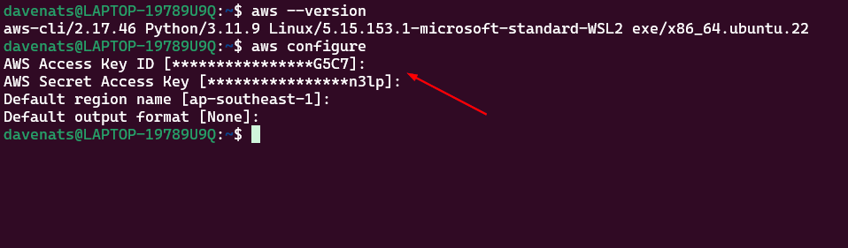

This sets up your default profile to authenticate your requests to AWS.


## **Creating an EC2 Instance Using AWS CLI**

Once AWS CLI is configured, you're ready to create an EC2 instance. Here's how:

### Step 1: Launch the EC2 Instance  

Use the following command to launch a t2.micro instance with the name 'awscli-instance', using the default security group and a key pair pemfile named 'keypair' that we made earlier (just replace the keypair name with your own). You can also omit the --key-name command if you dont want to put one: 

image-id as: ami-0aa097a5c0d31430a
This is the Amazon Linux 2023 AMI, the one we used earlier. 

```
aws ec2 run-instances \
    --image-id ami-0aa097a5c0d31430a \
    --instance-type t2.micro \
    --key-name keypair \
    --security-group-ids default \
    --tag-specifications 'ResourceType=instance,Tags=[{Key=Name,Value=awscli-instance}]'
```

if you dont want to have a keypair, you can remove the --key-name command.

```
aws ec2 run-instances \
    --image-id ami-0aa097a5c0d31430a \
    --instance-type t2.micro \
    --security-group-ids default \
    --tag-specifications 'ResourceType=instance,Tags=[{Key=Name,Value=awscli-instance}]' 
```

You will see the instance details after it is succesfully created.

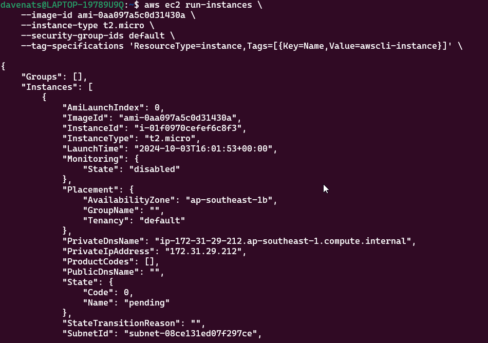


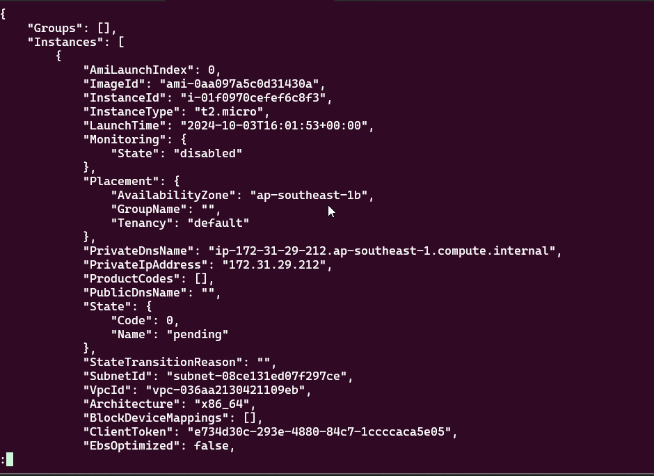


use `q` if you want to stop viewing the instance detail.

### Step 2: Verify the status of the instance

This command will show all the instances in the region, including the status of the instance you just created in a table format.

```
aws ec2 describe-instance-status --include-all-instances --output table
```

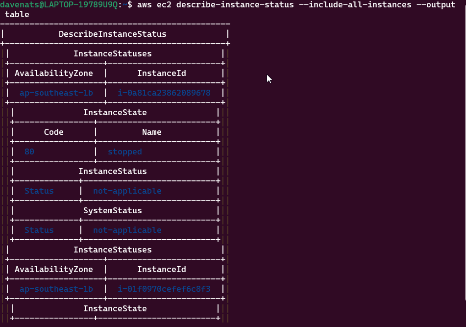


or to view with the instance name

```
aws ec2 describe-instances \
    --query 'Reservations[*].Instances[*].[InstanceId, Tags[?Key==`Name`].Value]' \
    --output table
```

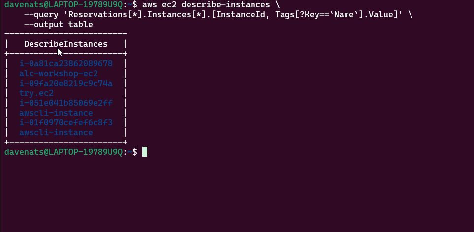

use `q` if you want to stop viewing the instances.  

You can check the synopsis of all the query avaialable here
https://awscli.amazonaws.com/v2/documentation/api/latest/reference/ec2/describe-instance-status.html

or if you want to fully navigate ec2 commands using aws cli, you can check the documentation here
https://docs.aws.amazon.com/cli/latest/reference/ec2/