# Connecting to your instance

After launching your EC2 instance, follow these steps to connect:

#### 1. Start by Clicking the Instance ID

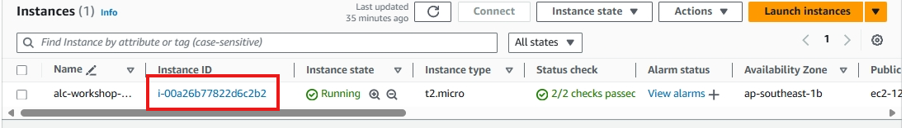

#### 2. Access Instance Details

After selecting your instance, you'll see all the details pertaining to it. To connect to your instance, click the **Connect** button on the upper right-hand corner of the page.

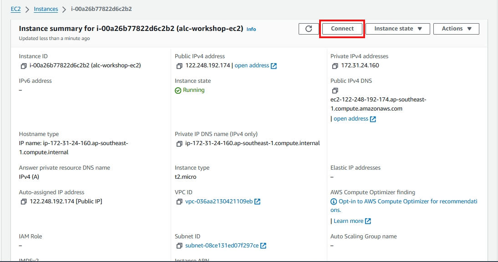

#### 3. Choose a Connection Method

There are four primary ways to connect to your instance:

1. **EC2 Instance Connect**  
2. **SSH Client**  
3. **Remote Desktop Protocol (RDP)** - for Windows instances only.
4. **Session Manager**  

Let's do the first 3 methods for this workshop.

---

## Method 1: EC2 Instance Connect

**EC2 Instance Connect** allows you to connect to your instance directly through your browser.

- Select **EC2 Instance Connect** as the connection method.
- Use the **Public IPv4 address** of your instance.
- Make sure your **username** is set to the default (`ec2-user` for Amazon Linux, `ubuntu` for Ubuntu).
- Click **Connect**.

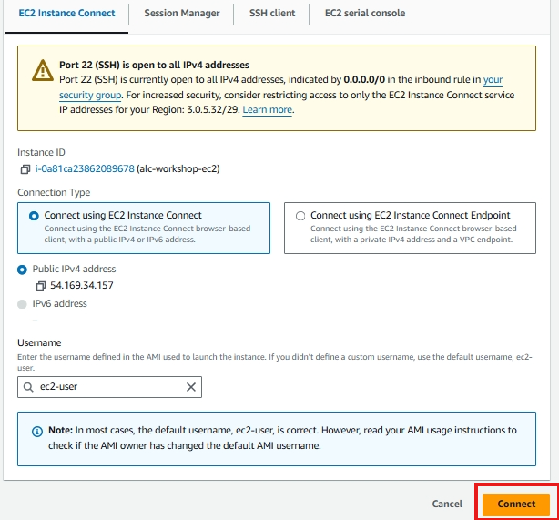

This will open a browser-based CLI that allows you to interact with your instance without needing an SSH key pair.

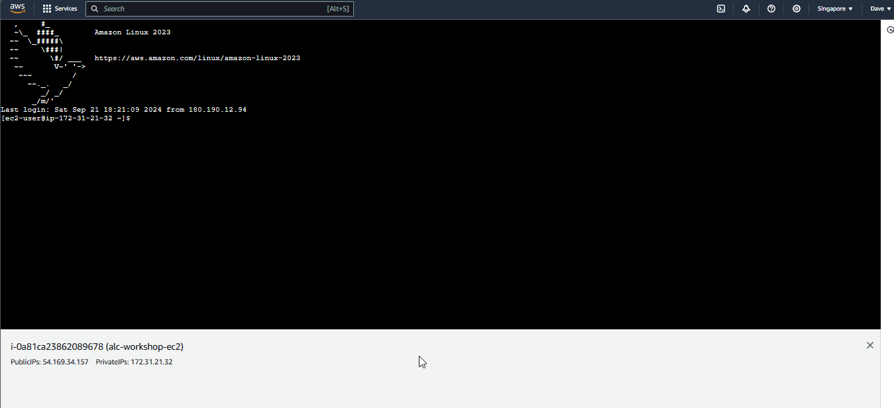

---

## Method 2: SSH Client

Using an **SSH Client** is one of the most common ways to connect to an EC2 instance, especially for Linux-based instances.

1. Make sure you have an SSH key pair created during the instance launch.
2. Download the `.pem` private key file if you haven't already.
3. Get the location of your `.pem`. If you let it download by itself. It is probably in your `Downloads` folder.  

Copy the pem file to your home > user folder.  

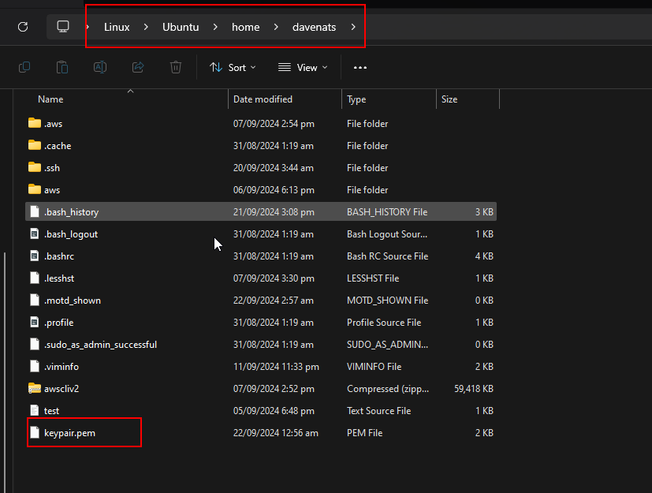

Do this command to make the pem file secure. This will prevent unauthorized access to the file by making it read only.
`chmod 400 "keypair.pem"`  

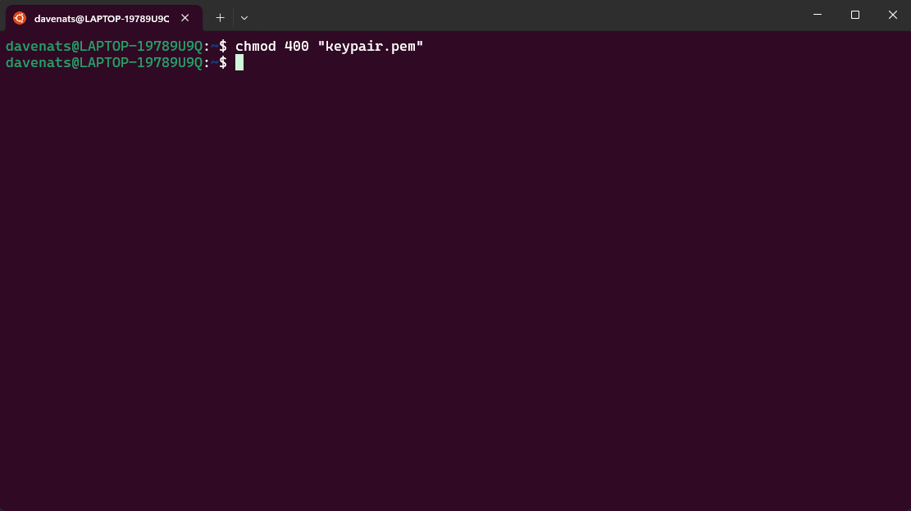

Lets connect to our instance, do `ssh -i keypair.pem ec2-user@<your-instance-public-ip>`. Replace `your-instance-public-ip` with the **Public IPv4 address** of your instance.

Or we can just simply copy the command from the AWS console.

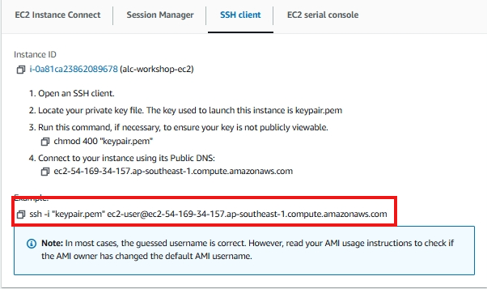

Paste it on your terminal and press enter. Just choose yes as the answer to the prompt.

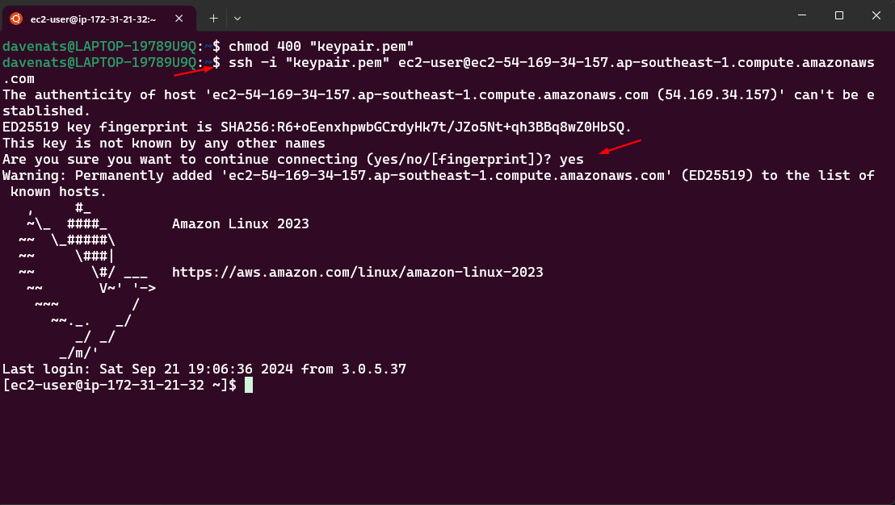

You are now connected to your instance using SSH Client.

---

## Method 3: Remote Desktop Protocol (RDP) (For Windows Instances Only)

**RDP** is used to connect to Windows instances. Follow these steps to use RDP:

1. Click on the **Connect** button at the top of the instance details page.
2. Select the **RDP Client** tab.
3. Click on **Get Password**.

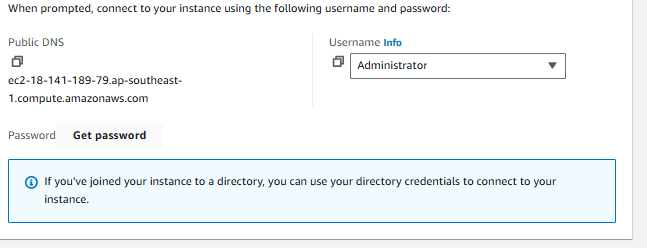

4. Click **Browse** and select your `.pem` file (the key pair you created). Then click **Decrypt Password**.

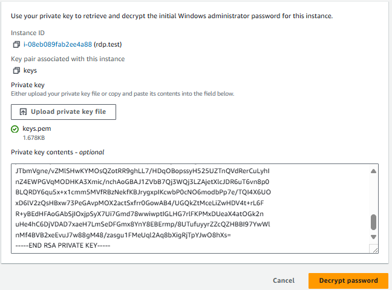

5. Note the Administrator **password** that is displayed. Lets copy that.

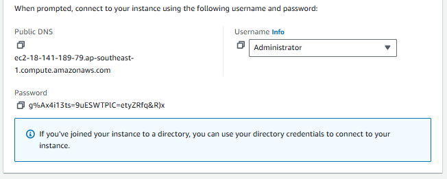

6.  Still in the **RDP Client** tab, click on **Download Remote Desktop File**. This will download an `.rdp` file to your local machine.

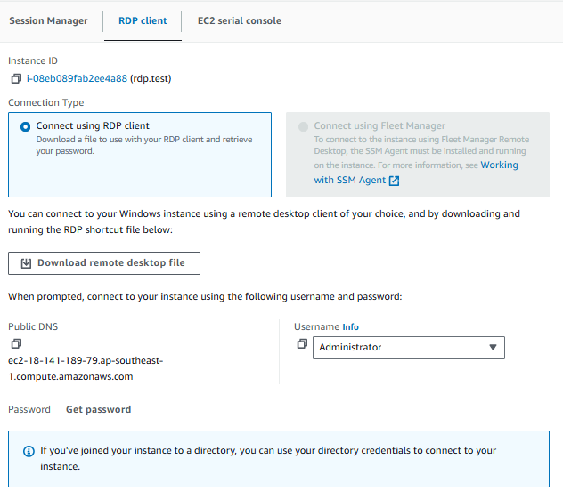

7.  Locate the downloaded `.rdp` file on your computer and double-click it. This will open the Remote Desktop Connection application.
   
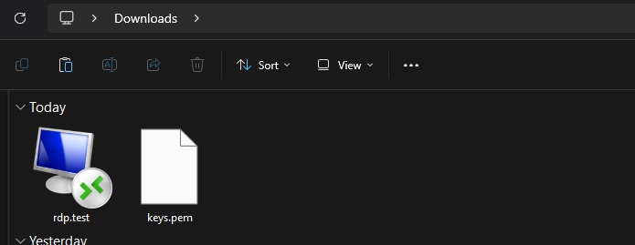

There will be a prompt after that, just click connect.

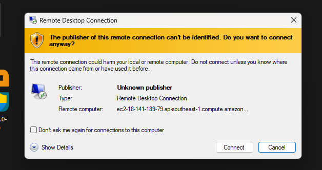

8. Enter the administrator passworrd you copied earlier. The username is `Administrator`. Click **OK** to connect.

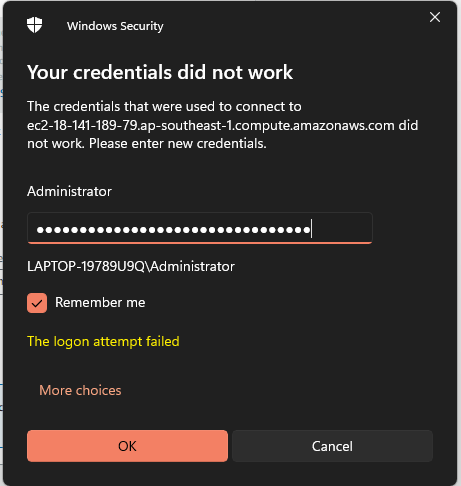

9.  You may receive a warning about the identity of the remote computer. Check the box to not be prompted again (if you wish) and click **Yes** to continue.

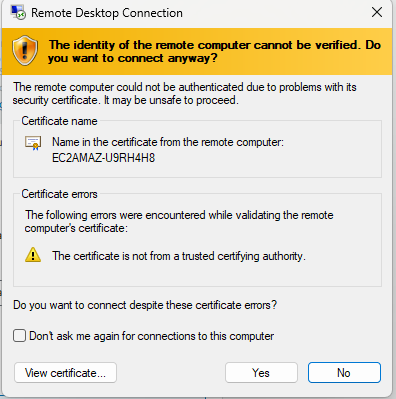

Congratulations! You are now connected to your Windows EC2 instance via RDP. You can now use it as you would a local Windows machine.

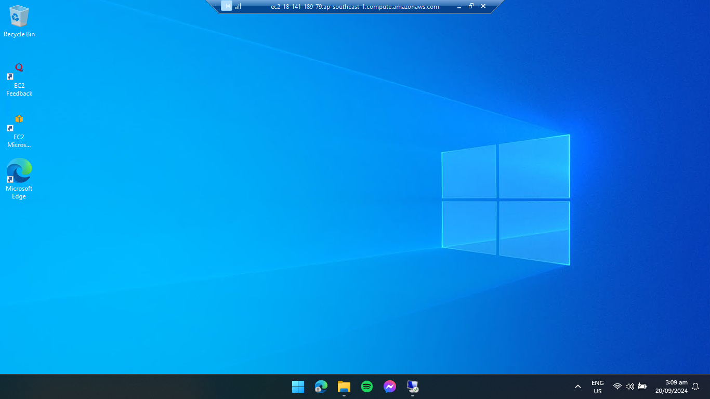

---

You can now connect to your EC2 instance using one of the above methods. Whether through a browser, SSH client, or RDP, AWS provides flexibility based on your needs and the instance's operating system.
