# Apache Web Server Setup on EC2 instace

## 1. Install the Apache Web Server
Apache is an open-source web server that processes HTTP requests and serves web content. Run the following command to install Apache:

```
sudo yum install httpd
```

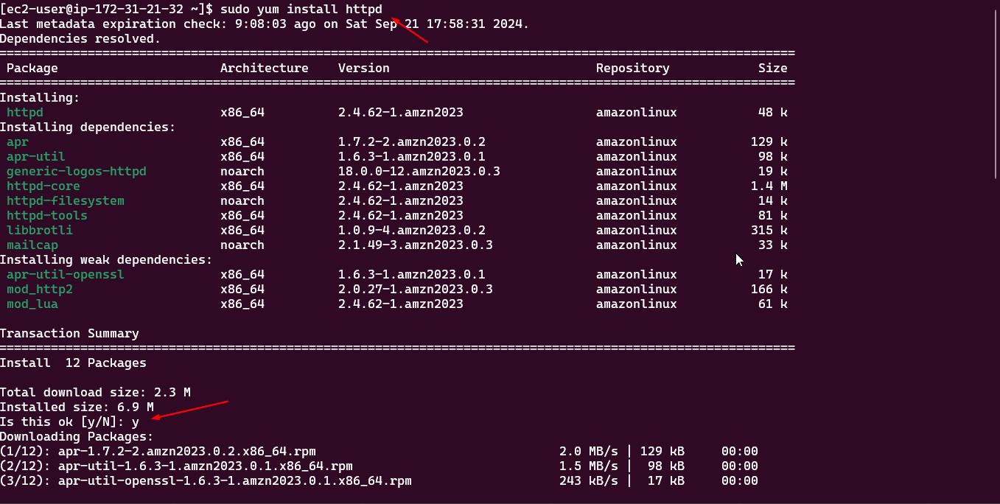

## 2. Start the HTTPD Service
The following command starts the Apache (`httpd`) service, allowing the web server to handle incoming requests:

```
sudo service httpd start
```

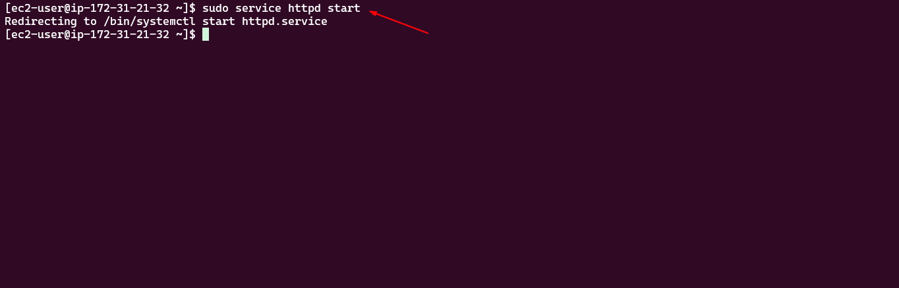

## 3. Enable Apache to Start on Boot
To ensure Apache starts automatically during system boot, run the following command:

```
sudo chkconfig httpd on
```

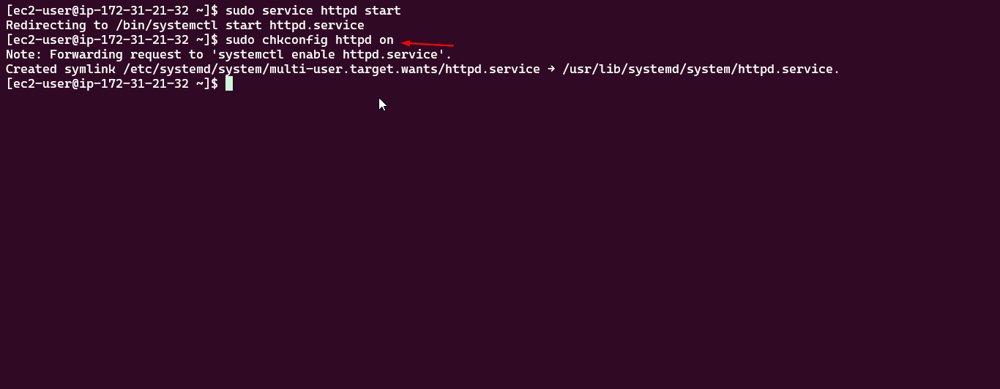

## 4. Switch to Root User
The command `sudo -i` allows a user to switch to the root user (the superuser) with full administrative privileges:

```
sudo -i
```

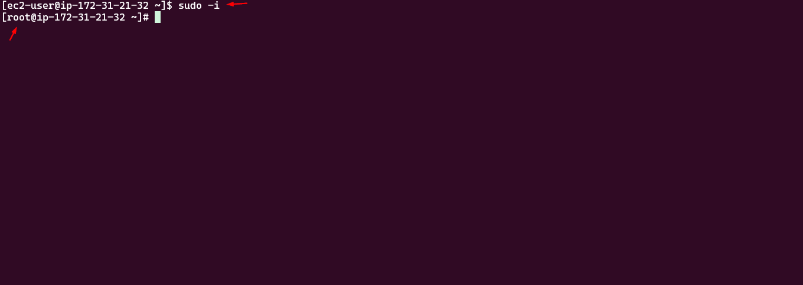


## 5. Navigate to the Apache Web Directory
Navigate to the directory where Apache will look for the `index.html` file (the default directory):

```
cd /var/www/html
```

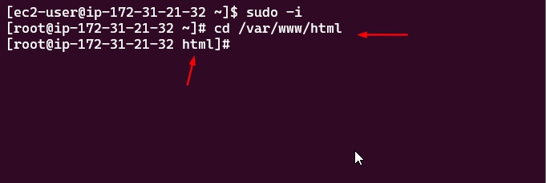

## 6. Create an `index.html` Page
Create a simple `index.html` file:

```
touch index.html
```

Verify the file exists by listing the directory contents:

```
ls
```

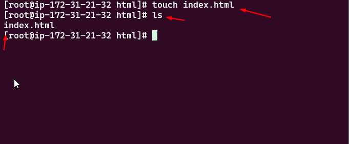

## 7. Edit the `index.html` File
Use `vim` or `nano` to add content to the `index.html` file:

```
vim index.html
# or
nano index.html
```
For vim: Do press `i` to enter insert mode and enter the following content:
```
Hello World!
```


Save and exit the editor by pressing `Esc`, typing `:wq`, and pressing `Enter`.


## 8. Find Your Instance Public IPv4 Address
In the AWS EC2 console, click the instance ID to find its details. Copy the Public IPv4 address.

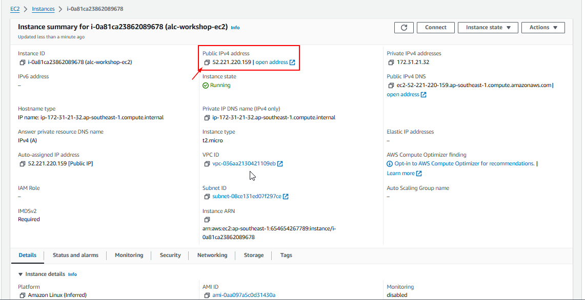

## 9. Test the Web Server
Open a browser and navigate to:

```
http://<your-public-ipv4-address>
```

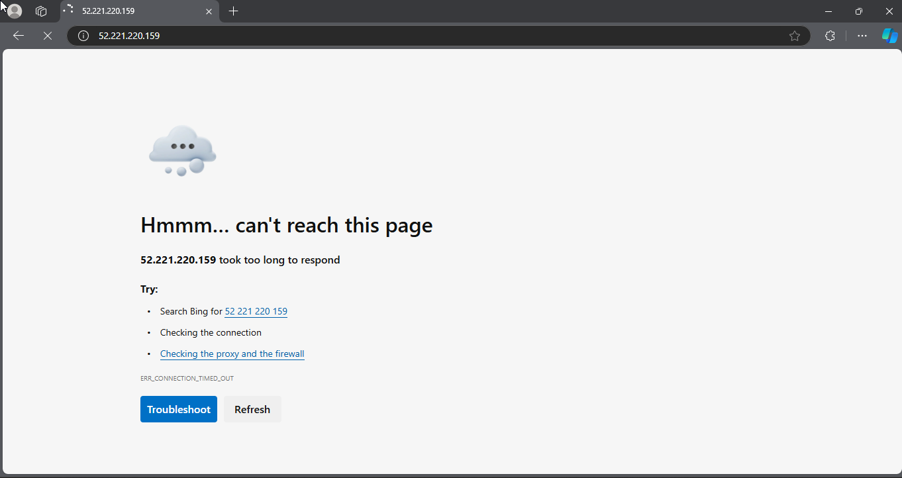

**If the website is not accessible, this means that there is a problem with our security group settings. We need to modify the security group settings to allow incoming traffic on port 80 (HTTP).**

## 10. Modify Security Group Settings
Scroll down to the "Security" section, and click on your security group.

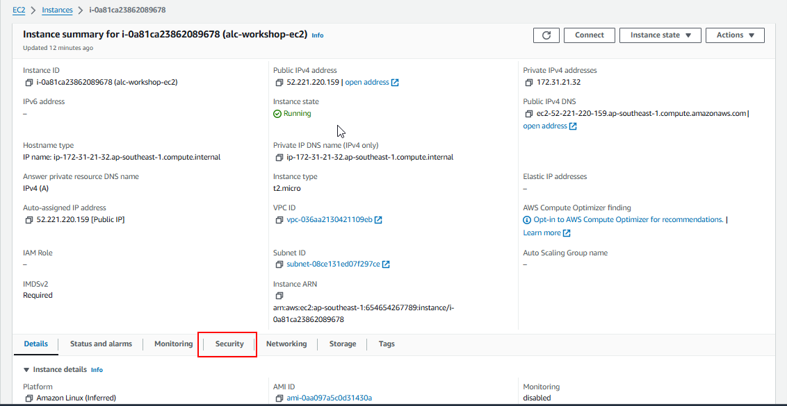

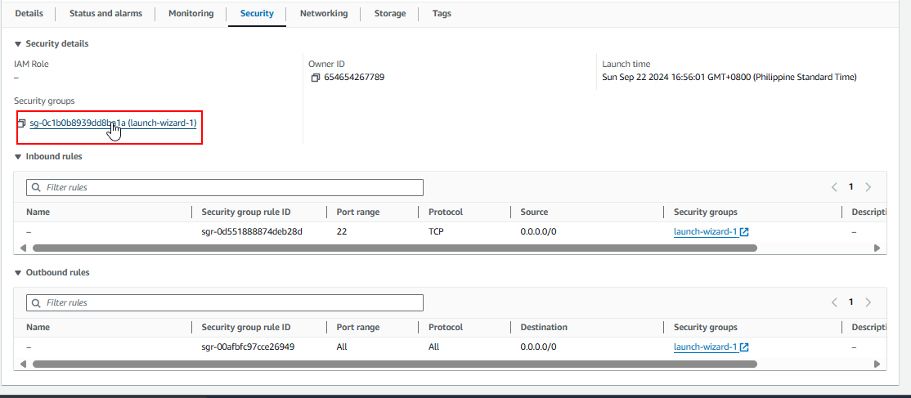

## 11. Edit Inbound Rules
Click **Edit Inbound Rules** to control incoming traffic to your server.

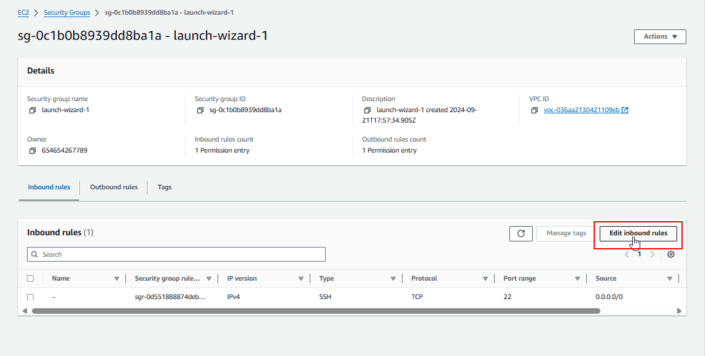

## 12. Allow Incoming Traffic on Port 80
Add a rule to allow incoming traffic on port 80 (HTTP). Ensure that traffic is allowed from any IP address (making it publicly accessible over the web).

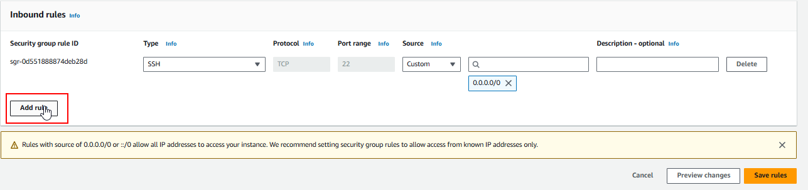

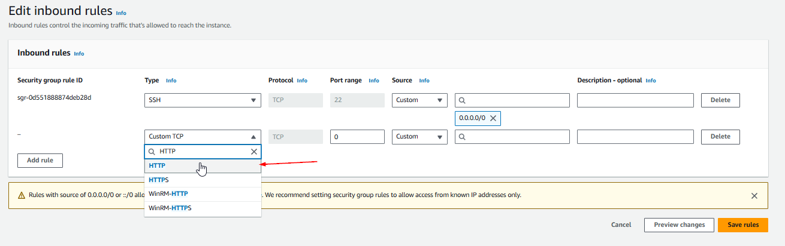

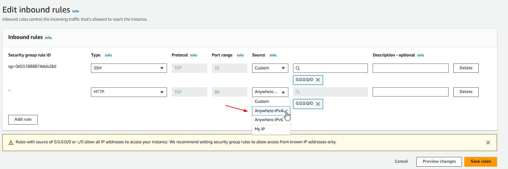

Save the changes.

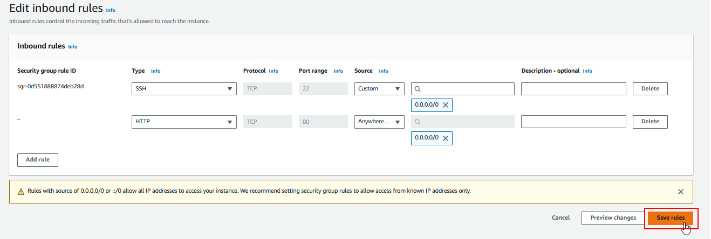

## 13. Revisit the Public IPv4 Address
Visit your public IPv4 address in a browser again. Your Apache web server should now be accessible.

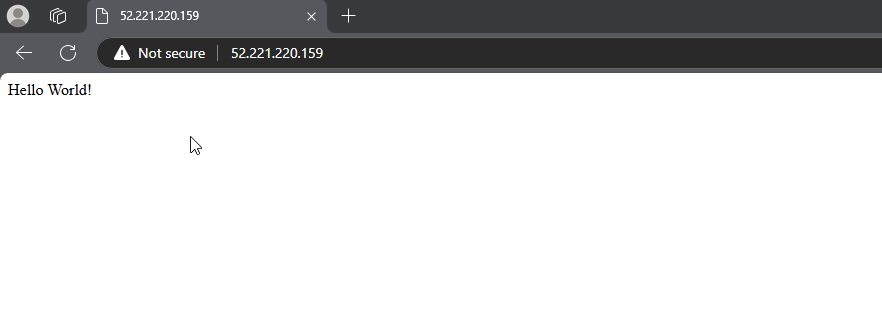

## 14. Customize Your Website
For funsies, copy-paste your favorite static HTML website into this server and watch it run! Better if it had external pictures or videos to see if it works.

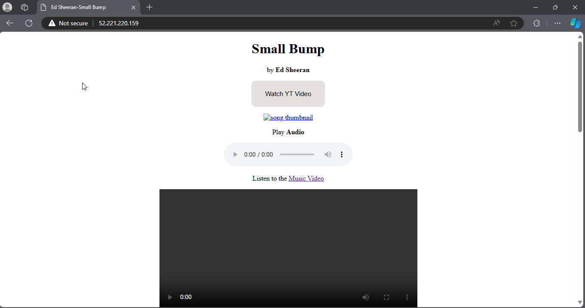

This is mine, lets watch yours!  

## 15. What if I dont have a static website?
- We will provide you with a simple HTML template that you can use.

Copy paste this to vim

```
<!DOCTYPE html>
<html lang="en">
<head>
    <title>EC2 Instance</title>
</head>
<body>
    <h1>Instance 1</h1>
    
</body>
</html>
```

- Prepare some image for later use of the workshop.

As you can see, pictures and videos wont load. Let's solve that.


