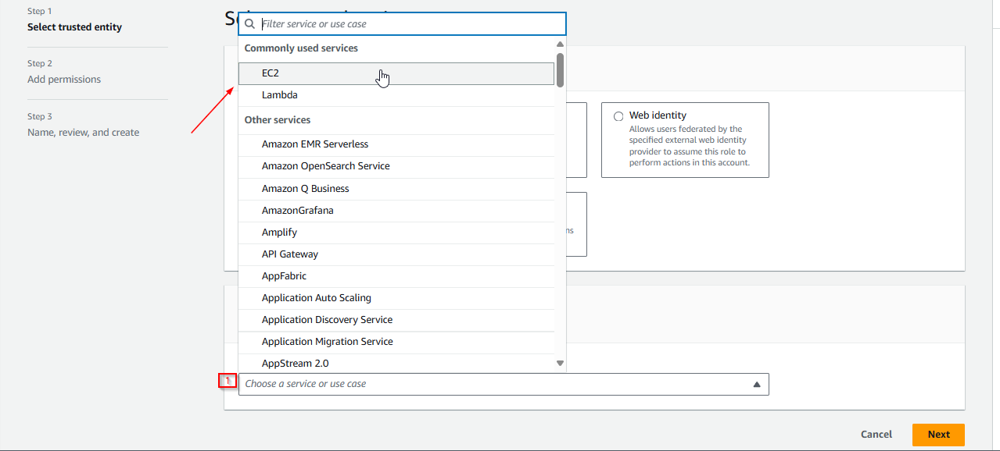
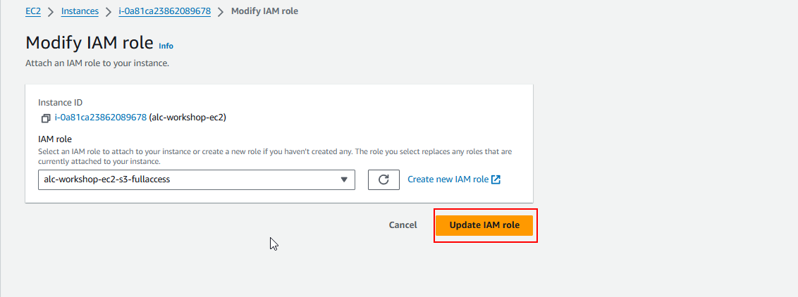

# Adding files to your EC2 Instance Using S3 and IAM

### **What is Amazon S3?**
Amazon S3 is an object storage service that provides industry-leading scalability, data availability, and security. It allows you to store and retrieve any amount of data at any time. In this guide, we will use S3 to store image files and transfer them to your EC2 instance.

### **What is IAM?**
IAM allows you to manage access to AWS services and resources securely. You create policies that define which actions are allowed on specific AWS resources. Here, we will create an IAM role to give our EC2 instance permission to access files stored in S3.

---

### Step 1: Create an S3 Bucket and Upload Images

1.1 **Create an S3 bucket** in the [S3 Console](https://s3.console.aws.amazon.com/). A bucket is a container for storing objects in S3 (like images, videos, or any file). Give your bucket a unique name (globally across AWS).


1.2 In the bucket, click **Upload**, and then **Add files/folder**. Select the image files you want to upload.


1.3 **Upload the files** to the S3 bucket. The files will now be stored in your S3 bucket, ready to be used in your application.


---

### Step 2: Create an IAM Role with S3 Access

IAM roles allow AWS services (such as EC2) to perform actions on your behalf. In this case, we need to grant EC2 the ability to interact with S3.

2.1 Go to the [IAM Console](https://console.aws.amazon.com/iam/) in the AWS Management Console.


2.2 Click **Roles**, then click **Create role**. Roles enable EC2 to assume temporary credentials to access AWS services like S3.


2.3 Select **EC2** as the trusted entity. This step ensures that only your EC2 instance will use this role to interact with S3.




2.4 **Attach the policy** `AmazonS3FullAccess`. This policy allows full access to all S3 buckets and objects (though this can be customized for more fine-grained control).


2.5 Click **Next: Tags**. Give your role a name (e.g., `EC2-S3-Access`) and a description.


2.5 Click **Create role** at the bottom of the page. You’ve now created a role with permissions to access S3.


---

### Step 3: Attach the IAM Role to Your EC2 Instance

Your EC2 instance needs permission to access your S3 bucket. We will now attach the IAM role to the instance.

3.1 Go back to the **EC2 Console**. You should see a list of running instances.

3.2 Click the **Instance ID** of the instance you want to grant S3 access. Then, go to **Actions > Security > Modify IAM Role**. This is where you attach an IAM role to your instance, enabling it to use AWS resources.

3.3 Or, you can just simply right-click on the instance and select **Security > Modify IAM Role**.


3.4 **Choose the IAM role** you created earlier, and then click **Update IAM role**. Now, your instance has the necessary permissions to access your S3 bucket.



---

### Step 4: Access the S3 Bucket from Your EC2 Instance

Now that your instance has S3 access, let’s transfer the images from your S3 bucket to the EC2 instance.

4.1 Open the **EC2 CLI** (either via SSH or the AWS Console). 

4.2 Run the following command to verify your S3 bucket exists:

```
aws s3 ls
```


This lists all the S3 buckets associated with your AWS account. You should see your bucket name here.

4.3 Sync the files from your S3 bucket to the /var/www/html directory on your EC2 instance (this is the default web root directory for the Apache server):

```
aws s3 sync s3://<your-bucket-name> /var/www/html
```


Replace <your-bucket-name> with the actual name of your S3 bucket. This command downloads all files from the S3 bucket into the web root directory of your Apache server.

4.4 To ensure the files were downloaded, list the contents of /var/www/html:

```
ls
```


If your images are listed here, the sync process was successful.  
Make sure that the directory of your files is aligned with directory inside the index.html file.

Step 5: Test Your Webpage
Now that your images are on your server, let’s check if everything works.


5.1 Open a web browser and go to:

```
http://<your-public-ipv4-address>
```


If everything is set up correctly, you should now see the images from your S3 bucket displayed on your website.

#### Cleanup
- Remember to delete the IAM role and S3 bucket if you no longer need them to avoid unnecessary charges.


