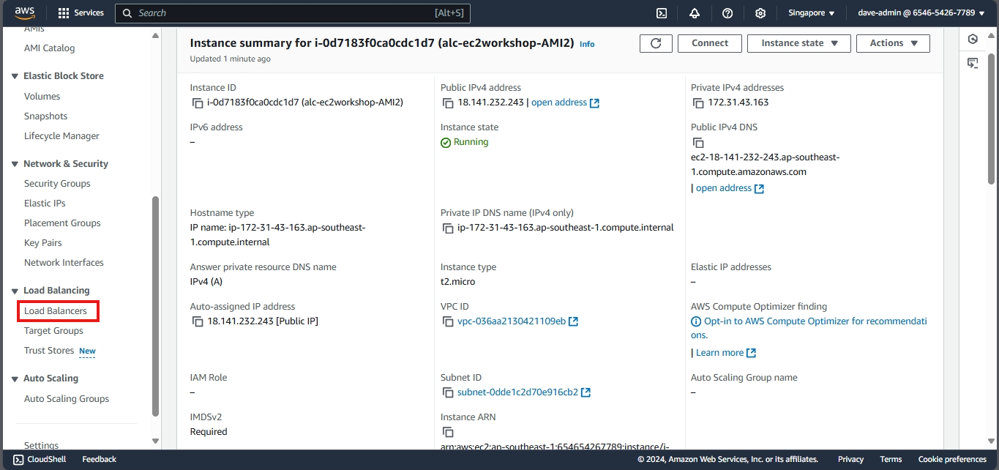
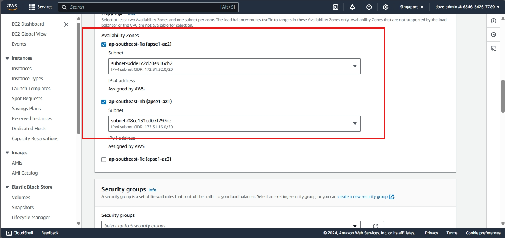

# Configuring an Elastic Load Balancer with Multiple Instances

This part will walk you through the process of setting up an Elastic Load Balancer (ELB) with three EC2 instances that provide slightly different outputs. This setup will help demonstrate how load balancing works by distributing traffic across the instances.

## Prerequisites

- Access to an AWS account
- Basic understanding of EC2 and Elastic Load Balancer

## Step 1: Create Three EC2 Instances

We already had 2 instances so we only need to create one more.

1. **Launch EC2 Instances**:
   - Make another instance with the same configuration as the first two instances.
   - Make minute changes to the instance to see the load balancer working
   - For a guide, go back to the "Link to creating an AMI page"

## Step 2: Create a target group

 1. **Create Target Group**:
 - Create a new target group for the instances.
 - Select "Instance" as the target type.
 - Add all three instances to the target group.

  

click `Include as pending below`

  

You have now created a target group with three instances. The next step is to create a load balancer and configure it to use this target group.

## Step 2: Configure the Elastic Load Balancer

1. **Navigate to Load Balancers**:
   - In the EC2 Dashboard, click on "Load Balancers" under "Load Balancing".

2. **Create Load Balancer**:
   - Click on "Create Load Balancer" and select "Application Load Balancer".

3. **Configure Load Balancer**:
   - **Name**: Enter a the name `alc-ec2workshop-ALB`
   - **Scheme**: Select "Internet-facing".

   - **VPC and Subnets**: Choose the same VPC and select all availability zones where your instances are located. 

     - To check the availability zone of your instances:
     - Go back to the instace page and check the availability zone of the instances

  

4. **Select Security Group**:
   - Choose the security group that applies to all instances.

5. **Listeners and Routing**:
   - Leave the default listener set to port 80 (HTTP).

6. **Configure Routing**:
   - Select the target group you created earlier.

7. **Launch the Load Balancer**:
   - Review the settings and click "Create".

## Step 3: Test the Load Balancer

1. **Obtain Load Balancer DNS**:
   - Once the load balancer is created, obtain its DNS name from the Load Balancers section.

2. **Access the Load Balancer**:
   - Open a web browser and enter the DNS name of the load balancer.
   - Refresh the page multiple times to see the different instance outputs:
     - Instance 1

     - Instance 2

     - Instance 3

## Step 4: Monitor Load Balancer and Instances

1. **Check Target Group Health Status**:
   - Select the target group associated with your instances.

   - Check the health status of each instance to ensure they are properly registered and healthy.

Note:
- If you want to attach a domain name to the load balancer, you can use Route 53 to create an alias record that points to the load balancer's DNS name.

Link: https://docs.aws.amazon.com/elasticloadbalancing/latest/classic/using-domain-names-with-elb.html

#### Cleanup
- Remove the load balancer and target group to avoid incurring additional costs if you no longer need them.