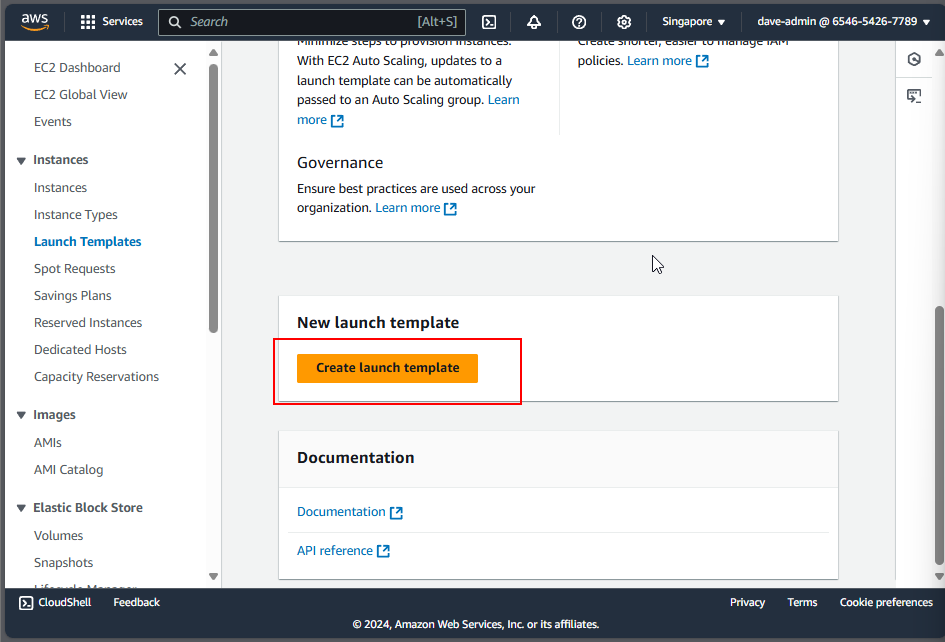
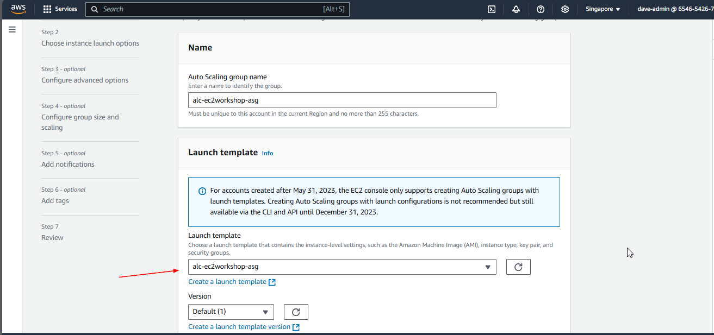

# Setting Up an Auto Scaling Group in EC2

## Prerequisites
Before creating an Auto Scaling Group, ensure that:
- You have an **EC2 instance** or an **Amazon Machine Image (AMI)**.
- You've configured a **key pair** for SSH access.
- A **VPC** (Virtual Private Cloud) and **subnets** are available for your instances.
- Ensure that you have the necessary **IAM permissions** to create Auto Scaling Groups, Launch Templates, and EC2 Instances.

## Step 1: Create a Launch Template or Launch Configuration

A **Launch Template** or **Launch Configuration** defines the configuration for instances in your Auto Scaling Group, including the AMI, instance type, key pair, security group, and block storage options.

### Using the AWS Management Console:

1. **Navigate to the EC2 Dashboard**:
   - Log in to the AWS Management Console.
   - In the search bar, type "EC2" and select **EC2** from the results.

2. **Create a Launch Template**:
   - On the left sidebar, under **Instances**, click **Launch Templates**.


   - Click **Create launch template**.



   - Provide a **Name** and **Description** for the template.


   - Under **Source AMI**, select the AMI we made earlier.


   - Choose an **Instance type** (e.g., t2.micro for free tier).


   - Assign a **Key Pair** for SSH access to your instances.


   - In the **Network settings**, select your **VPC** and choose the subnet where your instances are located.
   - Under **Security Groups**, select the security group we chose earlier.


   - Leave storage as it is as it is already defined in the AMI.

   - Click **Create launch template**.

### Using AWS CLI:

You can also create a Launch Template using the AWS CLI:

```
aws ec2 create-launch-template \
    --launch-template-name my-template \
    --version-description "Version 1" \
    --launch-template-data '{
      "ImageId": "ami-0abcdef1234567890",
      "InstanceType": "t2.micro",
      "KeyName": "my-key-pair",
      "SecurityGroupIds": ["sg-0123456789abcdef0"],
      "BlockDeviceMappings": [{
        "DeviceName": "/dev/xvda",
        "Ebs": {
          "VolumeSize": 8,
          "VolumeType": "gp2"
        }
      }]
    }
```

## Step 2: Create an Auto Scaling Group

An Auto Scaling Group ensures that you always have the right number of EC2 instances running to handle your application's load. It automatically increases or decreases the number of instances according to your defined policies.

### Using the AWS Management Console:

1. Navigate to Auto Scaling Groups:
   - In the EC2 Dashboard, under Auto Scaling, click Auto Scaling Groups.


Click Create Auto Scaling group. 


1. Configure Basic Settings:
   - Name your Auto Scaling group. Select the Launch Template or Launch Configuration created earlier.



3. Choose a VPC and Subnets:
   - Select a VPC and subnets where your instances will be launched. Se


4. Attach Load Balancers:
   - Attach our the target group on the load balancer we made to the Auto Scaling group.


5. For health check, select EC2 or ELB health check.


6. Configure Instance Scaling
   - Set the Minimum, Desired, and Maximum number of instances.
    Example:
     - Minimum: 2 - If one instance fails, the other will still handle traffic.
     - Desired: 3 - All target instances are running under normal circumstances.
     - Maximum: 5 - During traffic spikes or high demand periods


just click next until you reach the end.

6.  Review and Create:
   - Review the configuration and click Create Auto Scaling group.


### Using AWS CLI:

You can also create an Auto Scaling Group using the AWS CLI:

```
aws autoscaling create-auto-scaling-group \
    --auto-scaling-group-name my-auto-scaling-group \
    --launch-template "LaunchTemplateName=my-template,Version=1" \
    --min-size 1 \
    --max-size 4 \
    --desired-capacity 2 \
    --vpc-zone-identifier "subnet-0123456789abcdef0,subnet-0abcdef1234567890"
```

**Note**
- To verify auto scaling behaviour, refer to this documentation
https://docs.aws.amazon.com/sagemaker/latest/dg/endpoint-scaling-loadtest.html


#### Cleanup
- Remember to delete the Auto Scaling Group and Launch Template when you're done to avoid incurring unnecessary costs.
