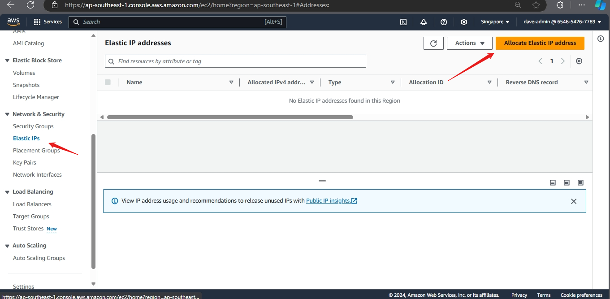
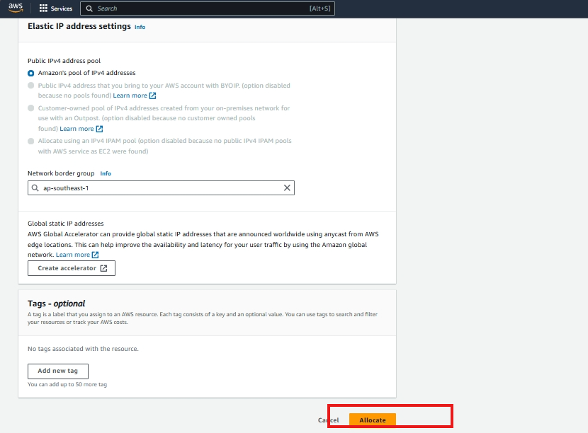
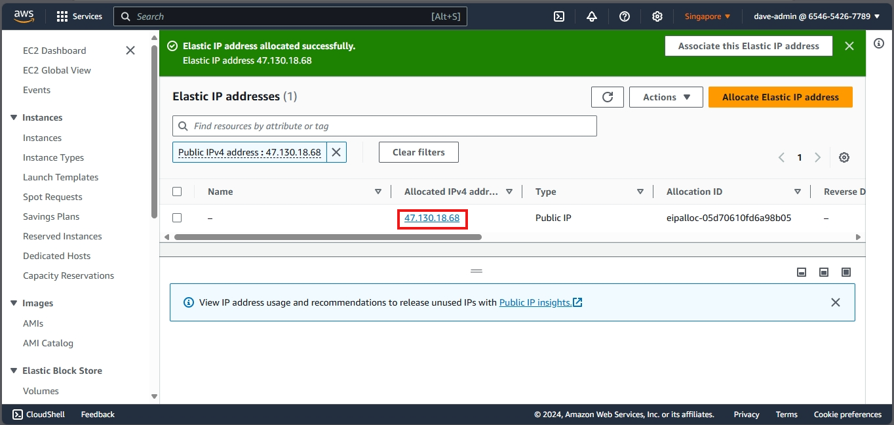
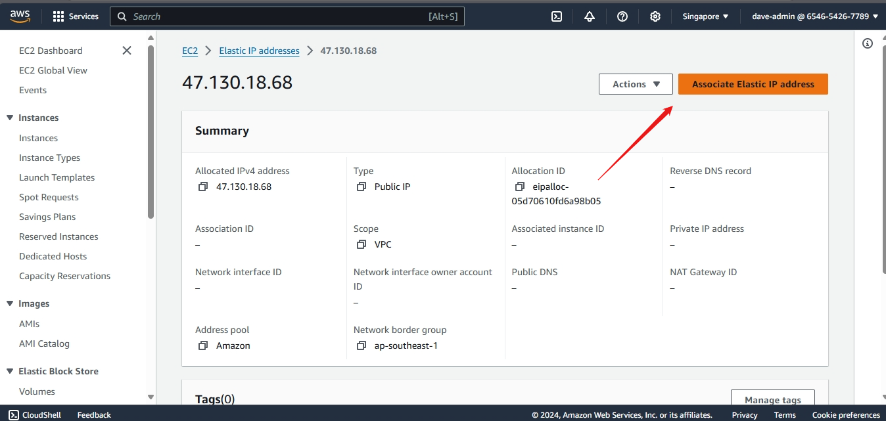
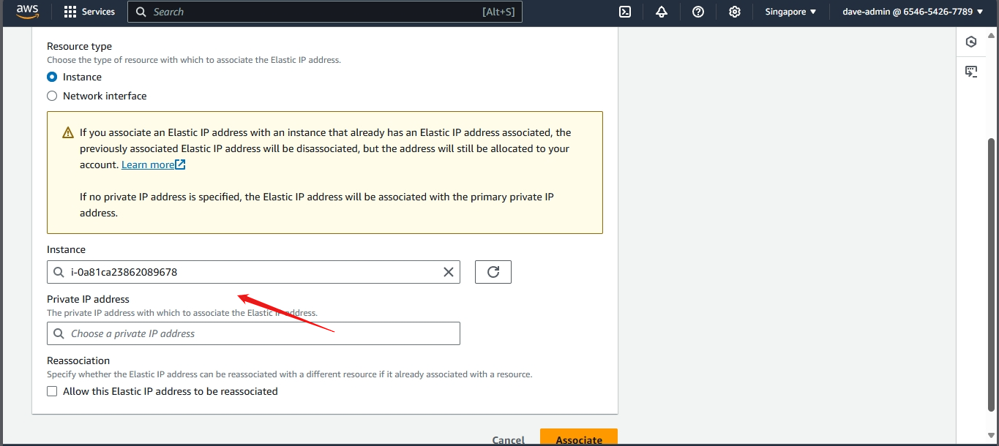
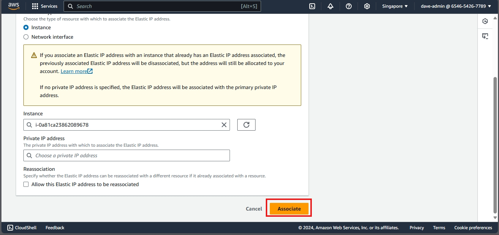
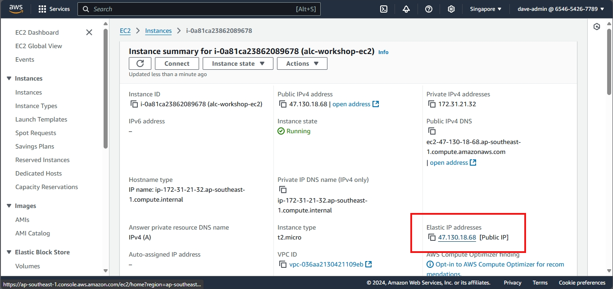
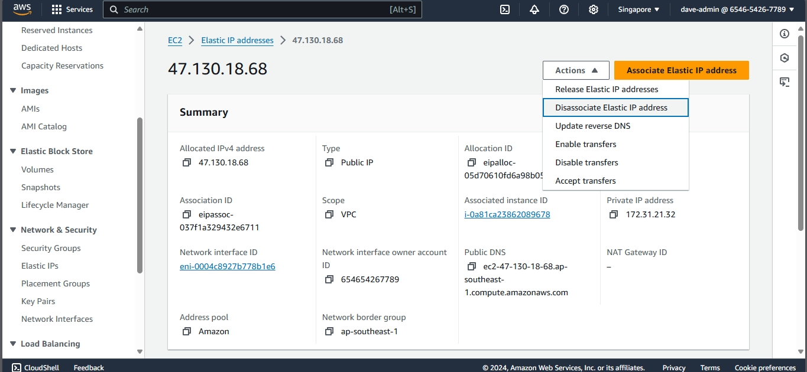
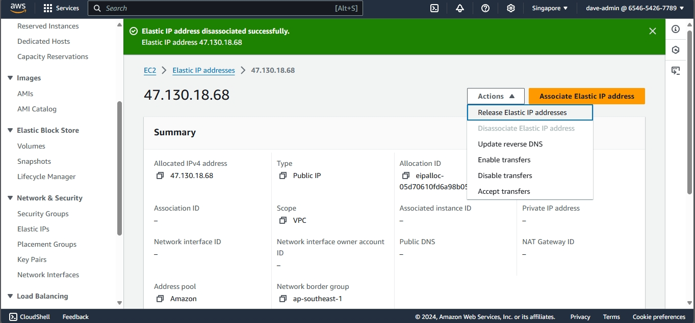
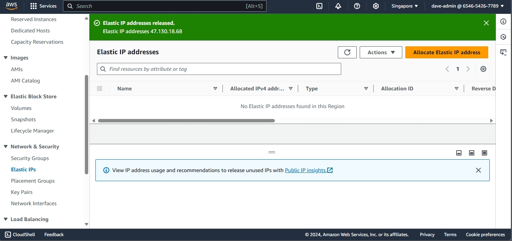

# Setting Up an Elastic IP on AWS EC2

## Prerequisites
- An existing EC2 instance to associate the Elastic IP with

## Steps to Set Up an Elastic IP

### Step 1: Allocate an Elastic IP Address
1. In the left navigation pane, click on **Elastic IPs** under the **Network & Security** section.
2. Click the **Allocate Elastic IP address** button.

3. Click **Allocate**. You will see a confirmation message, and your new Elastic IP will be displayed.

### Step 2: Associate the Elastic IP with an EC2 Instance
1. Select the newly allocated Elastic IP from the list.

2. Choose **Associate Elastic IP address**.

3. In the **Instance** field, start typing the ID or name of your EC2 instance and select it from the dropdown.

4. Leave the **Private IP address** field as default unless you have specific configurations.
5. Click **Associate**.

### Step 3: Verify the Association
1. Navigate back to the **Instances** section in the EC2 dashboard.
2. Select your EC2 instance and scroll down to the **Description** tab.
3. Verify that the **Elastic IP** is now listed under the instance's public IP address.
  

### Step 4: Test the Elastic IP
1. Open a web browser.
2. Enter the Elastic IP address in the address bar.
3. If a web server is running on your instance, you should see the expected response.

## Cleanup
1. If you no longer need the Elastic IP, go back to the **Elastic IPs** section.
2. Select the Elastic IP and choose **Disassociate Elastic IP address** from the **Actions** dropdown.

3. Release the Elastic IP by selecting **Release Elastic IP address** from the **Actions** dropdown.

4. Confirm the release.

## Additional Resources
- [Elastic IP Addresses](https://docs.aws.amazon.com/AWSEC2/latest/UserGuide/elastic-ip-addresses-eip.html)

