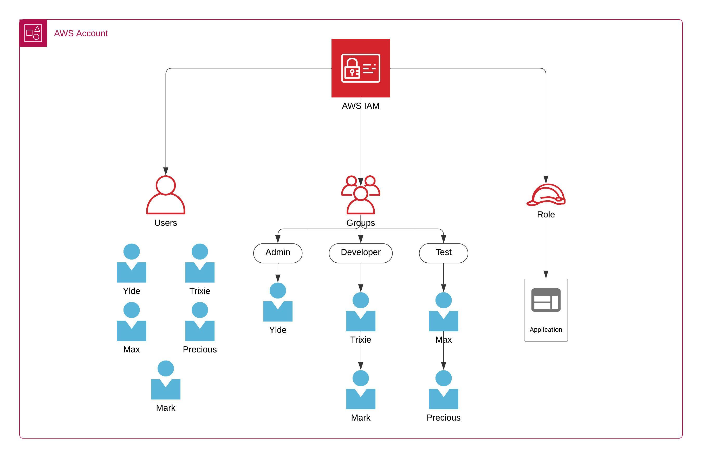

# **IAM Groups**

An **IAM group** is a collection of users with specific permissions assigned to all group members. This approach simplifies the management of user privileges by allowing administrators to assign permissions to groups rather than to each user individually. 

### IAM Groups allow you to:

* **Manage Users**: Assign access keys.

* **Define Roles**: Provide access to resources without sharing passwords or keys.

* **Utilize Groups**: Organize users into groups with specific permissions.

* **Apply Policies**: Attach policies to users, groups, or roles to define permitted actions.

This ensures that users can only perform actions within the scope of their group's permissions, **maintaining security and control within the AWS environment.**

For example, an account has three groups: developers, data analysts, and admins group. Each group has specific permissions tailored to their roles:

* **Admins**: They have full administrative access, including the ability to manage all resources, create new IAM users, and assign permissions.
* **Developers**: They have permission to deploy and manage code in AWS services like EC2 and Lambda.
* **Test**: Have access to testing environments and related services, enabling them to verify and test the deployed code.

Each user in the organization can be assigned to one or more of these groups based on their responsibilities, simplifying the management of permissions and ensuring that each user has the appropriate level of access.

[Next >> Permission Control Using IAM Groups](09%20-%20Permission%20Control%20Using%20IAM%20Groups.md)