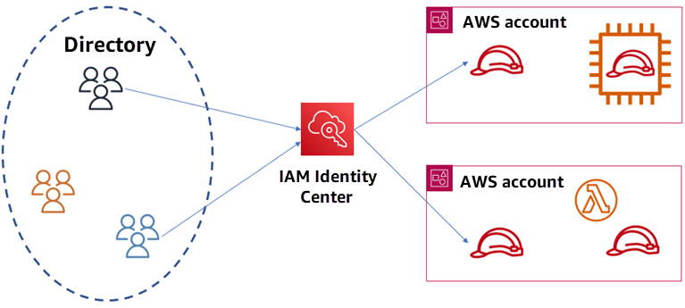

# **IAM Roles **

## What are IAM Roles?

**IAM (Identity and Access Management)** roles provide temporary access to AWS resources without using permanent credentials.  

Roles offer a way to _**grant temporary access**_ to AWS resources without relying on **permanent credentials**. This approach is especially useful for scenarios that require **short-term access** or adhere to best practices that discourage hardcoding credentials. Unlike IAM users, IAM roles provide **temporary security credentials**, which can be assumed by various entities such as users or applications.  
* IAM roles are versatile and can be used in several important ways. They allow **AWS services**, such as EC2 instances, to securely access other AWS resources like S3 buckets. Additionally, they facilitate **cross-account access**, enabling resources and permissions to be shared between different AWS accounts. IAM roles also support **role chaining**, where multiple roles can be assumed in sequence to achieve varying levels of access.  
* The structure of IAM roles includes key components: **Trust Policies**, which define who is allowed to assume the role; **Permissions Policies**, which specify what actions the role can perform; and  **Permissions Boundaries**, which set the maximum permissions that the role can grant.  

* **Use Cases:**  
  * **Access Within AWS**: Allow applications (e.g., EC2 instances) to securely access other AWS resources (e.g., S3 buckets).  
  * **Access Outside AWS**: Enable external applications to access AWS resources using IAM Roles Anywhere.  
  * **Cross-Account Access**: Share resources and permissions between different AWS accounts.  
  * **Grant Service Access**: Let AWS services (e.g., Lambda) perform actions on your behalf.

**Key Components of IAM Roles:**

* **Trust Policies**: Define who is allowed to assume the role.  
* **Permissions Policies**: Specify what actions the role can perform.  
* **Permissions Boundaries**: Set the maximum permissions the role can grant.

## **COMMON SCENARIOS**

**The image above  represents a simplified structure of AWS IAM Identity Center and its role.**

## **OTHER SCENARIOS:** 

### **Access Workloads Within AWS**:

* **Scenario**: An application running on an EC2 instance needs to interact with other AWS services.  
* **How It Works**: Create an IAM role with the necessary permissions and assign it to the application. The application uses temporary security credentials provided by the role.

### **Access Workloads Outside of AWS**:

* **Scenario**: Applications running on-premises or in other clouds need to access AWS resources.  
* **How It Works**: Use IAM Roles Anywhere to allow these external applications to obtain temporary access to AWS services, similar to applications within AWS.

### **Enable Cross-Account Access**:

* **Scenario**: You have multiple AWS accounts (e.g., development and production) and need to share resources between them.  
* **How It Works**: Set up IAM roles to grant permissions across AWS accounts, allowing resources in one account to access resources in another.

### **Grant Access to AWS Services**:

* **Scenario**: AWS services (e.g., Lambda) need to perform actions on your behalf (e.g., read from S3, write to DynamoDB).  
* **How It Works**: Define a role with specific permissions for the service. The service assumes this role to carry out its tasks.

## **Federated Identities in AWS**

**What It Is:**

* Allows users from external systems (e.g., corporate directories, social logins) to access AWS resources without separate AWS accounts.

**How It Works:**

1. **User Logs In**: Signs in through an existing identity provider (e.g., Microsoft Active Directory, Google).  
2. **Token Exchange**: The identity provider sends a token to AWS to verify the user’s identity.  
3. **Role Assumption**: AWS uses the token to grant access by allowing the user to assume an IAM role with specific permissions.  
4. **Temporary Access**: AWS provides temporary credentials based on the role, allowing access to resources.

[Next >> Using IAM Roles](11%20-%20Using%20IAM%20Roles.md)

<!-- (12%20-%20Simple%20Identity%20Policies%20in%20AWS.md) -->