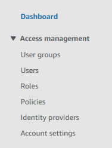

# Identity Policies in AWS

## What are AWS IAM Permissions and Policies?

Permissions in AWS IAM define what actions an identity (user, group, or role) can perform on AWS resources. These permissions are granted through **policies**, which are attached to identities. Policies are objects that define permissions and can be attached to identities.

### Why Are Permissions Important?

- **Ensure Specific Access Levels**: Users, groups, and roles can have complex and specific levels of access to AWS resources.
- **Maintain Security and Compliance**: Prevent unauthorized actions and manage security and compliance effectively.

### Types of IAM Policies

1. **Managed Policies**: Pre-built policies created and maintained by AWS or your organization. These can be attached to users, groups, or roles.

2. **Inline Policies**: Custom policies directly attached to a specific identity (user, group, or role).

## Adding Simple Identity Permissions in AWS IAM

### Permissions for IAM Users

1. **Navigate to IAM Users**

   - Open the AWS Management Console.
   - Go to IAM or search for IAM in the search bar.
   - Select Users, User Groups, or Roles from the sidebar.

      

2. **Select the Identity**

   - **Click on the user/user group/role to which you want to add permissions.**

      


3. **Attach Policies**

   - Go to the Permissions tab and click **Add permissions**.

      

      
  
   - Choose **Attach policies directly** to assign managed or inline policies.

      

   - Find the appropriate policy using the search bar and select it.

      

### Common AWS Managed Policies

1. AdministratorAccess

   - **Full Access to All Services**: Perform any action on any AWS service.
   - **Full Control Over All Resources**: Create, modify, delete, and configure any AWS resource.
   - **No Restrictions**: No limitations or conditions imposed.

      

2. ReadOnlyAccess

   - **Read-Only Access**: Provides read-only access to all AWS services.
   - **Use Case**: Ideal for users who need to view resources across all AWS services.

      
 
<p align="center">
  (The policy search bar works by finding all results with that text, so other more specific policies may pop up first).
</p>


3. IAMFullAccess

    

   - **Purpose**: Grants full access to IAM.
   - **Permissions**: Manage IAM users, groups, roles, and policies.
   - **Use Case**: Best for administrators managing IAM aspects.


4. IAMUserChangePassword

    

   - **Purpose**: Allows users to change their own IAM password.
   - **Permissions**: Allows actions like `iam:ChangePassword`.
   - **Use Case**: Attach to users who need to manage their own password.


## Custom Inline Policies

If you need fine-grained control and a high degree of specificity, create inline policies. Useful for roles with unique requirements not covered by managed policies.

### Steps to Create a Custom Inline Policy

1. **Navigate to the Permissions Tab**

   - For the user, group, or role, go to the Permissions tab.
   - Click **Add inline policy**.


2. **Use the Policy Editor**

   - **Visual Editor**: Define permissions by selecting actions, resources, and conditions through a guided interface.


   - **JSON Editor**: Write the policy directly for more flexibility.

     **Full Administrator Permissions JSON:**

     ```json
     {
       "Version": "2012-10-17",
       "Statement": [
         {
           "Effect": "Allow",
           "Action": "*",
           "Resource": "*"
         }
       ]
     }
     ```

     **IAMFullAccess JSON:**

     ```json
     {
       "Version": "2012-10-17",
       "Statement": [
         {
           "Effect": "Allow",
           "Action": [
             "iam:*",
             "organizations:DescribeAccount",
             "organizations:DescribeOrganization",
             "organizations:DescribeOrganizationalUnit",
             "organizations:DescribePolicy",
             "organizations:ListChildren",
             "organizations:ListParents",
             "organizations:ListPoliciesForTarget",
             "organizations:ListRoots",
             "organizations:ListPolicies",
             "organizations:ListTargetsForPolicy"
           ],
           "Resource": "*"
         }
       ]
     }
     ```


3. **Review and Name Your Policy**

   - Click **Review policy**.
   - Give your policy a meaningful name.
   - Click **Create policy** to apply it.


[Next >> IAM Policy Simulator](13%20-%20IAM%20Policy%20Simulator.md)

<!-- (13%20-%20Allowing%20Access%20to%20Billing%20Console.md) -->