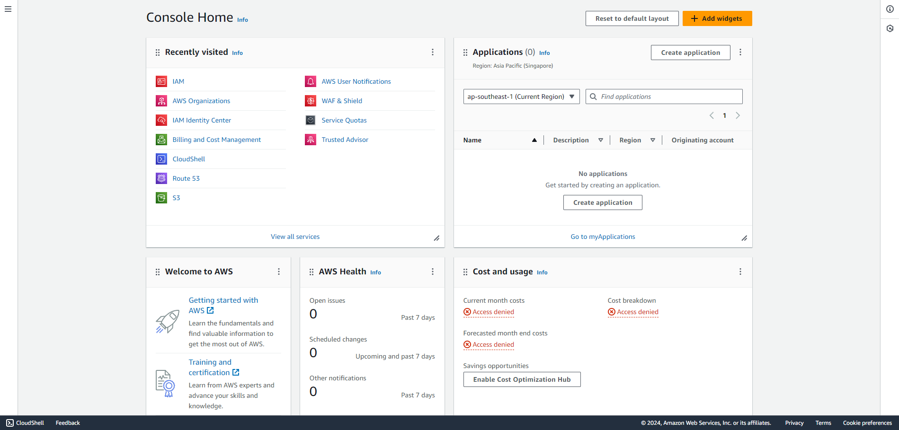
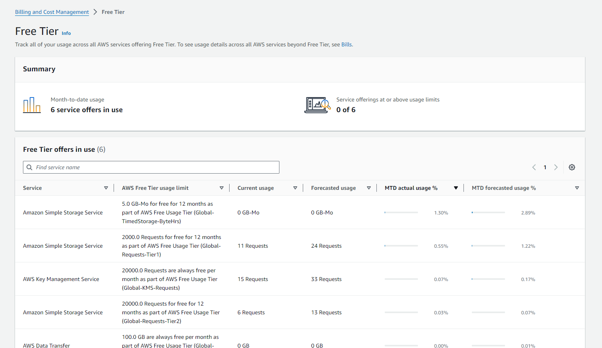
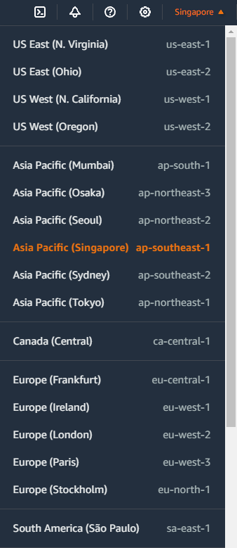
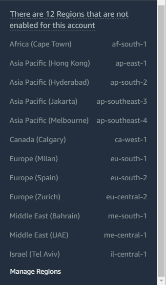
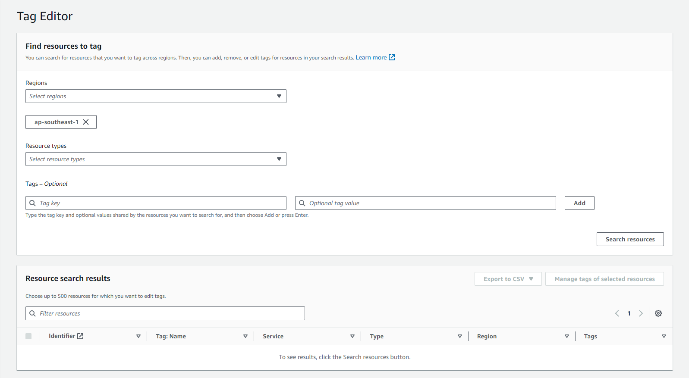
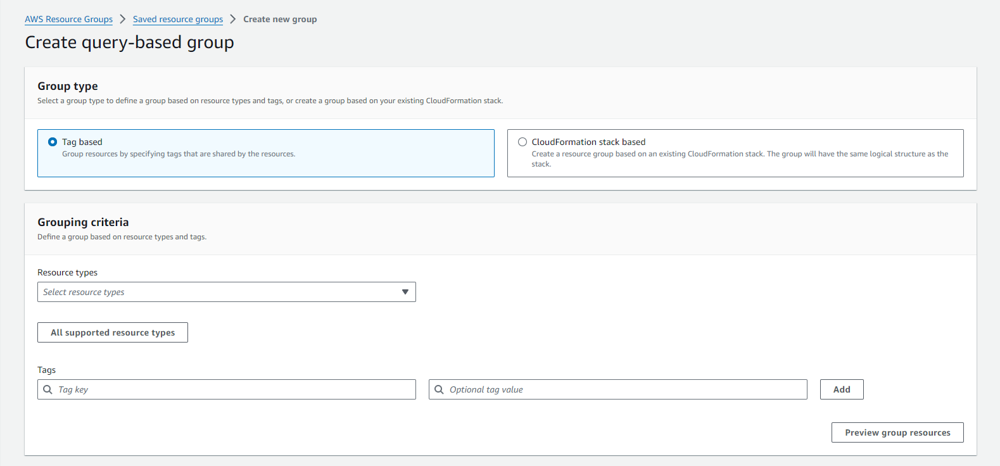

---
date: 2024-08-02
---

# **AWS Getting Started**

### **What is AWS? What is it all about?**

**Amazon Web Services (AWS)** is a secure and comprehensive cloud computing platform provided by Amazon. A **cloud platform** offers a range of services like computing power, storage, databases, and networking over the internet, allowing users to manage and scale resources without owning physical hardware. AWS embodies this concept by delivering a vast array of services on a "pay-as-you-go" basis, meaning you only pay for what you use. Known for its reliability, scalability, and flexibility, AWS supports a wide range of applications and use cases.

An AWS account is like a container where you keep all your AWS resources and manage them. It handles two main things: access control (who can use the resources) and billing (how much you are charged).

## Use Multiple AWS Accounts

**Using multiple AWS accounts** is a good practice for several reasons:

1. **Clear Billing**: Each account has its own billing, so you can easily see and manage costs for different projects or departments.

2. **Security**: By separating resources into different accounts, you can keep them isolated, which helps protect your data and services.

3. **Flexibility**: Different teams or individuals can have their own accounts, which gives them more control over their resources without affecting others.

4. **Adaptability**: As your business grows or changes, it’s easier to adjust or add new accounts to fit new needs or processes.

## A Brief Overview of AWS Services

AWS provides a broad spectrum of services that cater to various needs:

1. **Compute Services**:
   - **EC2 (Elastic Compute Cloud)**: Virtual servers to run applications.
   - **AWS Lambda**: Serverless computing that automatically scales.
2. **Storage Services**:
   - **Amazon S3 (Simple Storage Service)**: Scalable object storage.
   - **EBS (Elastic Block Store)**: Block storage for EC2 instances.
3. **Database Services**:
   - **Amazon RDS (Relational Database Service)**: Managed relational databases like MySQL and PostgreSQL.
   - **DynamoDB**: Managed NoSQL database.
4. **Networking Services**:
   - **Amazon VPC (Virtual Private Cloud)**: Isolated network environment.
   - **Elastic Load Balancing**: Distributes incoming traffic across multiple targets.
5. **Other Domains**:
   1. **Machine Learning**: Services like SageMaker for building and deploying ML models.
   2. **Internet of Things (IoT)**: Services for connecting and managing IoT devices.
   3. **Blockchain**: Managed blockchain services.
   4. **Analytics**: Tools for big data processing and analysis.

## Additional AWS Account Management Topics:

### 1. Management Console:

- **Access:** The AWS Management Console is a web-based interface that lets you interact with AWS services. You can manage resources, view billing details, and monitor performance.

  

- **Services:** From the console, you can access various AWS services like EC2 (Elastic Compute Cloud), S3 (Simple Storage Service), and more.

  

### 2. IAM (Identity and Access Management):

- **Users & Groups:** IAM allows you to create and manage users and groups, assigning permissions to control access to AWS resources.

- **Roles & Policies:** IAM roles define what actions are allowed and what resources are accessible. Policies are attached to roles to grant permissions.

### 3. Billing and Cost Management:

- **Billing Dashboard:** View and manage your AWS costs and usage.

  

- **Free Tier:** AWS provides a free tier with limited usage of many services, which is useful for new users to explore AWS without incurring charges.

  

### 4. Regions and Availability Zones:

- **Regions:** AWS is divided into multiple geographic regions to help you deploy resources closer to your users.

  
  

- **Availability Zones:** Each region contains multiple Availability Zones (data centers) to enhance fault tolerance and availability.

### 5. Resource Management:

- **Tags:** Tags are labels you can assign to AWS resources for organization and management.

  

- **Resource Groups:** Helps in managing and organizing resources that share common tags or attributes.

  

  

### 6. Security:

Security is a fundamental aspect of working with AWS. From the moment you create your AWS account, you have access to a range of security features that help you protect your data, manage access, and ensure compliance with regulations.

#### **Shared Responsibility Model**

AWS operates under a **Shared Responsibility Model**, which defines the security responsibilities of AWS (the cloud provider) and you (the customer):

- **AWS's Responsibility (Security _of_ the Cloud):**

  - AWS is responsible for the security of the infrastructure that runs all the services offered in the AWS Cloud. This includes hardware, software, networking, and facilities.

- **Your Responsibility (Security _in_ the Cloud):**
  - You are responsible for securing the data, identities, applications, and configurations that you run on AWS. This includes managing permissions, encrypting data, and monitoring your resources.

#### **Identity and Access Management (IAM)**

- **IAM Overview:** AWS Identity and Access Management (IAM) is a service that helps you control access to AWS resources. It enables you to create and manage AWS users, groups, and roles, and define permissions to allow or deny access to resources.
- **IAM Concepts:**
  - **Users:** Individuals or services that interact with AWS resources.
  - **Groups:** Collections of users that share the same permissions.
  - **Roles:** Temporary security credentials for AWS services or users to perform specific tasks.

#### **Data Protection**

- **Encryption:** AWS provides several encryption options to protect your data both at rest (stored data) and in transit (data moving between services or over the internet). You can use AWS Key Management Service (KMS) to manage encryption keys securely.

- **Data Integrity:** AWS ensures data integrity by using secure, fault-tolerant infrastructure. It provides tools like checksums and cryptographic algorithms to ensure data is not altered or tampered with during transfer.

### 7. Monitoring and Logging:

**Monitoring** and **logging** in AWS are critical for maintaining the health, security, and performance of your environment.

**AWS offers several tools to help you monitor and log activities in your environment:**

- **AWS CloudTrail:** Records API calls across your AWS account, including actions via the Management Console, SDKs, CLI, and AWS services. It provides details on which users and accounts made calls, the source IP addresses, and the timestamps of these actions.

- **Amazon CloudWatch:** Provides a scalable solution for monitoring AWS resources and applications. It allows you to collect and track metrics, set alarms, and automatically respond to changes in your AWS environment.

- **Amazon GuardDuty:** A threat detection service that continuously monitors for malicious activity and unauthorized behavior. It integrates with CloudWatch for alerting, enabling automated responses or notifications.

### 8. Support Plans:

- **Basic:** Free support plan that includes access to documentation and forums.

- **Developer, Business, and Enterprise:** Paid plans with varying levels of access to AWS support teams and additional resources.

### 9 . Account Management Best Practices:

To safeguard your AWS management account and ensure effective organizational management, follow these best practices:

- **Limit Access:** Restrict access to the management account to only those admin users who need it. This account handles critical administrative tasks like account management and consolidated billing.

- **Review Access:** Regularly review who has access to the management account credentials (email, password, MFA, and phone number). Implement a periodic review process (monthly or quarterly) and ensure access recovery procedures are not dependent on specific individuals.

- **Use Exclusively for Admin Tasks:** Utilize the management account solely for tasks that require it. Avoid deploying AWS resources here; instead, manage resources in other AWS accounts within the organization to better track costs and ensure that service control policies (SCPs) are applied effectively.

- **Avoid Workload Deployment:** Refrain from deploying workloads in the management account, as it does not benefit from SCPs and could complicate billing and resource management.

- **Delegate Responsibilities**: Delegate tasks and permissions to other accounts where possible. Use features like AWS Service Catalog and AWS CloudFormation StackSets to allow teams to manage their needs without direct access to the management account.

[Next >> Shared Responsibility Model](02%20-%20Shared%20Responsibility%20Model.md)
