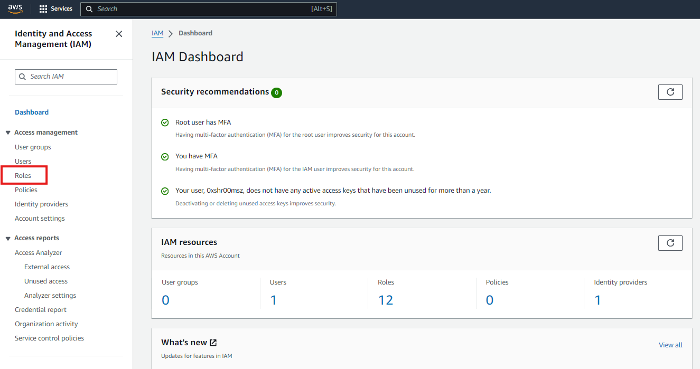

# IAM Roles Demonstration

## Introduction

IAM Roles are a powerful feature in AWS that allows you to grant temporary access to your AWS resources without needing to share long-term credentials. In this demonstration, we will walk through the process of creating an IAM role, configuring the AWS CLI to use that role, and performing actions using the role's permissions.

## Step 1: Create an IAM Role

1. **Navigate to IAM Dashboard:**

   - Log in to the AWS Management Console.
   - Go to the IAM service.

   

2. **Create a New Role:**

   - In the IAM Dashboard, click on **Roles** in the left-hand menu.

   

   - Click **Create role**.

   

3. **Select Trusted Entity:**

   - Choose **AWS service** as the trusted entity.

   

   - Select the service that will use the role, such as EC2.

   

4. **Attach Permissions:**

   - Attach the `AmazonS3ReadOnlyAccess` policy to the role to grant read-only access to **S3**.

   

5. **Name and Create the Role:**

   - Give the role a descriptive name, such as `EC2_S3ReadOnlyAccess`.

   

   - Review the settings and click **Create role**.

6. **Modify the Trust Relationship**

   - Click your newly created role

   

   - Go to `Trust relationships` and `Edit trust policy`

   

   - You can copy and paste this and simply replace `123456789012` with your AWS Account ID.

   ```
   {
      "Version": "2012-10-17",
      "Statement": [
         {
            "Effect": "Allow",
            "Principal": {
               "AWS": "arn:aws:iam::123456789012:root"
            },
            "Action": "sts:AssumeRole"
         }
      ]
   }
   ```

## Step 2: Configure AWS CLI to Use the Role

1. **Click your newly created role and copy the ARN**.

   

2. **Open AWS CLI Configuration:**

   - On your local machine, open the AWS CLI configuration file, typically located at `~/.aws/config`.

3. **Edit the Configuration File: We'll be using Nano Editor**

   ```bash
   nano ~/.aws/config
   ```

   - Add a new profile that specifies the role to assume:

     ```ini
     [profile ec2-role]
     role_arn = <paste your ARN here>
     source_profile = default
     ```

4. **Verify the Configuration:**

   - Run the following command to verify that you can list the contents of an S3 bucket using the newly assumed role:

     ```bash
     aws s3 ls --profile ec2-role
     ```

## Step 3: Demonstrate Role Usage

1. **List S3 Buckets:**

   - Use the command below to list all S3 buckets accessible with the role:

     ```bash
     aws s3 ls --profile ec2-role
     ```

2. **Accessing S3 with the Role:**

   - Upload or download files from an S3 bucket using the following commands:

     ```bash
     aws s3 cp your-file.txt s3://your-bucket-name/ --profile ec2-role
     aws s3 cp s3://your-bucket-name/your-file.txt ./ --profile ec2-role
     ```

[Next >> IAM Policies](13%20-%20Simple%20Identity%20Policies%20in%20AWS.md)
