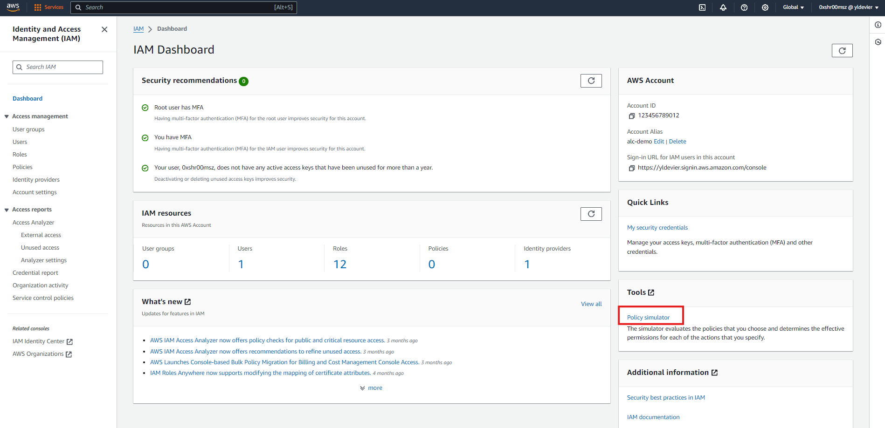

# **Using the AWS IAM Policy Simulator: Test Your IAM Policies Before Applying**

## **What is the AWS IAM Policy Simulator?**

The AWS IAM Policy Simulator is a powerful tool that lets you test the effects of policies on your IAM entities (like users, groups, and roles) before you actually apply them. By using this simulator, you can evaluate how your policies will behave and ensure they are granting or denying permissions as expected.

## **How to Access the IAM Policy Simulator**

To get started, follow these steps:

1. **Login to AWS Management Console**:
   Navigate to the AWS Management Console and sign in to your account.

2. **Search for IAM**:
   In the search bar, type "IAM" and select it from the dropdown list.

3. **Navigate to Policy Simulator**:
   Once in the IAM dashboard, look for "Policy Simulator" under the "Tools" section on the right-hand menu.

   

## **Step-by-Step Guide to Using the IAM Policy Simulator**

### **Step 1: Select a Policy to Simulate**

In the IAM Policy Simulator, you have the option to select policies attached to users, groups, or roles, or you can paste a policy directly into the simulator. Here’s how you can do it:

1. **Choose the Entity**:
   Select whether you want to simulate a policy for a user, group, role, or directly enter a policy.

2. **Select the Policy**:
   If you chose a user, group, or role, you’ll see a list of associated policies. Check the box next to the policy you want to simulate.

3. **Paste a Policy**:
   If you want to test a custom policy, click on "Create Policy" and paste your JSON policy into the editor.

### **Step 2: Choose Actions to Simulate**

Next, you'll need

[Next >> Allowing Access to Billing Console](15%20-%20Allowing%20Access%20to%20Billing%20Console.md)
