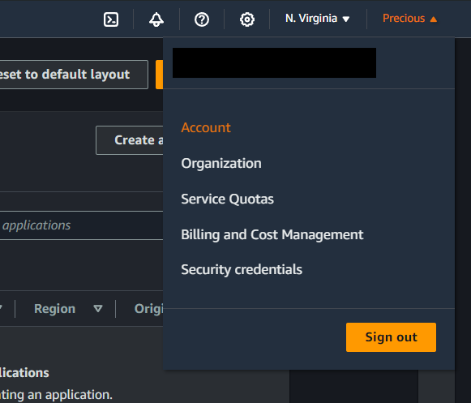
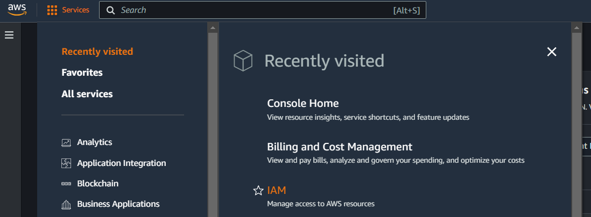
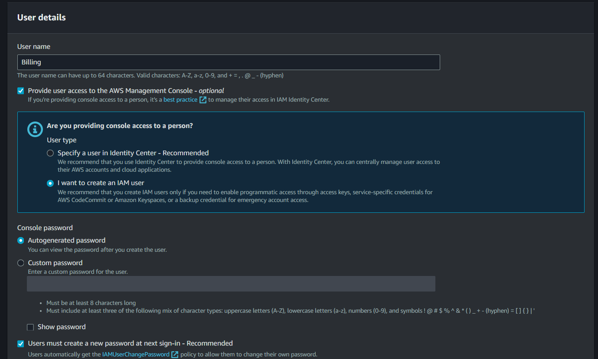
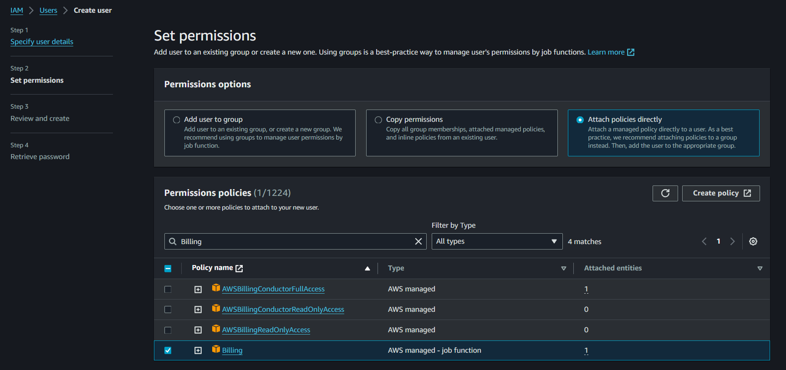

# **Allow Access to Billing Console for an IAM user**

By default, IAM users do not have access to the AWS Billing Console. To enable such access, the root user must first make a specific configuration change. This restriction is in place to enhance security and ensure that only trusted accounts can manage billing and account-related settings. Therefore, the root user must manually grant access by modifying the relevant IAM policies or settings.

## **Allow Access to the Billing Console**

1. Sign in to the AWS Management Console using your root account.
2. In the navigation bar, click on your account name, and then choose **Account**.

   

3. Scroll down and look for **IAM user and Role Access to Billing Information** and then click on **Edit**.

   

4. Click on the **Activate IAM Access** checkbox to allow access. Afterwards, click on **Update**.

   

## **Create an IAM Entity with Billing Permissions**

1. Go to the AWS Management Console and look for **IAM** on the Services Tab.

   

2. Navigate to **Users** on the sidebar and click on **Create User.**

   

3. Specify user details, such as the name and password.

   

4. Set permissions for the user. Choose **Attach policies directly** and then look for **Billing** in the permission policies.

   

5. Review your choices, and once you’re done click on **Create User**.
