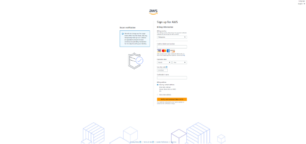

# **Creating an AWS User Account**

### PREREQUISITE

- Payment Method - provide a valid credit card or another payment method for identity verification and billing purposes.

The AWS offers a free tier with limited free resources, you must provide a valid credit card or another payment method for identity verification and billing purposes.

<!-- more -->

## Steps to Create an AWS User Account

1. Visit the [AWS's official website](https://aws.amazon.com) and click 'Create an AWS Account' at the top right corner of the page.
2. Input your account information. This will serve as an entry to the AWS Console.

   

- **Input your Root User Email Address**. If you wish to open a personal account, use your email account, otherwise use your corporate email distribution list or email box for a professional AWS account.
- **Provide an AWS Account Name**. Choose a unique name for your account. This can be your name, company name, or anything you prefer.
- **Verify your email address**. Check the code sent to your email and choose Verify.

  

1. **Input a Secure Password**. Create a strong root user password for your AWS account then choose Continue.
2. **Select Account Type**. Select 'Personal' or 'Professional' depending on your use case.

   

Business and personal accounts have similar features and functions. In business AWS accounts, it is essential to provide the company's credentials including the phone number, email address, and payment details. Read and accept the AWS Customer Agreement and select Continue.

5. **Check your Email**. An email will be sent to your email address to confirm that your account has been created.

   

> _NOTE: You cannot fully utilize AWS services until your account is fully activated. This process includes verifying your email, entering billing information, and completing phone verification._

6. Input your payment information. Navigate to the Billing information page and select your preferred payment method then choose Verify and Add. AWS requires this for identity verification and to bill you for any resources you use beyond the free tier.

   

7. Verify your identity. Visit the Confirm your Identity page, select your phone number country (+63) code from the list and AWS will send a code to your phone number for verification. Enter the code when prompted. If CAPTCHA is presented, input the displayed code then hit Submit. Enter the pin and choose Continue.

   

8. Select a Support Plan. AWS offers different support plans. For beginners, the Basic Support plan (which is free) is usually sufficient. 
9. Choose Complete signup and check your email inbox for confirmation.

   Some instances occur where the process may usually take up to 24 hours. When this happens, you can still sign in to your AWS Account but the Complete Sign Up button shows up despite completing the steps of the sign-up process. 

[Next >> Setting Up MFA](MFA.md)
