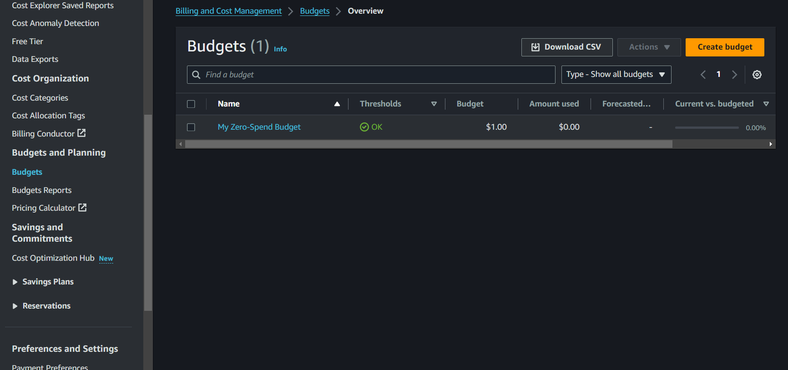
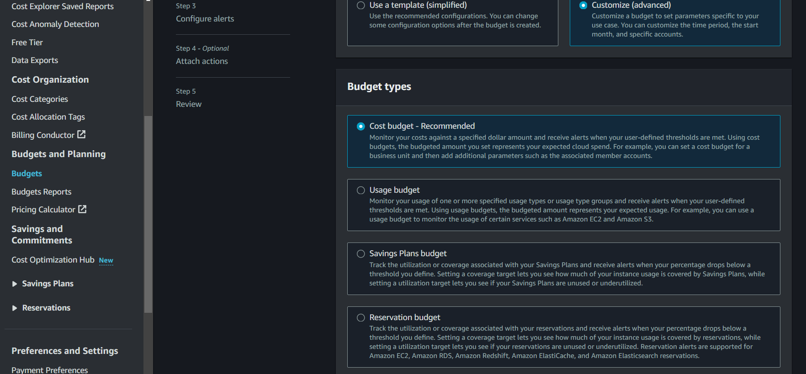
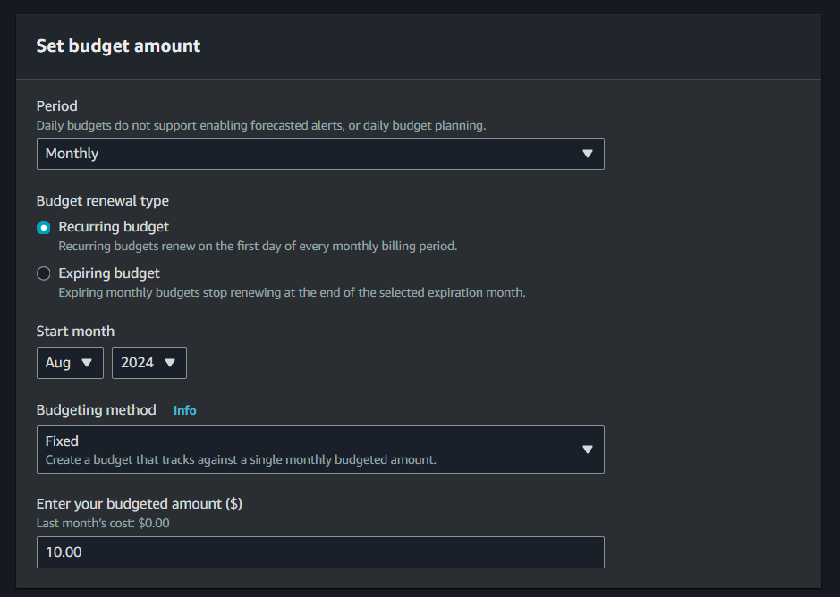
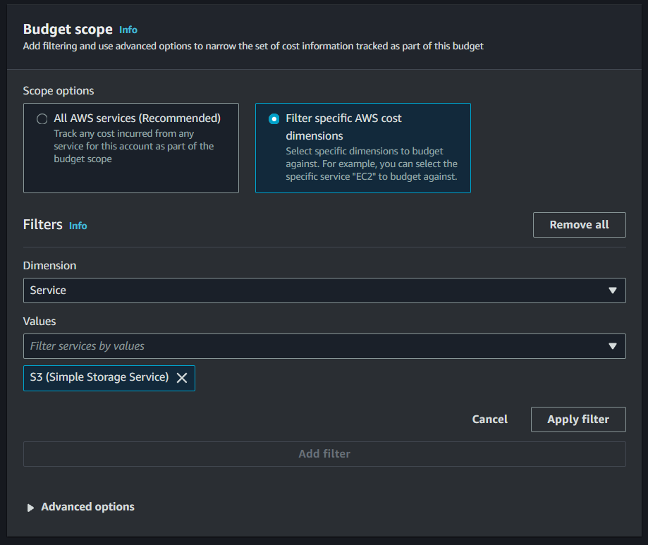
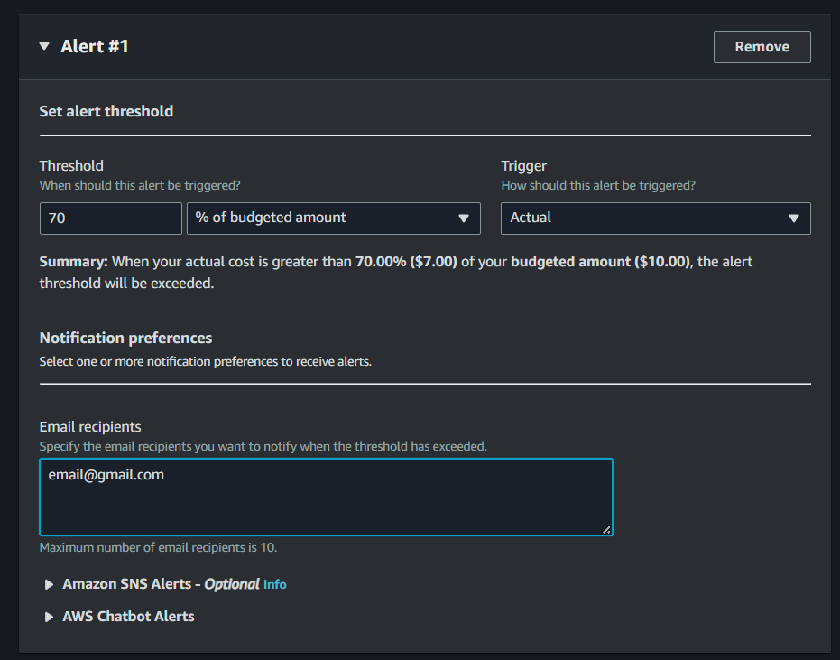
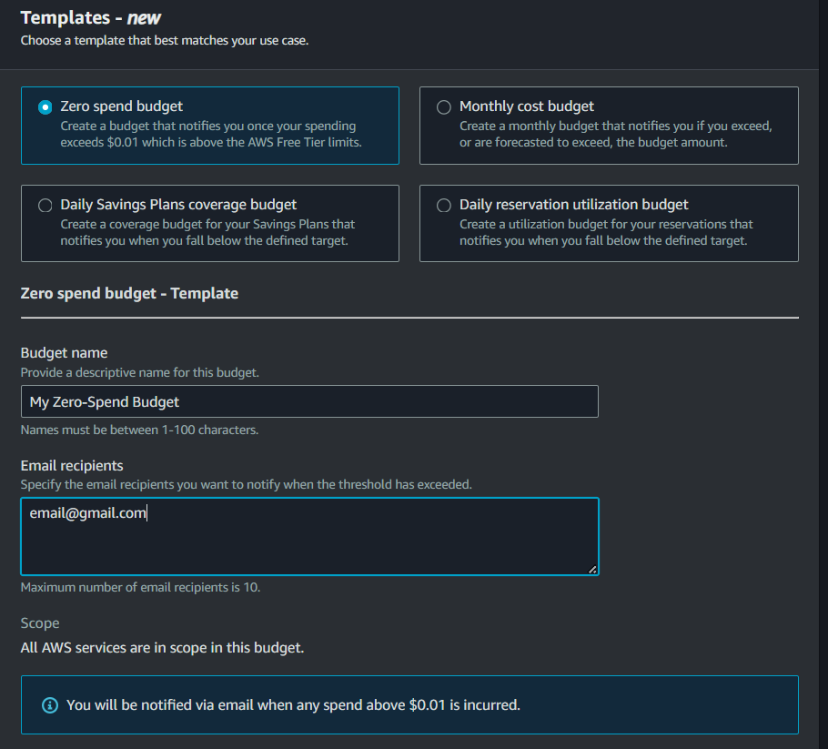

# **Creating a Budget and Setting Up Budget Alarms**

## **Introduction to AWS Budgets**

AWS Budgets allows you to set custom spending limits on your AWS costs and usage. You can receive alerts when you exceed your budget or approach the limit, helping you keep track of your expenditures. By setting up AWS Budgets, you can gain better control over your AWS spending and avoid unexpected charges.

You can set up a budget in two ways: using a budget template, or customizing your own. To better understand budgets, let's set up your own customized budget.

<!-- more -->

## **Creating a Budget**

**Step 1**: In your AWS Console, click services and look for _Billing and Cost Management,_ alternatively you can also use the search bar to access it.

**Step 2**: Navigate to Budgets in the sidebar.

**Step 3**: Click on "Create budget".

**Step 4**: Choose if you want to use a template or customize. In this case, let's create a _customized cost budget_ for Amazon S3.

### **Customized:**

1. **Choose Budget Type**: You’ll be prompted to choose the type of budget you want to create. The main options are:

   - **Cost Budget**: For tracking spending by cost.
   - **Usage Budget**: For tracking usage of specific AWS services.
   - **Reservation Budget**: For tracking costs related to reserved instances.

   

2. **Configure Your Budget**:

   - **Name**: Enter a name that will help you identify the budget later.
   - **Set the budget amount**: Enter the maximum amount you are willing to spend. You can choose to set this amount for a specific time period (e.g., monthly, quarterly, yearly).

   

   - **Specify the budget scope**: Choose whether the budget should apply to your entire account or specific services, cost categories, or tags.

   

   For this demo, configure your budget to be recurring, fixed, and monthly, with a budget amount of $10.00. Specify your budget scope to Filter Specific AWS Cost Dimensions, choose Service for the Dimension and look for S3 (Simple Storage Service) for the Values.

3. **Set Alerts and Notifications**:

   You can set up notifications to alert you via email when your spending reaches certain thresholds (e.g., 50%, 80%, 100% of the budget).

   - On the 3rd step of setting up your customize budget, click “Add an alert threshold”
   - Here, you can set when the alarm is triggered, such as a _numerical absolute_ or _percentage value_, and whether it should trigger when it reaches the _forecasted cost_ or _actual cost_.
   - Then, you can move on to the notification preferences. The budget alerts can notify you via _email_, _SNS_, or _chatbot alerts_.

     **Email**: For Email alerts, you can input the emails you would like to receive alerts to, separated by commas: [person@gmail.com](mailto:person@gmail.com), [aws@aws.com](mailto:aws@aws.com), etc.

     **Amazon Simple Notification Service Alerts (SNS):** You also have an option to send notifications with SNS. This is where your Amazon SNS sends an alert to a Topic, which in turn sends it to its subscribers, Applications or Persons.

     **Chatbot**: For Chatbot Alerts, it can send a notification to the specified chat rooms.

   In this case, we set the threshold to 70% of the budgeted amount, to trigger when it reaches greater than the threshold.

   

4. **Review and Confirm:**
   - Review your budget settings to ensure they meet your needs.
   - Click "Create budget" to finalize and save your new budget.

Since we’ve set up a customized budget already, you’ve already likely understood the essentials for creating a budget. However, there might be cases wherein you don’t actually need a fully customized budget for your services or account. In this case, you would greatly benefit from using AWS Budgets Templates. Let’s now set up a budget using a template.

### **Template:**

1. You have four (4) options if you want to use a template:

   - **Zero spend budget**: A budget that notifies you after your spending exceeds AWS Free Tier limits ($0.01)
   - **Monthly cost budget**: A monthly budget that notifies you if you exceed, or are forecasted to exceed, the budget amount.
   - **Daily Savings Plans coverage budget**: A coverage budget for your Savings Plans that notifies you when you fall below the defined target. (For savings plan)
   - **Daily reservation utilization budget**: A utilization budget for your Reserved Instances that notifies you when you fall below the defined target. (For reserved instances plan)

   In this case, let's choose the _zero-spend budget_.

2. After choosing, you have to specify the _email recipients_ you want to notify when the threshold has exceeded (The maximum number is 10). You can also choose to have a customized name for your budget, albeit optional.

   

3. Review and Confirm:
   - Review your budget settings to ensure they meet your needs.
   - Click "Create budget" to finalize and save your new budget.
   - Do note that you can **configure this budget after creating it**, so in the case wherein you only need to change one setting, you can create a budget with a template without tediously configuring everything.

After creating your budget, you can monitor it from the AWS Budgets dashboard. This section will show you how much you’ve spent and how it compares to your budgeted amount. You can also create budget reports to monitor the performance of your existing budgets on a daily, weekly, or monthly frequency and deliver that report to up to 50 email addresses.

[Next >> Identity and Access Management](AWS%20Identity%20and%20Access%20Management.md)
