# **IAM Access Keys**

## **What are IAM Access Keys?**

IAM Access Keys consist of two components: an _**Access Key ID**_ and a _**Secret Access Key**_. These keys are analogous to a username and password and are used to sign programmatic requests to AWS services.

The **Access Key ID** is a unique identifier, while the Secret Access Key is a secret that should only be known by the user who owns the key.

<!-- more -->

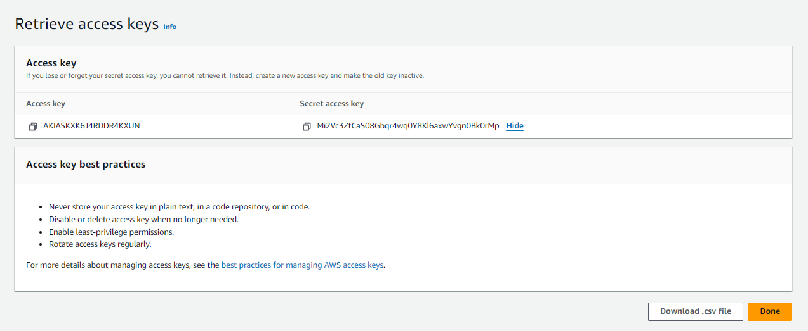

**IAM Access Keys** are used when you want to interact with AWS services via APIs, the AWS Command Line Interface (CLI), or AWS SDKs. They are essential for automation tasks, such as running scripts that manage AWS resources or integrating with third-party applications that require access to your AWS account.

## **Why do we need Access Keys?**

### 1. Security and Access Control

- **Non-Root Access:** It's a best practice to avoid using root account credentials. Instead, you can create IAM users with Access Keys, each with specific roles and permissions, reducing the risk associated with using high-privileged accounts.
- **Granular Permissions:** You can create Access Keys for specific users with precise permissions, following the principle of least privilege. This allows you to control which actions or resources the keys can access.

### 2. Programmatic Access

- **APIs and SDKs:** Access Keys are used by AWS SDKs (e.g., for Python, Java, or Node.js) and APIs to authenticate and authorize programmatic requests. This is crucial for developers building applications that need to interact with AWS resources directly.
- **Command Line Interface (CLI):** The AWS CLI, a powerful tool for managing AWS resources from the command line, also relies on Access Keys for authentication.

### 3. Automating

- **CI/CD Pipelines:** Continuous Integration/Continuous Deployment (CI/CD) tools often use Access Keys to automate the deployment of applications, infrastructure changes, or updates to AWS services.

## How to Create Access Keys in the Management Console

### 1. Navigate to the IAM Service

In the AWS Management Console, search for "IAM" in the search bar at the top and click on the IAM service from the results.

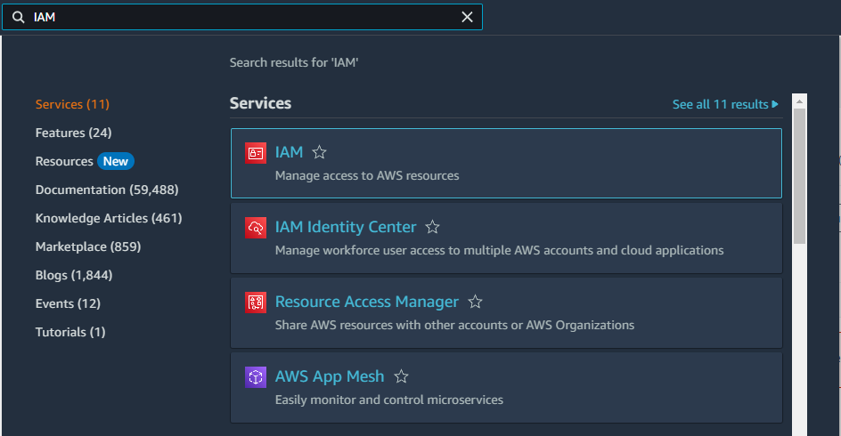

### 2. Select a User:

In the "Users" section, click on the username which we created earlier.

### 3. Create Access Keys:

Once a user is selected, create access key 1 by clicking the **Create Access Key**

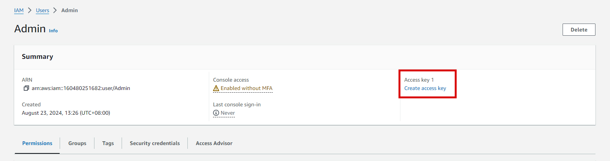

### 4. Use Case

Select the _**Command Line Interface**_ to enable the AWS CLI to access this AWS IAM User account.

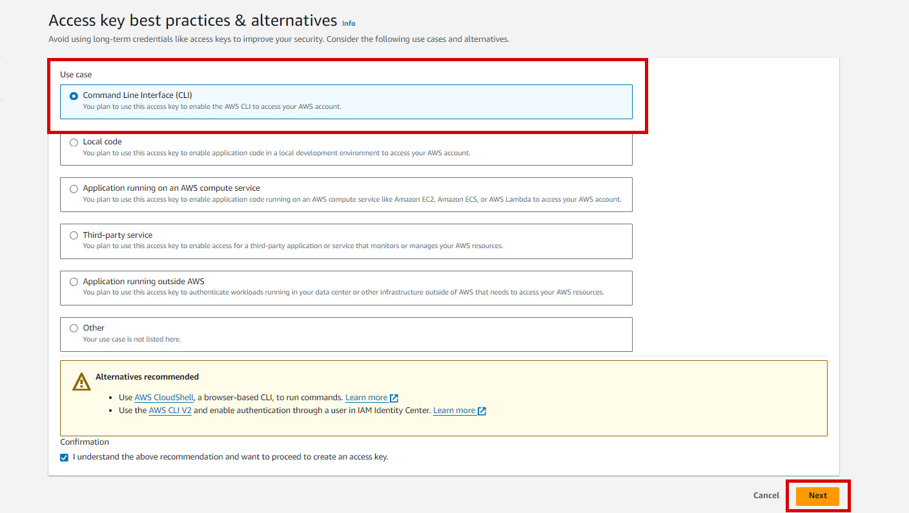

### 5. Set Description Tag (optional)

After setting a description tag, you can now create access key by clicking the button.

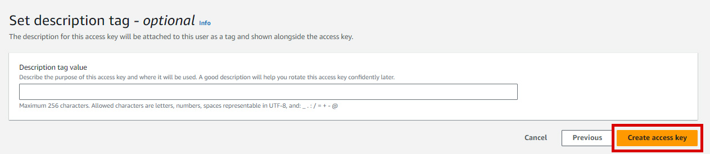

### 6. Download the Access Key

- After the access key is generated, you'll see the Access Key ID and Secret Access Key.
- Make sure to download the `.csv` file or copy the Access Key ID and Secret Access Key immediately. AWS does not store the Secret Access Key, so if you lose it, you'll have to create a new access key.

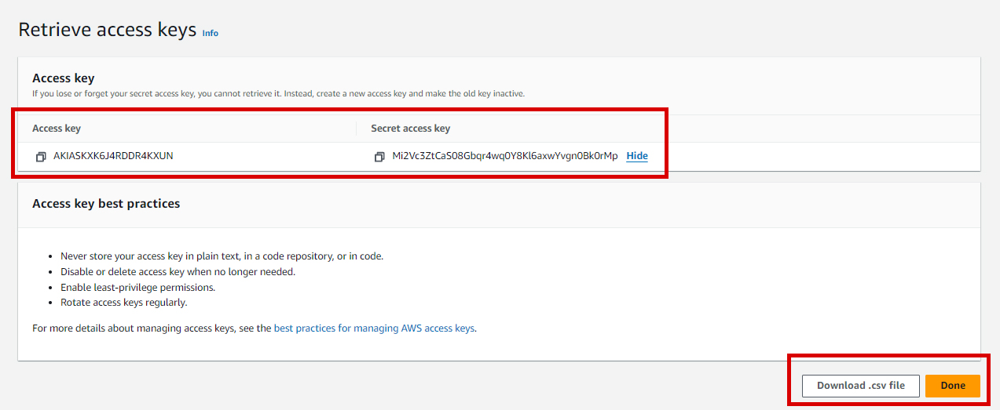

## **How to Set Up AWS v2 Tools**

### **Install unzip in WSL**

```bash
sudo apt install unzip
```

### **Download and Install AWS CLI**

```bash
curl "https://awscli.amazonaws.com/awscli-exe-linux-x86_64.zip" -o "awscliv2.zip"

unzip awscliv2.zip

sudo ./aws/install
```

### **Verify AWS CLI Installation**

```bash
aws --version
```

### **Configure AWS CLI (Default Profile)**

```bash
aws configure
```

> _Upon executing the command, the following output will be displayed in the terminal._

```bash
AWS Access Key ID [None]: YOUR_ACCESS_KEY_ID

AWS Secret Access Key [None]: YOUR_SECRET_ACCESS_KEY

Default region name [None]: ap-southeast-1

Default output format [None]:

```

### **Test your Configuration**

```bash
aws s3 ls
```

### **List S3 Buckets Using Specific Profile**

View the profile list created:

```bash
cat ~/.aws/credentials
```

```bash
aws s3 ls --profile myprofile
```

## **How to Create Access Keys Using AWS CLI**

### **List users:**

```bash
aws iam list-users
```

### **Create access key for a specific user**

```bash
aws iam create-access-key --user-name <IAM_username>
```

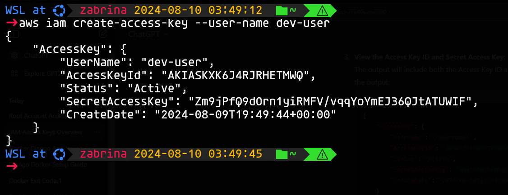

### **Now, add the IAM user to the AWS CLI Credentials:**

```bash
aws configure --profile <profile-name>

AWS Access Key ID [None]: YOUR_ACCESS_KEY_ID

AWS Secret Access Key [None]: YOUR_SECRET_ACCESS_KEY

Default region name [None]: ap-southeast-1

Default output format [None]:
```

## **Test your Configuration**

Before testing our configuration, we need to create an Amazon S3 bucket using the AWS Management Console. This process will help you verify that your AWS CLI credentials and access keys are correctly configured.

## **Creating S3 Bucket**

### 1. Navigate to the IAM Service

In the AWS Management Console, search for "S3" in the search bar at the top and click on the IAM service from the results.

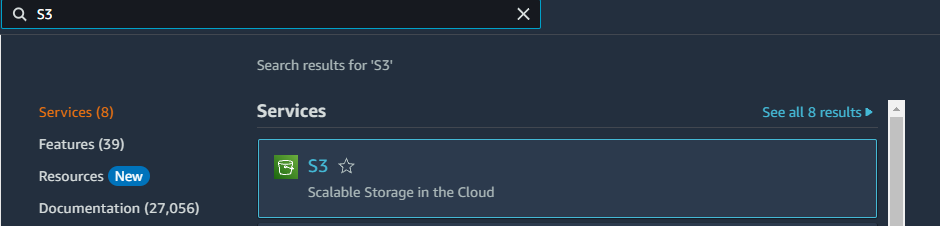

### 2. Create a Bucket

- On the S3 Dashboard, click the Create bucket button.
- You’ll be taken to the Create bucket wizard.

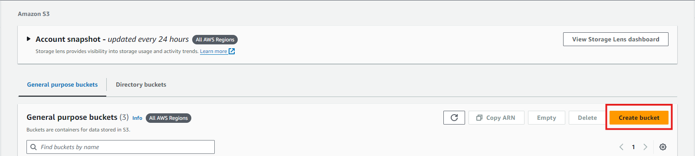

- Configure Bucket Settings
- Enter a unique name for your bucket. Bucket names must be globally unique across all AWS accounts.
- Scroll down, leave all as it is by default and click `Create Bucket`

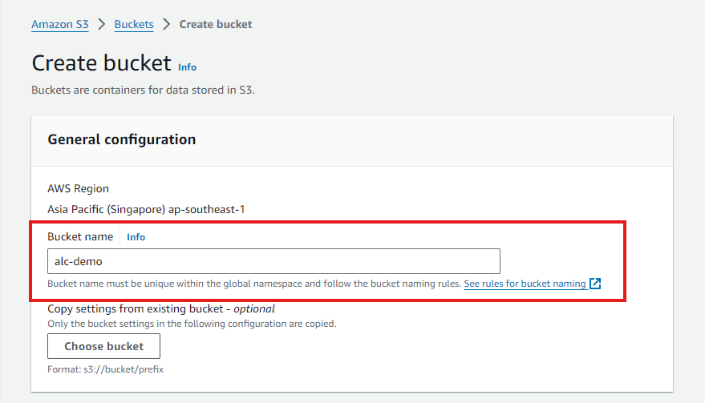

### 3. Upload a File to Your Bucket

Click on your newly created bucket to open it.

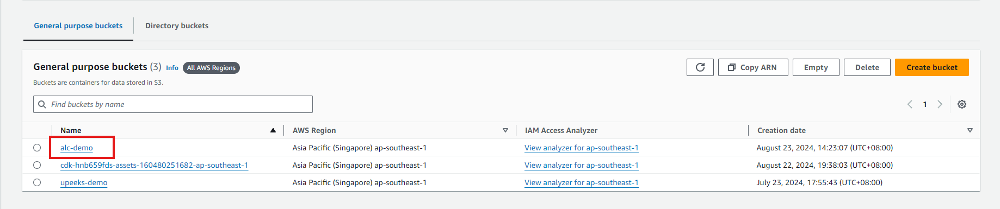

Click the Upload button.

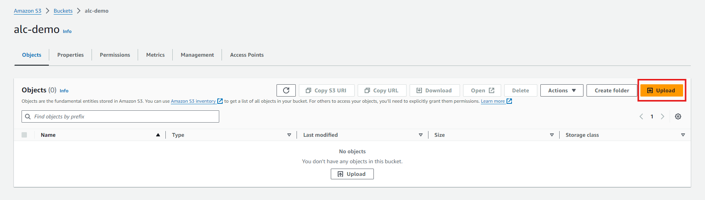

In the upload dialog, drag and drop files or use the Add files button to select files from your computer.

Click the Upload button to start the upload process.

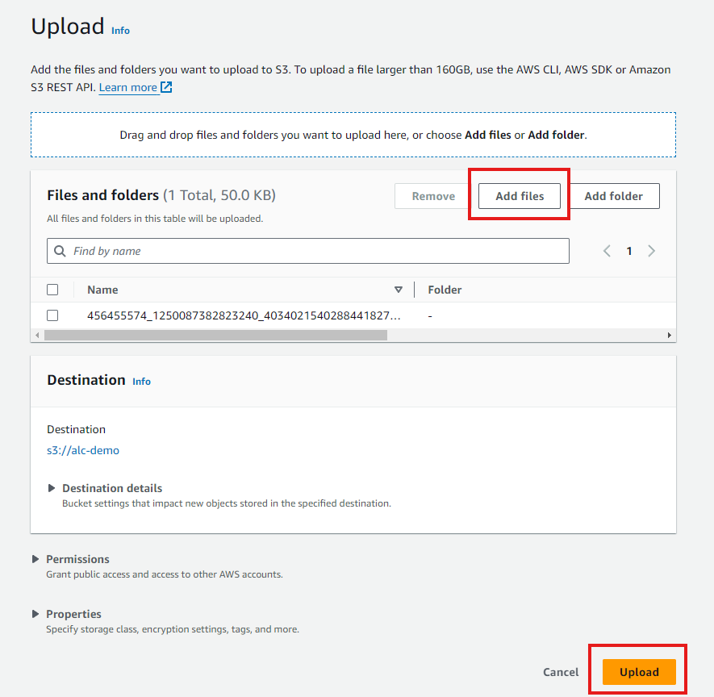

## **Testing AWS CLI Access Keys Using Listing Buckets**

```bash
aws s3 ls
```

### **Testing: List S3 Buckets Using Specific Profile**

View the profile list created:

```bash
cat ~/.aws/credentials
```

```bash
aws s3 ls --profile myprofile
```
