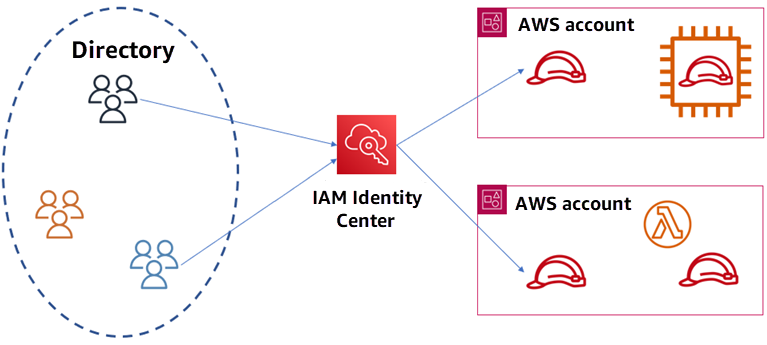

# **IAM ROLES**

## What are IAM Roles?

**IAM (Identity and Access Management)** roles provide temporary access to AWS resources without using permanent credentials.

Roles offer a way to _**grant temporary access**_ to AWS resources without relying on **permanent credentials**. This approach is especially useful for scenarios that require **short-term access** or adhere to best practices that discourage hardcoding credentials. Unlike IAM users, IAM roles provide **temporary security credentials**, which can be assumed by various entities such as users or applications.

- IAM roles are versatile and can be used in several important ways. They allow **AWS services**, such as EC2 instances, to securely access other AWS resources like S3 buckets. Additionally, they facilitate **cross-account access**, enabling resources and permissions to be shared between different AWS accounts. IAM roles also support **role chaining**, where multiple roles can be assumed in sequence to achieve varying levels of access.
- The structure of IAM roles includes key components: **Trust Policies**, which define who is allowed to assume the role; **Permissions Policies**, which specify what actions the role can perform; and **Permissions Boundaries**, which set the maximum permissions that the role can grant.

<!-- more -->

- **Use Cases:**
  - **Access Within AWS**: Allow applications (e.g., EC2 instances) to securely access other AWS resources (e.g., S3 buckets).
  - **Access Outside AWS**: Enable external applications to access AWS resources using IAM Roles Anywhere.
  - **Cross-Account Access**: Share resources and permissions between different AWS accounts.
  - **Grant Service Access**: Let AWS services (e.g., Lambda) perform actions on your behalf.

**Key Components of IAM Roles:**

- **Trust Policies**: Define who is allowed to assume the role.
- **Permissions Policies**: Specify what actions the role can perform.
- **Permissions Boundaries**: Set the maximum permissions the role can grant.

## **COMMON SCENARIOS**

**The image above represents a simplified structure of AWS IAM Identity Center and its role.**

## **IAM Identity Center Overview**

### **What Is IAM Identity Center?**

- A service that manages user authentication, authorization, and provisioning across multiple AWS accounts.

### **Components:**

- **Directory**: Centralized location for user information (e.g., names, roles, permissions).
- **IAM Identity Center**: Core service for user management and access control across AWS accounts.
- **AWS Account**: Individual environments where AWS resources are created and managed.

### **How It Works:**

- **User Management**: Manage users in the Directory, including creating, modifying, and deleting accounts.
- **Centralized Authentication**: IAM Identity Center verifies user identities through a single point of authentication.
- **Access Control**: Determines user access to AWS accounts and resources based on assigned roles and permissions.

### **Benefits:**

- **Simplified User Management**: Manage all users in one place instead of across multiple AWS accounts.
- **Enhanced Security**: Centralized control over user access and authentication.
- **Improved Efficiency**: Streamlined user provisioning and de-provisioning.

### **Example Scenario:**

- A large company uses IAM Identity Center to manage team access to various AWS tools and resources. It acts as a gatekeeper, ensuring only authorized employees access specific services and data, enhancing security and simplifying user management.

## **OTHER SCENARIOS:**

### **Access Workloads Within AWS**:

- **Scenario**: An application running on an EC2 instance needs to interact with other AWS services.
- **How It Works**: Create an IAM role with the necessary permissions and assign it to the application. The application uses temporary security credentials provided by the role.

### **Access Workloads Outside of AWS**:

- **Scenario**: Applications running on-premises or in other clouds need to access AWS resources.
- **How It Works**: Use IAM Roles Anywhere to allow these external applications to obtain temporary access to AWS services, similar to applications within AWS.

### **Enable Cross-Account Access**:

- **Scenario**: You have multiple AWS accounts (e.g., development and production) and need to share resources between them.
- **How It Works**: Set up IAM roles to grant permissions across AWS accounts, allowing resources in one account to access resources in another.

### **Grant Access to AWS Services**:

- **Scenario**: AWS services (e.g., Lambda) need to perform actions on your behalf (e.g., read from S3, write to DynamoDB).
- **How It Works**: Define a role with specific permissions for the service. The service assumes this role to carry out its tasks.

## **Federated Identities in AWS**

**What It Is:**

- Allows users from external systems (e.g., corporate directories, social logins) to access AWS resources without separate AWS accounts.

**How It Works:**

1. **User Logs In**: Signs in through an existing identity provider (e.g., Microsoft Active Directory, Google).
2. **Token Exchange**: The identity provider sends a token to AWS to verify the user’s identity.
3. **Role Assumption**: AWS uses the token to grant access by allowing the user to assume an IAM role with specific permissions.
4. **Temporary Access**: AWS provides temporary credentials based on the role, allowing access to resources.

[Next >> Creating an IAM User](Creating%20an%20IAM%20User.md)
