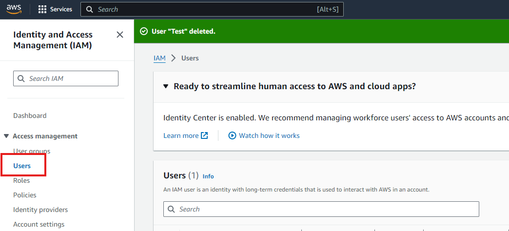
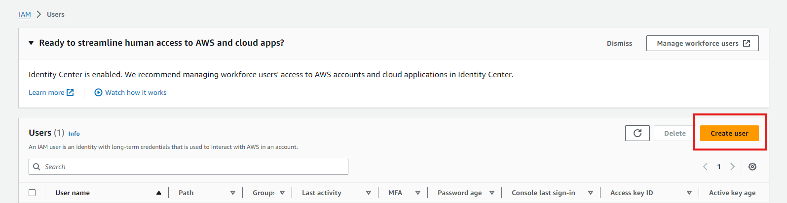
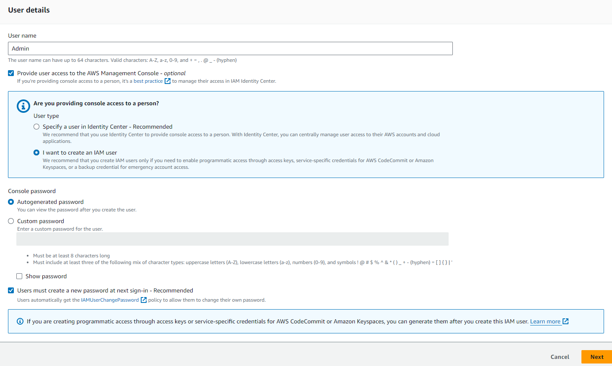
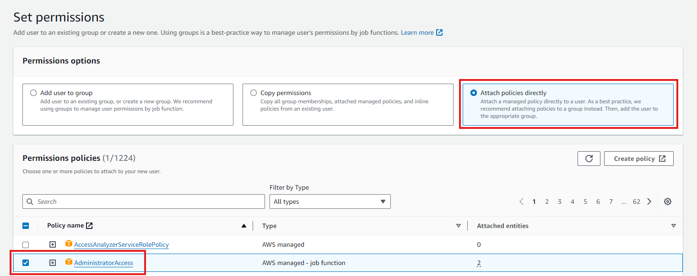
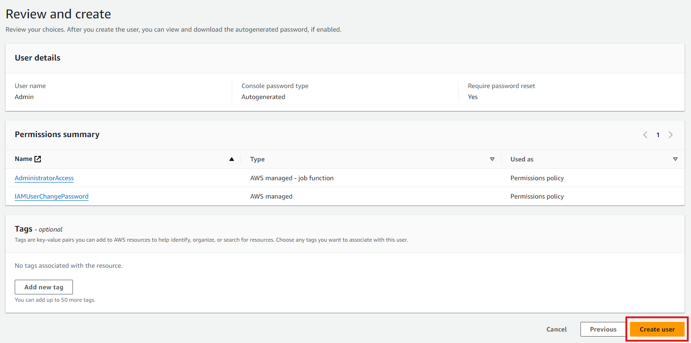
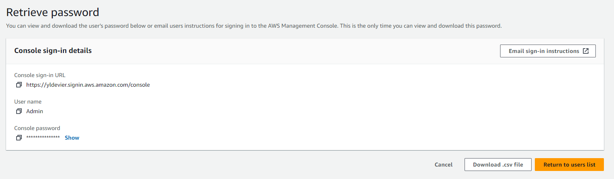
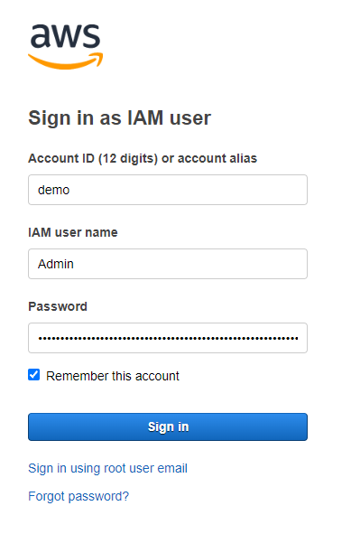
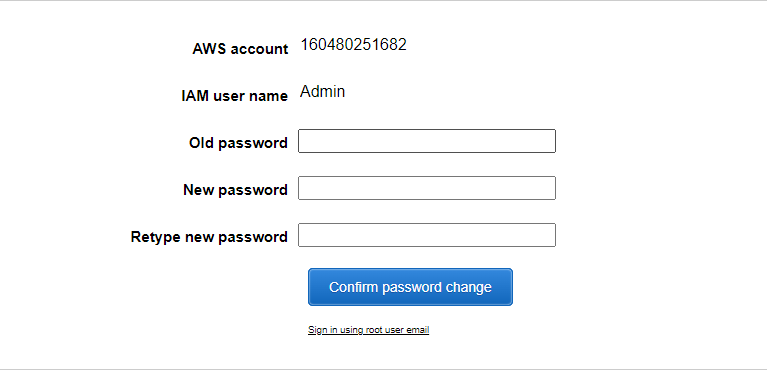
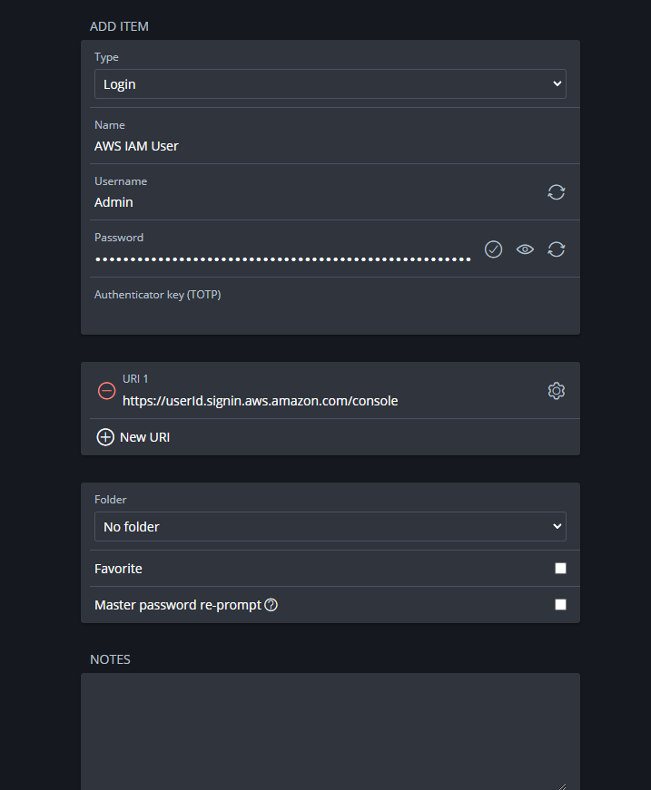

# **IAM Users and ARNs**

## **What is an IAM User?**

An IAM user is a regular account that you create for someone who needs access to your AWS resources. It is similar to giving someone a unique, personalized key that only opens specific doors you have assigned to them.

<!-- more -->

### **Why create IAM Users?**

When you create an AWS account, you are provided with a root user, which acts as a master key. However, using this "master key" at all times is risky. Instead, you create IAM users and assign them the specific permissions they require. This is a good practice because if something goes wrong with one user, the other accounts remain secure.

### **What does an IAM User have?**

An IAM user has a username and password, which serve as a key to access permissions. Depending on the permissions assigned, IAM users can access certain resources. Additionally, they have access keys, which are special credentials that allow them to interact with AWS services from the command line or through code.

## **Creating IAM User**

When creating an AWS account, you create an identity called the root user which has complete access to all AWS services and resources. It is highly discouraged to use the root user for daily tasks, instead we use a certain ID and password which becomes your AWS User account. A user account is not a separate account, but instead is a user within your account.

### Step 1: Go to your AWS Console and open IAM Dashboard/Console


### Step 2: In the side bar, click on “Users” to see users and create users.




### Step 3: Once you click “Create User”, it will lead to the specification of access and user details.

1. You can enter a certain name for a user as well as provide the user to access the AWS management console (_but it is optional_). If you don’t provide the access to AWS Management Console, the user can only access your AWS account using SDK or CLI (_programmatic access_).
2. Assuming that you checked it, AWS will ask if you wish to provide console access to a person. If you choose the first one, you will be redirected to the IAM Identity Center wherein you can centrally manage user access to services. In this case, we select “I want to create an IAM user”.
3. You can select the specification of a password whether it is autogenerated, custom, or let the user create a new password at next sign-in.



### Step 4: Setting permissions for the account

To grant the admin IAM account full access, attach the "AdministratorAccess" policy to the IAM account, which provides it with comprehensive permissions across all AWS services and resources.

Policies are Javascript Object Notation (JSON) that can define the access of the IAM user. You can select certain policies for the IAM user as well the permissions boundary of it (optional). We will explore policies in more detail at a later stage.



### Step 5: Review and Create

In this part, AWS gives you a chance to review all of your choices to ensure everything is as you want it, also allowing you to change any details as you want it one last time. Once you are finished reviewing your choices, simply click “**Create user**”.



### Step 6: Retrieval and Finishing



After creating the IAM user, you are almost set! The final step involves downloading the user's console sign-in details, which include important information like the username, password, and the console sign-in link. You can easily download these details as a .csv file, which serves as a backup and a quick reference for future logins.

### Step 7: Testing the IAM User to check if it works perfectly.

Input the created credentials to check if you can access it.



### Step 8: Create New Password (Change the Autogenerated Password)

After logging in with the autogenerated password, the user should promptly log in and change it to a new, secure password. This is a crucial step in protecting the account and ensuring that the credentials remain confidential and safe.

Simply enter your old password, the one from the .csv file, and then generate and enter a new password using the Bitwarden Password Manager.



### Step 9: Save New Password in a Password Manager (Bitwarden)

We will be using the Bitwarden password manager. It is essential for maintaining robust cybersecurity practices, as it securely stores and encrypts passwords, enabling the use of strong, unique credentials for each account. This approach mitigates the risk of security breaches caused by weak or reused passwords, enhancing overall organizational and personal data protection.

Enter the item name, username, and generate password. You can paste your console sign-in url from the credentials.csv you downloaded to the Bitwarden URI field.



## **What is an ARN?**

In AWS, which functions as a massive digital library of resources (such as virtual computers, storage spaces, and databases), an ARN (Amazon Resource Name) is a special code or label that points to the exact "book" or resource you want to use.

### **Why do we need ARNs?**

AWS has millions of different resources, so it is often necessary to specify which one you are referring to. For example, if you have two storage buckets (similar to two different folders), you need a way to distinguish between them. ARNs help by providing a unique name for each resource.

### **When do you use ARNs?**

If you want to give someone permission to access a specific file in your digital library, you would use the ARN of that file to tell AWS exactly which one you are referring to. It is similar to giving directions that say, "Go to this exact address and pick up the specific book there."

## **What does an ARN look like?**

```yaml
arn:partition:service:region:account-id:resouce-type/resource-id
```

```yaml
arn:aws:ec2:us-west-2:123456789012:instance/i-0abcd1234ef567890
```

- **ARN**: This indicates that what follows is an Amazon Resource Name.

- **Partition**: Specifies the AWS partition in which the resource is located. Common partitions include `aws` (for AWS regions) and `aws-cn` (for China regions).

- **Service**: Identifies the AWS service to which the resource belongs (e.g., `s3` for Amazon S3, `ec2` for Amazon EC2).

- **Region**: Specifies the region where the resource is located. Some services, like S3, are global, so this part might be omitted.

- **Account-id**: The AWS account ID that owns the resource. This is a 12-digit number.

- **Resource-type/resource-id**: Specifies the resource type and the unique identifier for the resource. The format and inclusion of resource-type may vary depending on the service.

[Next >> Creating Access Keys and Setting Up AWS v2 Tools](IAM%20Access%20Keys.md)
