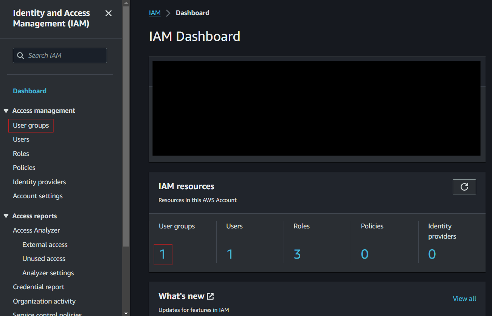
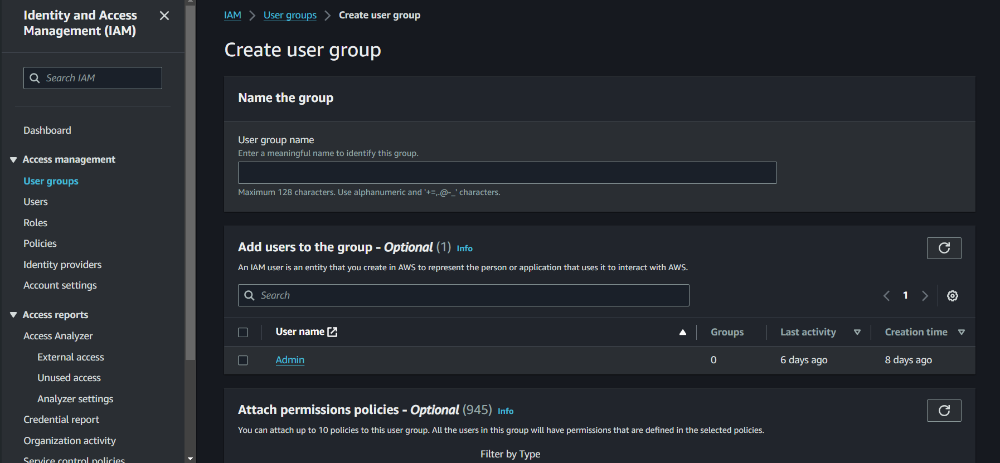
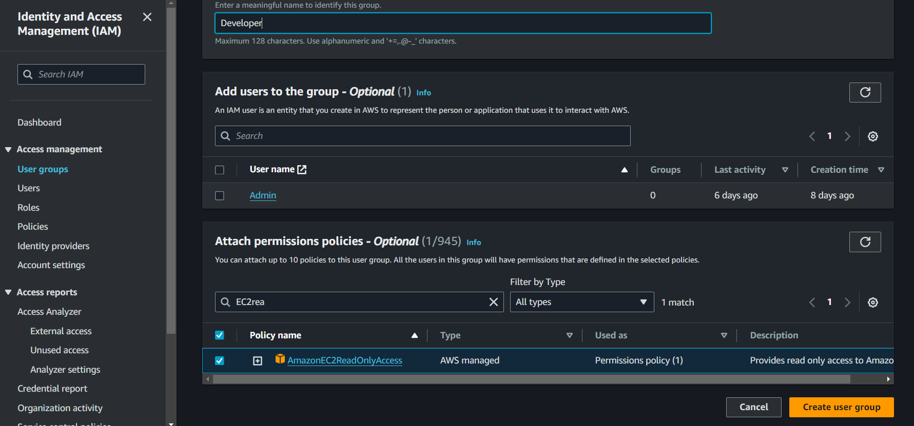
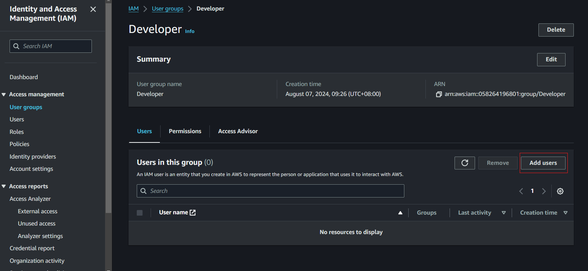
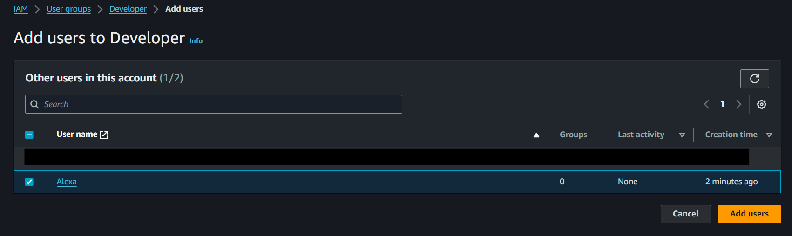
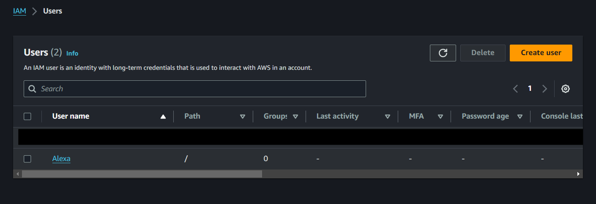
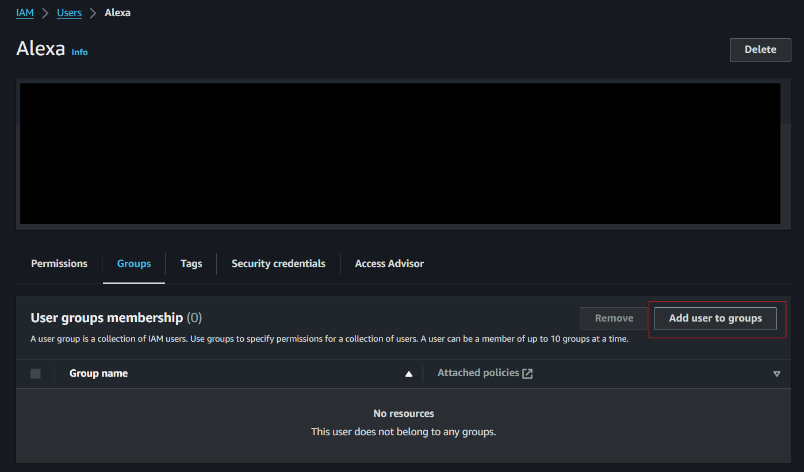
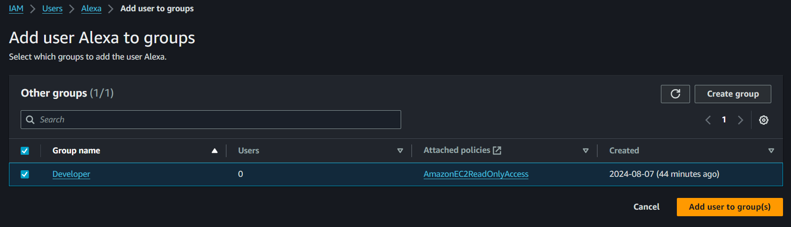

# **Permission Control Using IAM Groups**

## Creating IAM user groups

Creating and managing **IAM (Identity and Access Management)** user groups in AWS is essential for maintaining a secure and organized environment. User groups allow you to efficiently manage permissions for multiple users by assigning policies to a group rather than individually configuring each user's access.

In this guide, you'll learn how to create an IAM user group, attach policies to the group, and add users to it. This process ensures that users within a group inherit the same set of permissions, making it easier to manage access control across your AWS environment.

<!-- more -->

## Steps Overview

1. Log in to the AWS Management Console
2. Go to the IAM dashboard.

   

3. Navigate to "Groups" and click "Create New Group."
4. Enter the Group Name (e.g., Developers).

   

5. Attach Policies to the Group:
   - Choose policies from the policy list. For this demo, attach the ‘AmazonEC2ReadOnlyAccess’ policy.
6. Click "Create Group."

   

## Adding Users to the Group:

1. Navigate to the IAM Dashboard.
2. Navigate to User Group
3. Select the user group that you want to add a user to, for this demo choose the one we created earlier.
4. Click on ‘Add Users’

   

5. Select the User to Add to the Group

6. Click on ‘Add User’

   

> You can also edit the certain user’s permissions to add them to the group.

1. Navigate to the IAM Dashboard.
2. Navigate to Users

   

3. Click on the user you want to edit permissions and add to the group.
4. Click add permissions
5. Click Add user to a group

   

6. Choose the group you want to add the user to.
7. Click Next, which will direct you to the review page. Review your choices, and when you are done click ‘add permissions’

   

The user is now added to the selected group, and will inherit the permissions assigned to that group.

[Next >> IAM Roles](IAM%20Roles.md)
