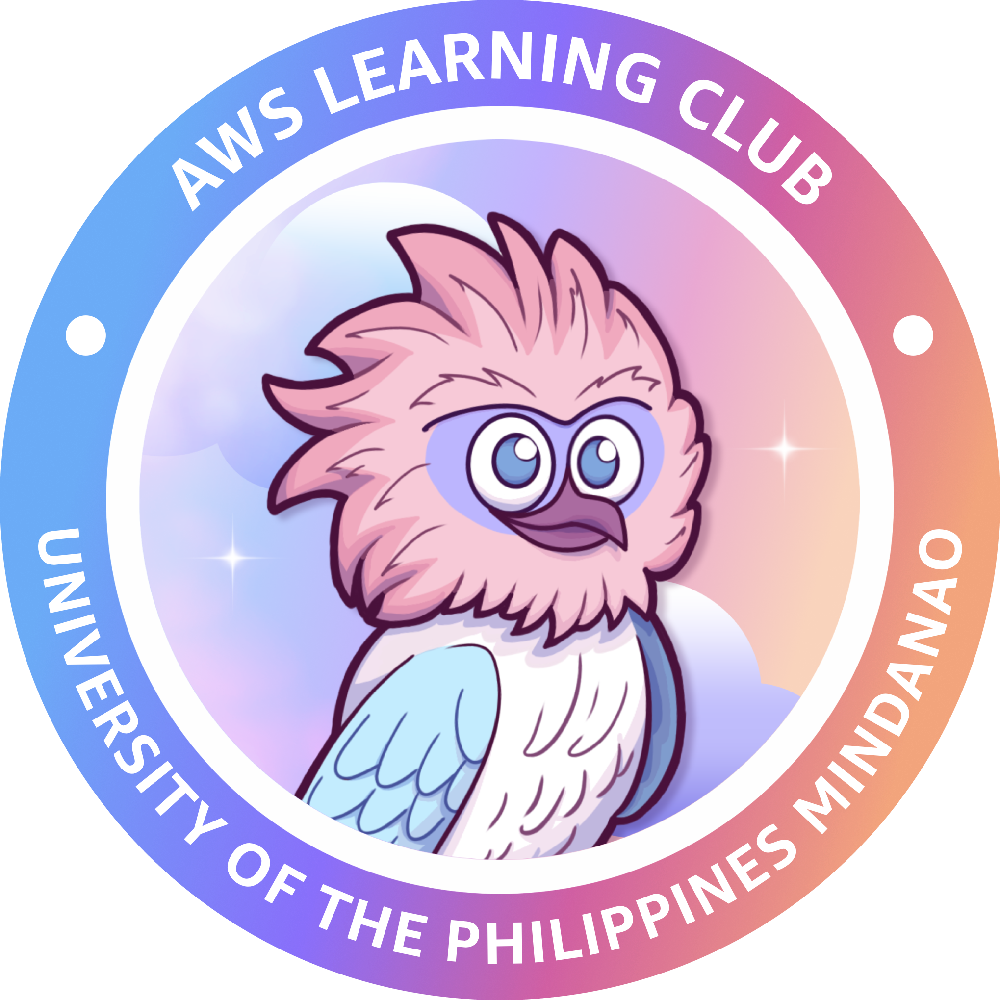

# **About**

Amazon Web Services Learning Club - University of the Philippines Mindanao is the **first official AWS student organization in Mindanao**. Founded in early 2024, this club fosters AWS knowledge growth through **workshops, knowledge sharing, and community building**.

## **Mission**

Foster a **collaborative learning environment** to empower individuals of all backgrounds to gain proficiency in Amazon Web Services (AWS) through workshops, knowledge sharing, and community building.

## **Vision**

To become a **premier learning hub** that cultivates a skilled and passionate cloud computing community leveraging AWS to **drive innovation and create positive impact**.
